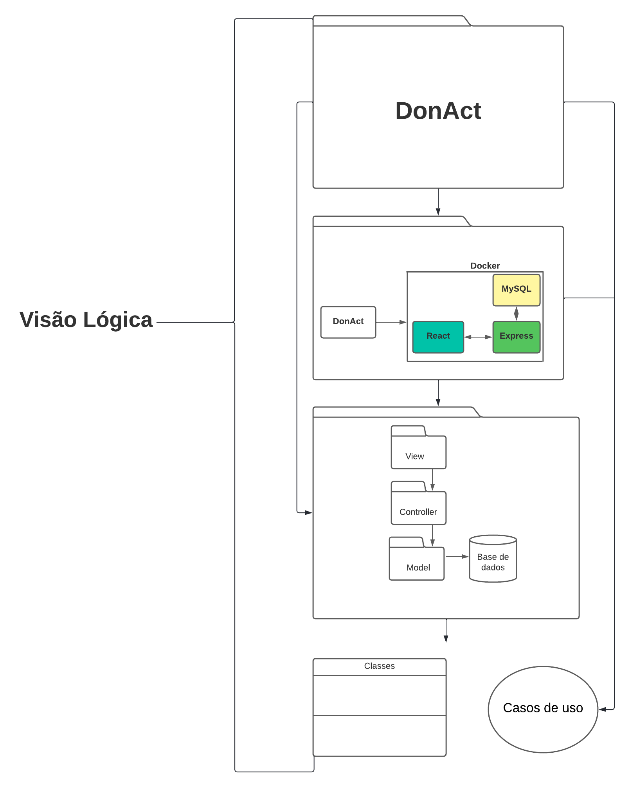

# 4.1. Módulo Estilos e Padrões Arquiteturais

## Versionamento
| Versão | Alterações                                               | Responsável                       | Data       |
| ------ | -----------------------------------------------------    | --------------------------------  | ---------- |
| 0.1    | Introdução ao DAS e DAS Visão Lógica Criador             | Cibele  e Julia Sousa             | 22/08/2022 |
| 0.2    | Adição de tópicos                                        | Victor Eduardo                    | 26/08/2022 |
| 0.3    | Adição DAS implantação                                   | Luiz Henrique, Savio Cunha        | 27/08/2022 |
| 0.4    | Representação Arquitetural e Metas e Restrição de Arquitetura       | Cibele Goudinho        | 30/08/2022 |
| 0.5    | Detalhamento do DAS Visão Lógica                         | Cibele e Júlia  | 30/08/2022 |

## 4.1.1. DAS
### 4.1.1.1. Introdução
#### 4.1.1.1.1 Objetivo
Nesse documento tratamos das decisões arquiteturais tomadas pelo grupo. Trazemos a visão lógica, voltada para apresentar a divisão dos pacotes, sistemas, classes e seus relacionamentos, a visão de implementação, focada mais nos padrões e modelos utilizados durante a implementação do projeto, a visão de implantação, traz uma ideia de em qual(is) hardwares o software seria implementado, a visão de dados, perspectiva de armazenamento dos dados no sistema.

#### 4.1.1.1.2 Escopo
O Documento da Arquitetura de Software se aplica ao projeto Donact, trabalho da disciplina de Arquitetura e Desenho de Software, o qual é voltado para auxiliar pessoas que querem doar objetos que não utilizam mais, facilitando o contato com ONGs e possibilitando a doação.

#### 4.1.1.1.3 Definições, Acrônimos e Abreviações
| Abreviação    | Acrônimo                                              | Definição                         |  
| ------------  | ----------------------------------------------------- | --------------------------------- |  
|               |                                                       |                                   |

#### 4.1.1.1.4 Visão geral

### 4.1.1.2. Representação Arquitetural
#### 4.1.1.2.1 Back-End
No nosso Back-End optamos por utilizar o Node Js, que é um software de código aberto, multiplataforma, permite o desenvolvimento de códigos em JavaScript rodando em uma máquina virtual específica (V8). A aplicação do Node, além do anterior contato dos membros, se deu principalmente pelo NPM (Node Package Manager) que permite que a equipe aproveite todos os recursos já disponibilizados dentro do repositório do NPM, outro motivo para a utilização do Node é que é um software extremamente leve e versátil. 
Ainda utilizamos o framework Express dentro do Node, visto que iremos desenvolver uma aplicação web e o Express fornece um conjunto robusto de recursos para esse tipo de aplicação. 
#### 4.1.1.2.2 Front-End
Utilizamos no Front-End o React JS que é uma biblioteca JavaScript de código aberto com foco em criar inferfaces de usuário em páginas web. Utilizamos essa tecnologia, tanto pelos membros já terem um conhecimento prévio, quanto por permitir a reutilização de código e a componetização, o sque torna mais simples e diminui o tempo de manutenção e codificação.
#### 4.1.1.2.3 Banco de Dados
Para o banco de dados utilizamos do MySQL que é um sistema de gerenciamento banco de dados, que utiliza da linguagem SQL, sendo um dos SGBD mais utilizados da Oracle. Ele também é um sistema que é de fácil uso, não precisa de muitas configurações e requer ajustes mínimos para possuir um bom desempenho, também possui um bom suporte da comunidade, o que facilita durante o uso. Por essas razões que optamos pelo MySQL.

### 4.1.1.3. Metas e Restrições da Arquitetura
#### 4.1.1.3.1 Metas
#### 4.1.1.3.2 Restrições
| Restrição     | Descrição                                           |
| ------------  | ----------------------------------------------------- |  
|   Conectividade   |  É necessário ter conexão com a internet para utilizar a aplicação.  |
|   Idioma          |  O sistema deve ser desenvolvido para o idioma português do Brasil.                                                     |
|   Público         |  O projeto deve ser desenvolvido para pessoas que desejam realizar doações e para ONGs que desejam receber doações |
|   Plataforma      |  A aplicação será utilizada em plataformas web, tais como Google Chrome e Web FireFox    |
|   Prazo Final     |  O escopo do projeto deve ser concluído até o final da disciplina.  |

### 4.1.1.4. Visão Lógica
A visão lógica na Arquitetura de Software mostra um subconjunto de modelo de design composto por classes, subsistemas, pacotes  e realizações de casos de uso.Ela nada mais é que uma abstração dos modelos criados, onde são ressaltadas as suas carecterísticas mais importantes, diminuindi o nível de complexibilidade da representação.

Com o diagrama abaixo conseguimos passar por grande parte das camadas arquiteturais já implementadas anteriormente de forma detalhada em uma unica visão abstrata que co-relaciona os diagramas arquiteturais. Passando do sistema, para o Diagrama de Contexto, depois para o Diagrama de Pacotes e conectando às classes e aos casos de uso:

  
_Imagem 1: DAS Visão Lógica_

### 4.1.1.5. Visão de Implementação

### 4.1.1.6. Visão de Implantação

### 4.1.1.7. Visão de Dados

### 4.1.1.8. Tamanho e Performance

### 4.1.1.9. Qualidade

## 4.1.2. Referências

- DAS do SPEU. Disponível em: https://www.facom.ufu.br/~flavio/pds1/files/2016-01/Documento%20de%20Arquitetura%20de%20Software%20do%20SPEU%201-Exemplo-RUP.pdf. Acesso em: 22 Agosto de 2022.
- Representção Arquitetural. Disponível em: https://unbarqdsw2021-2.github.io/2021.2_G2_Ki-Limpinho/arquitetura_reutilizacao/das/#representacao-arquitetural. Acesso em: 30 de Agosto de 2022.
- Representção Arquitetural. Disponível em: https://unbarqdsw2021-2.github.io/2021.2_G1_chapa_quente/#/pages/fase_04/documento_de_arquitetura?id=_2-representa%c3%a7%c3%a3o-arquitetural. Acesso em: 30 de Agosto de 2022.
- Caderno Arquitetura. Disponível em: https://www.trt9.jus.br/pds/pdstrt9/workproducts/caderno_arquitetura_9BB92433.html. Acesso em: 30 de Agosto de 2022.
- Express Js. Disponível em: https://expressjs.com/pt-br/. Acesso em: 30 de Agosto de 2022.
- Node Js. Disponível em: https://nodejs.org/en/about/. Acesso em: 30 de Agosto de 2022.
- React Js. Disponível em: https://pt-br.reactjs.org/. Acesso em: 30 de Agosto de 2022.
- MySQL. Disponível em: https://www.mysql.com/. Acesso em: 30 de Agosto de 2022.
-DAS Visão Lógical.Disponível em: https://www.cin.ufpe.br/~gta/rup-vc/core.base_rup/guidances/concepts/logical_view_C135365E.html
- DAS do SPEU. Disponível em: https://www.facom.ufu.br/~flavio/pds1/files/2016-01/Documento%20de%20Arquitetura%20de%20Software%20do%20SPEU%201-Exemplo-RUP.pdf. Acesso em: 22 Agosto de 2022.

