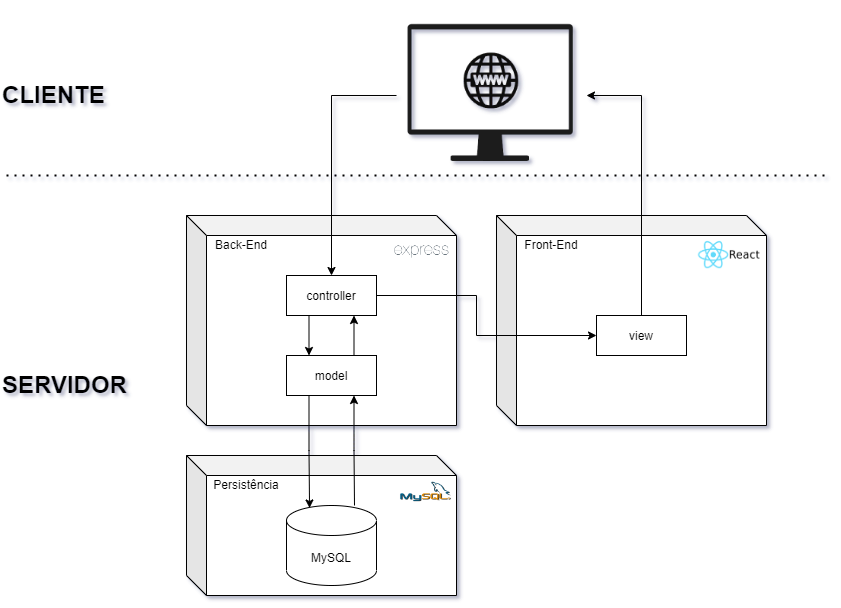

# 4.1. Módulo Estilos e Padrões Arquiteturais

## Versionamento

| Versão | Alterações                                                    | Responsável                | Data       |
| ------ | ------------------------------------------------------------- | -------------------------- | ---------- |
| 0.1    | Introdução ao DAS e DAS Visão Lógica Criador                  | Cibele e Julia Sousa       | 22/08/2022 |
| 0.2    | Adição de tópicos                                             | Victor Eduardo             | 26/08/2022 |
| 0.3    | Adição DAS implantação                                        | Luiz Henrique, Savio Cunha | 27/08/2022 |
| 0.4    | Representação Arquitetural e Metas e Restrição de Arquitetura | Cibele Goudinho            | 30/08/2022 |
| 0.5    | Detalhamento do DAS Visão Lógica                              | Cibele,Júlia             | 30/08/2022 |
| 0.6    | Adição Visão de Dados                                         | Isadora e Antônio          | 30/08/2022 |
| 0.7    | Validação do DAS de visão lógica                         | Yan Andrade, Felipe Agustini  | 30/08/2022 |
| 0.8   |  DAS Implantação          | Luiz Henrique, Savio  | 30/08/2022 |
| 0.9   |  Validando Visão Logica     | Luiz Henrique  | 30/08/2022 |

## 4.1.1. DAS

### 4.1.1.1. Introdução

#### 4.1.1.1.1 Objetivo

Nesse documento tratamos das decisões arquiteturais tomadas pelo grupo. Trazemos a visão lógica, voltada para apresentar a divisão dos pacotes, sistemas, classes e seus relacionamentos, a visão de implementação, focada mais nos padrões e modelos utilizados durante a implementação do projeto, a visão de implantação, traz uma ideia de em qual(is) hardwares o software seria implementado, a visão de dados, perspectiva de armazenamento dos dados no sistema.

#### 4.1.1.1.2 Escopo

O Documento da Arquitetura de Software se aplica ao projeto Donact, trabalho da disciplina de Arquitetura e Desenho de Software, o qual é voltado para auxiliar pessoas que querem doar objetos que não utilizam mais, facilitando o contato com ONGs e possibilitando a doação.

#### 4.1.1.1.3 Definições, Acrônimos e Abreviações

| Abreviação | Acrônimo | Definição |
| ---------- | -------- | --------- |
|            |          |           |

#### 4.1.1.1.4 Visão geral

### 4.1.1.2. Representação Arquitetural

#### 4.1.1.2.1 Back-End

No nosso Back-End optamos por utilizar o Node Js, que é um software de código aberto, multiplataforma, permite o desenvolvimento de códigos em JavaScript rodando em uma máquina virtual específica (V8). A aplicação do Node, além do anterior contato dos membros, se deu principalmente pelo NPM (Node Package Manager) que permite que a equipe aproveite todos os recursos já disponibilizados dentro do repositório do NPM, outro motivo para a utilização do Node é que é um software extremamente leve e versátil.
Ainda utilizamos o framework Express dentro do Node, visto que iremos desenvolver uma aplicação web e o Express fornece um conjunto robusto de recursos para esse tipo de aplicação.

#### 4.1.1.2.2 Front-End

Utilizamos no Front-End o React JS que é uma biblioteca JavaScript de código aberto com foco em criar inferfaces de usuário em páginas web. Utilizamos essa tecnologia, tanto pelos membros já terem um conhecimento prévio, quanto por permitir a reutilização de código e a componetização, o sque torna mais simples e diminui o tempo de manutenção e codificação.

#### 4.1.1.2.3 Banco de Dados

Para o banco de dados utilizamos do MySQL que é um sistema de gerenciamento banco de dados, que utiliza da linguagem SQL, sendo um dos SGBD mais utilizados da Oracle. Ele também é um sistema que é de fácil uso, não precisa de muitas configurações e requer ajustes mínimos para possuir um bom desempenho, também possui um bom suporte da comunidade, o que facilita durante o uso. Por essas razões que optamos pelo MySQL.

### 4.1.1.3. Metas e Restrições da Arquitetura

#### 4.1.1.3.1 Metas

#### 4.1.1.3.2 Restrições

| Restrição     | Descrição                                                                                                         |
| ------------- | ----------------------------------------------------------------------------------------------------------------- |
| Conectividade | É necessário ter conexão com a internet para utilizar a aplicação.                                                |
| Idioma        | O sistema deve ser desenvolvido para o idioma português do Brasil.                                                |
| Público       | O projeto deve ser desenvolvido para pessoas que desejam realizar doações e para ONGs que desejam receber doações |
| Plataforma    | A aplicação será utilizada em plataformas web, tais como Google Chrome e Web FireFox                              |
| Prazo Final   | O escopo do projeto deve ser concluído até o final da disciplina.                                                 |

### 4.1.1.4. Visão Lógica

A visão lógica na Arquitetura de Software mostra um subconjunto de modelo de design composto por classes, subsistemas, pacotes  e realizações de casos de uso. Ela nada mais é que uma abstração dos modelos criados, onde são ressaltadas as suas carecterísticas mais importantes, diminuindo o nível de complexibilidade da representação. [[UFPE]](#ref1)

Com o diagrama abaixo conseguimos passar por grande parte das camadas arquiteturais já implementadas anteriormente de forma detalhada em uma única visão abstrata que co-relaciona os diagramas arquiteturais. Passando do sistema, para o Diagrama de Contexto, depois para o Diagrama de Pacotes e conectando às classes e aos casos de uso: [[FLAVIO]](#ref2)

  
_Imagem 1: DAS Visão Lógica_

### 4.1.1.5. Visão de Implementação

### 4.1.1.6. Visão de Implantação

#### 4.1.1.5.1. Diagrama de Contexto

Com o objetivo de representar as tecnologias que serão utilizadas no projeto no contexto da Arquitetura Cliente Servidor foi desenvolvido na etapa de Modelagem o diagrama de contexto abaixo:

<a href="https://unbarqdsw2022-1.github.io/2022.1_G2_DonAct/#/Modelagem/2.2.IniciativasExtras?id=_2213-escolha-das-tecnologias" >Diagrama de Implantação V1</a>


_Imagem 2: Diagrama de Contexto V1_

Para esta etapa do projeto desenvolvemos uma evolução do mesmo refletindo a arquitetura definitiva do projeto e suas tecnologias,  no mesmo buscamos evidenciar a arquitetura cliente servidor e N camadas:


_Imagem 3: Diagrama de Contexto V2_

### 4.1.1.7. Visão de Dados

Nesse tópico mostramos o modelo de dados utilizado no sistema e para isso utilizamos o banco de dados relacional MySQL.

- Modelo Doador:

| Dado           | Tipo   | Obrigatório |
| -------------- | ------ | ----------- |
| fotoDePerfil   | BLOB   | SIM         |
| nome           | STRING | SIM         |
| telefone       | STRING | NÃO         |
| email          | STRING | SIM         |
| endereco       | STRING | SIM         |
| cidade         | STRING | SIM         |
| estado         | STRING | SIM         |
| senha          | STRING | SIM         |
| cpf            | STRING | SIM         |
| dataNascimento | STRING | SIM         |

### Exemplo

```json
{
  "fotoDePerfil": "9eebbf3a-2873-11ed-a261-0242ac120002",
  "nome": "Isabel Laís da Paz",
  "telefone": "96984701121",
  "email": "isabel.lais.dapaz@smbcontabil.com.br",
  "endereco": "Avenida dos Goitacazes 112",
  "cidade": "Macapá",
  "estado": "AP",
  "senha": "2TFQLilTDS",
  "cpf": "57230240514",
  "dataNascimento": "09/02/1996"
}
```

- Modelo ONG:

| Dado               | Tipo   | Obrigatório |
| ------------------ | ------ | ----------- |
| cnpj               | STRING | SIM         |
| fotoDePerfil       | BLOB   | NÃO         |
| nome               | STRING | SIM         |
| telefone           | STRING | SIM         |
| email              | STRING | SIM         |
| endereco           | STRING | SIM         |
| cidade             | STRING | SIM         |
| estado             | STRING | SIM         |
| cep                | STRING | SIM         |
| senha              | STRING | SIM         |
| nomeDoResponsavel  | STRING | SIM         |
| emailDoResponsavel | STRING | SIM         |

```json
{
  "cnpj": "28103789000125",
  "fotoDePerfil": "d01db28e-2873-11ed-a261-0242ac120002",
  "nome": "ONG Amigos Unidos pelo Amor",
  "telefone": "1147745369",
  "email": "contato@amigosunidospeloamor.org.br",
  "endereco": "Rua dos Potiguaras, 6 ",
  "cidade": "São Paulo",
  "estado": "SP",
  "cep": "06663600",
  "senha": "2TFQLilTDS",
  "nomeDoResponsavel": "Igor Osvaldo Pereira",
  "emailDoResponsavel": "igor.osvaldo.pereira@mtc.eng.br"
}
```

- Modelo Item:

| Dado       | Tipo    | Obrigatório |
| ---------- | ------- | ----------- |
| id         | UUID    | SIM         |
| nome       | STRING  | SIM         |
| descricao  | STRING  | NÃO         |
| quantidade | INTEGER | SIM         |
| foto       | BLOB    | SIM         |

```json
{
  "id": "0e81c62a-2872-11ed-a261-0242ac120002",
  "nome": "Cobertor",
  "descricao": "",
  "quantidade": 3,
  "foto": "dbc588be-2873-11ed-a261-0242ac120002"
}
```

### 4.1.1.8. Tamanho e Performance

### 4.1.1.9. Qualidade

A fim de analisar os aspectos de qualidade da aplicação criada foi realizada a análise da mesma com base no modelo de qualidade de McCall's que ressalta alguns aspectos principais a serem realizados. 


Aspectos de qualidade:

| Fatores de Qualidade   | Aplicação no Programa |
| -------------- | ------ |
| Eficiência  | Com o objetivo de melhorar a eficiência da aplicação desenvolvida foi utilizado o padrão N casadas, que possibilita a independência entre a camada lógica e a visualização do usuário, o que permite a melhora no tempo de resposta da aplicação, assim tornando-a mais eficiente.   |
| Usabilidade | Os aspectos de usabilidade foram desenvolvidos por meio de um  <a href="https://unbarqdsw2022-1.github.io/2022.1_G2_DonAct/#/Base/1.1.AbordagemNaoEspecifica?id=_1134-fase-4-prototype">protótipo funcional de de alta fidelidade </a> que foi validado com o público por meio de um questionário, assim, os aspectos de melhoria identificados foram corrigidos, obtendo a versão final do protótipo que serviu como guia para o desenvolvimento. |
| Confiabilidade | Para buscar uma maior confiabilidade da aplicação foram utilizados padrões de projeto e tecnologias consolidadas. Com o objetivo de garantir uma maior confiabilidade dos dados da aplicação foi desenvolvido uma camada de persistência respeitando todas as Formas Normais. |
| Testabilidade | Os aspectos de testabilidade foram trabalhados através da análise de Pull Requests na ferramenta <a href="https://github.com">GitHub</a>, estes foram analisados utilizando testes de caixa preta, averiguando a funcionalidade desenvolvida estava de acordo com os  <a href="https://unbarqdsw2022-1.github.io/2022.1_G2_DonAct/#/Modelagem/2.1.3.Agil?id=_2132-backlog-produto-priorizado">critérios de aceitação </a> e seguindo as orientações do <a href="https://unbarqdsw2022-1.github.io/2022.1_G2_DonAct/#/Base/1.1.AbordagemNaoEspecifica?id=_1134-fase-4-prototype">protótipo de de alta fidelidade </a>. |
| Manutenabilidade | Visando a manutenibilidade a longo prazo a equipe utilizou tecnologias, padrões e frameworks consolidados no mercado que possuem um largo arcabouço de consulta e suporte da comunidade, assim estima-se que o processo de manutenção será simples. | 
| Portabilidade | Os aspectos de portabilidade foram trabalhados por meio de padrões arquiteturais, neste sentido podemos destacar o <a href="https://unbarqdsw2022-1.github.io/2022.1_G2_DonAct/#/PadroesDeProjeto/3.3.PadroesExtra?id=_331-mvc-model-modelo-view-vis%c3%a3o-controller-controle">padrão MVC</a> que trás aspectos de uma arquitetura N camadas, assim temos nesta arquitetura o isolamento do FrontEnd em relação às regras de negócio. | 

Vale ressaltar também que aspectos de qualidade foram trabalhados também na implementação do código utilizando modelos <a href="https://unbarqdsw2022-1.github.io/2022.1_G2_DonAct/#/PadroesDeProjeto/3.1.GRASPs">GRASPs</a> e <a href="https://unbarqdsw2022-1.github.io/2022.1_G2_DonAct/#/PadroesDeProjeto/3.2.GoFs">GoFs</a>.

## 4.1.2. Referências

<a id="ref1"></a> 
- DAS Visão Lógica. <https://www.cin.ufpe.br/~gta/rup-vc/core.base_rup/guidances/concepts/logical_view_C135365E.html> Acesso em: 22 Agosto de 2022.

<a id="ref2"></a> 
- DAS do SPEU. <https://www.facom.ufu.br/~flavio/pds1/files/2016-01/Documento%20de%20Arquitetura%20de%20Software%20do%20SPEU%201-Exemplo-RUP.pdf> Acesso em: 22 Agosto de 2022.

- Representção Arquitetural. Disponível em: https://unbarqdsw2021-2.github.io/2021.2_G1_chapa_quente/#/pages/fase_04/documento_de_arquitetura?id=_2-representa%c3%a7%c3%a3o-arquitetural. Acesso em: 30 de Agosto de 2022.
- Caderno Arquitetura. Disponível em: https://www.trt9.jus.br/pds/pdstrt9/workproducts/caderno_arquitetura_9BB92433.html. Acesso em: 30 de Agosto de 2022.
- Express Js. Disponível em: https://expressjs.com/pt-br/. Acesso em: 30 de Agosto de 2022.
- Node Js. Disponível em: https://nodejs.org/en/about/. Acesso em: 30 de Agosto de 2022.
- React Js. Disponível em: https://pt-br.reactjs.org/. Acesso em: 30 de Agosto de 2022.
- MySQL. Disponível em: https://www.mysql.com/. Acesso em: 30 de Agosto de 2022.
  -DAS Visão Lógical.Disponível em: https://www.cin.ufpe.br/~gta/rup-vc/core.base_rup/guidances/concepts/logical_view_C135365E.html
- DAS do SPEU. Disponível em: https://www.facom.ufu.br/~flavio/pds1/files/2016-01/Documento%20de%20Arquitetura%20de%20Software%20do%20SPEU%201-Exemplo-RUP.pdf. Acesso em: 22 Agosto de 2022.
- SINGH, Jagannath - User's Perspective of Software Quality. 2018. Acesso em: 30 de Agosto de 2022.