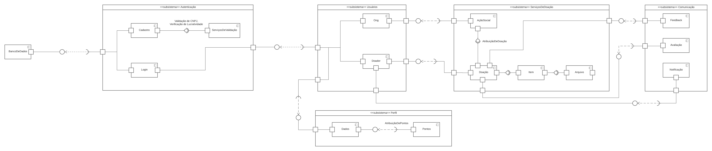

# 4.3. Iniciativas Extras - Arquitetura & Reutilização de Software

## Versionamento

| Versão | Alterações                          | Responsável                     | Data       |
| ------ | ----------------------------------- | ------------------------------- | ---------- |
| 0.1    | Evolução do Diagrama de Componentes | Victor Buendia e Victor Eduardo | 04/09/2022 |

## 4.3.1 Diagrama de Componentes

Nós evoluímos nosso [Diagrama de Componentes antigo](/Modelagem/2.1.1.UMLEstaticos?id=_22113-diagrama-de-componentes) para conseguir contemplar uma visão mais madura do DAS de Implementação.

As principais evoluções que fizemos no Diagrama de Componentes foi aumentar o detalhamento desse diagrama, trazendo detalhes mais técnicos da implementação que traremos no nosso código. Detalhamos melhor quais são os subsistemas da nossa aplicação e quais componentes estão dentro deles. Além disso, evidenciamos as relações de interação através de interfaces oferecidas e requeridas pelos componentes. [[UML]](#ref1)

Os membros Victor Buendia e Victor Eduardo trabalharam na evolução desse diagrama com o apoio da Isadora, que havia concebido a versão inicial.

  

  <i>Imagem 1: DAS Visão Implementação</i>

### 3.4.3 Documentação daily Sprints

&emsp;&emsp;As Dailys da equipe estão sendo realizadas diariamente via Telegram onde cada membro da equipe deve responder 4 perguntas sobre o andamento de suas atividades:

- O que eu fiz desde a última Daily?

- O que vou fazer até amanhã?

- Quais são os impedimentos que estão me atrapalhando o andamento do meu trabalho? (Marque alguém que você acredita que possa te ajudar com esse problema.)

- Quais atividades dessa sprint ainda preciso realizar?

&emsp;&emsp;Nesta entrega foi realizado o registro das dailys das sprints 9, 10, 11 e 12 no formato de planilha, visando o melhor registro e analise dos dados coletados: 

[Registro Dailys](https://docs.google.com/spreadsheets/d/14c7agbEHBoryS6Nd4Bq-8rD-v3mqoQNe/edit?usp=sharing&ouid=115308633450486530905&rtpof=true&sd=true)

## Referências

 
- Diagramas de Componentes UML. Disponível em: <https://www.uml-diagrams.org/component-diagrams.html>. Acesso em: 31 de Agosto de 2022.