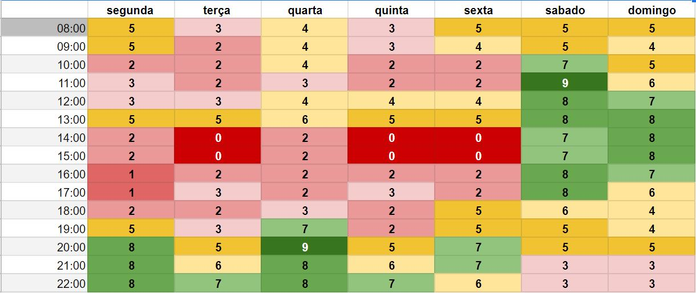

# 1.1. Módulo Projeto Não Orientado a Abordagens Específicas

| Versão | Alterações                                                                                                                           | Responsável                                                                                                             |
| ------ | ------------------------------------------------------------------------------------------------------------------------------------ | ----------------------------------------------------------------------------------------------------------------------- |
| 0.1    | Adicionado os tópicos 1.1.1, 1.1.2, 1.1.3, 1.1.3.1, 1.1.3.2                                                                          | Cibele Goudinho                                                                                                         |
| 0.2    | Adicionado os tópicos 1.1.3.3, 1.1.3.4, 1.1.3.5 e Referências; Correções gramaticais                                                 | Victor Buendia                                                                                                          |
| 0.3    | Alterado texto no tópico 1.1.1, 1.1.3.1, 1.1.3.2, adicionado imagens no tópico 1.1.3.1 e Referências                                 | Cibele Goudinho                                                                                                         |
| 0.4    | Confecção rich picture                                                                                                               | Antônio Neto, Carlos Rafael, Cibele Goudinho, , Luiz Henrique, Savio Cunha, Victor Eduardo, Victor Buendia, Yan Andrade |
| 0.5    | Registro rich picture nos tópicos 1.1.3.2 e 1.1.3.3 e adicionado apêndice                                                            | Luiz Henrique, Cibele Goudinho                                                                                          |
| 0.6    | Adicionando versão final do Rich Picture                                                                                             | Yan Andrade                                                                                                             |
| 0.7    | Colocado númeração em referências e apêndice, alterado texto no tópico 1.1.1, adicionado informação sobre apêndice no tópico 1.1.3.1 | Cibele Goudinho                                                                                                         |
| 0.8    | Elicitação Requisitos | Luiz Henrique, Victor Eduardo, Savio Cunha, Carlos Rafael |
| 0.9    | Documentação Brainstorming, Backlog e priozição | Luiz Henrique, Carlos Rafael |                                  |
| 1.0   | Adicionando o tópico 1.1.3.4.1.1 Processo de Gerenciamento dos Riscos                                | Victor Buendia  |
| 1.1  | Adicionando o topico de Instropecção | Luiz Henrique, Victor Eduardo, Sávio Cunha |
| 1.2    | Registro brainstorm e adicionando mapa mental | Isadora Soares e Antonio Neto |
| 1.3    | Adicionando mapa mental e fluxograma | Isadora Soares e Antonio Neto |
| 1.4 | Adicionando léxicos | Antônio Neto | 
| 1.5 | Ajustado numeração de tópicos e resolvido conflitos | Cibele Goudinho |

## 1.1.1.  Introdução

O **Design Sprint** é uma metodologia desenvolvida pela Google Ventures, principalemente para facilitar o processo inicial de um projeto, ao invés de focar em um MVP (Minimum Viable Product) para escolher a ideia a ser trabalhada, o Design Sprint foca especificamente na validação da ideia com usuários e encurta o tempo necessário para essa fase do desenvolvimento. A metodologia visa construir uma visão de um projeto de maneira mais detalhada e auxiliar na compreensão do produto a ser alcançado. No contexto da disciplina de _Arquitetura e Desenho de Software_, o Design Sprint será usado com o intuito de desenvolver um produto de software. A metodologia reune os envolvidos no trabalho para atuar na construção, ideação e planejamento do projeto, podendo ter diversas fases de desenvolvimento, as quais podem ser adaptadas a cada projeto dependendo do escopo e do que melhor se encaixa para a equipe em questão.

Essa metodologia é dividida principalmente em cinco fases, sendo elas: *Unpack, Sketch, Decide, Prototype e Test*. As quais podem ser realizadas em um período de uma sprint, tendo um dia para cada fase, porém o tempo dedicado a cada fase pode ser adaptado as necessidades do time e o que melhor se encaixa para ele, o importante é que cada fase seja bem detalhada e que a equipe não tenha mais nenhuma dúvida em relação as atividades desenvolvidas em cada parte.

### Unpack
Nessa primeira fase para a equipe pensar no projeto a ser realizado, levantar problemas, trazer ideias. Nessa estapa o grupo pode utilizar de artefatos, como **Brainstorm** ou **Mapa Mental**, para levantar possíveis problemas e posteriormente discutir sobre eles e quail será o que a equipe irá focar.

### Sketch
Na segunda fase, o problema decidido na fase anterior é trabalhado, a equipe individualmente pensa sobre soluções e gera ideias plausíveis que poderam desenvolver para resolver o problema escolhido. Como no Unpack pode-se utilizar artefatos coomo **Brainstorm** ou **Mapa Mental**.

### Decide
Na terceira fase será dado continuidade ao Sketch e as ideias levantadas serão filtradas e refinadas para melhor se adaptarem ao que a equipe busca desenvolver como solução final do problema levantado na fase 1. Também há a criação do backlog e requisitos do produto a ser criado. Aqui usa-se artefatos como **Storyboard** para visualização da ideia em um cotidiano do usuário.

### Prototype
Nessa fase deve-se criar um protótipo para o projeto e definir prioridades, prazos de cada tarefa definida e responsabilidades de cada membro. É importante que o protótipo final seja de média para alta fidelidade, pois ajuda durante a fase de teste, trazendo uma imagem sólida do produto ao usuário final possibilitando um feedback mais realista e facilita a realizar os ajustes necessários. Além de que permite uma melhor visulização da ideia e assim diminui o tempo durante o desenvolvimento, já que a imagem do que seria o projeto já está construida.

### Test
A validação é a parte em que testes serão realizados. O prótotipo é apresentado para um grupo de teste, buscando receber feedbacks, possibilidades de melhoria e também possibilitar a interação do usário com o produto. Além disso, nessa atividade também se registra as conclusões das atividades anteriores e dos testes que foram realizados.

## 1.1.2. Porque vamos usar o Design Sprint

Escolhemos essa metodologia porque traz agilidade no ponto inicial do projeto, visto que possui etapas bem definidas com prazos para conclusão e possibilita o desenvolvimento rápido desde a decisão de tema do projeto ao protótipo. Além disso, é uma abordagem sistemática com baixa complexidade que facilita a curva de aprendizado e também a adaptação para dentro do escopo do projeto caso necessário. Ela também possibilita um melhor alinhamento entre a equipe, uma vez que todos os integrantes tem conhecimento acerca da base do projeto e dos requisitos a serem elaborados, facilitando o desenvolvimento posteriormente. E por fim, a maior parte dos integrantes do grupo já possuia contato com a metodologia, assim utilizá-la foi conveniente por trazer familiaridade aos integrantes em relação aos prazos estabelecidos para entrega e o ritmo do processo.

## 1.1.3. Fases

Como citado anteriormente, o Design Sprint tem atividades sistematizadas e que precisam ser seguidas com certo rigor para o sucesso do processo. Normalmente, utilizam-se cinco dias para percorrer todas as fases. Contudo, buscando adequar-se ao cronograma da disciplina e encontrar horários em comum para o trabalho colaborativo entre os integrantes, decidimos adaptar as atividades em 5 fases as quais seriam realizadas idealmente em três dias.

### 1.1.3.1. Fase 1 - Unpack

Nessa fase buscamos definir qual o problema que iriamos resolver, levantando por meio de um **Brainstorm**, com participação de todos os integrantes, ideias acerca do tema do projeto. Utilizamos o **Mapa Mental** como ferramenta de apoio para documentar os resultados do Brainstorm da equipe.

Em seguida, debatemos os aspectos da solução computacional desejada, no intuito de ter um levantamento bem razoável do problema que queríamos atingir para desenhar o escopo dessa solução. Para isso, fizemos uso dos artefatos **Ishikawa** e **5H2W**. Dessa forma aqui já obtemos uma ideia inicial do que será realizado, suas causas e informações relevantes, como o que será (aplicação web), por que está sendo criado, como será realizado, dentre outras informações levantadas durante o 5H2W.

### Heatmap

*Imagem 1: Heatmap do grupo com a quantidade de membros disponiveis por horário*

### Brainstorm

O Brainstorm é uma técnica que tem como propósito chegar a uma solução, através de um grande fluxo de ideias. Decidimos utilizar essa técnica por que permite que todos os membros da equipe possam participar trazendo ideias, que podem ser complementadas ou também substituídas com a intenção de chegar na ideia mais viável. 

A técnica do brainstorm foi aplicada em uma das nossas reuniões em grupo com a intenção de definir qual seria o projeto. Cada participante que tivesse alguma ideia deveria pegar um post-it e colocar sua ideia nele. Ao final do tempo estimado para as ideias, fizemos uma votação em que cada participante teria a opção de votar em 3 ideias e a ideia com mais votos seria a ideia escolhida. Utilizamos o Miro para colocar essa ténica em prática. 

*Imagem 2: Brainstorm*

### Mapa Mental

A técnica do mapa do mental auxilia na organização e na memorização de pensamentos e ideias, foi desenvolvida para potencializar a capacidade do cérebro ajudando no armazenamento do conhecimento e na elaboração do raciocínio lógico. Essa técnica consiste em expandir as palavras-chave associadas ao tema central para as laterais da página

Selecionamos a ideia mais votada e decidimos utilizar o mapa mental para mostrar a ideia do projeto de um jeito mais dinâmico. Utilizamos as caixas maiores para colocar as ideias principais e as setas e textos para interligar e explicar a ligação entre essas ideias.

*Imagem 2: Mapa mental*

### Fluxograma 

Fluxograma é uma técnica voltada para o aspecto visual, assim como o mapa mental. No fluxograma busca-se representar uma pequena narrativa da ideia do projeto DonAct e qual seus objetivos. 

*Imagem 3: Fluxograma*

### Ishikawa - Visão Geral

*Imagem 3: Ishikawa - Visão geral*

### 5W2H - Visão geral
De acordo com Silva (2009), O método **5W2H** é uma ferramenta muito utilizada para realizar o plano de ação e colocar em prática as alternativas de soluções encontradas, bem como forma de padronizar procedimentos. O nome **5W2H** vem das palavras em inglês: What? Why? Who? Where? When? How? e How much?, que significam respectivamente: O que?, Por quê?, Quem?, Onde?, Quando?, Como? E Quanto custa?. Respondendo a essas perguntas se estará planejando as ações de melhoria ou padronizando processos de forma organizada, garantindo que a execução das atividades aconteça da forma planejada.

Nós utilizamos do método **5W2H** com a finalidade de trazer mais clareza e objetividade das atividades planejadas para todos os membros do grupo, assim auxiliando a contrução de um produto com maior qualidade. Os resultados da aplicação da metodologia podem ser vistos na imagem abaixo. 

*Imagem 10: 5W2H - Visão geral*
*Detalhes no apêndice*

### 1.1.3.2. Fase 2 - Sketch

No Sketch, buscamos detalhar ainda mais a ideia escolhida na fase anterior e optamos pelo uso do artefato **Rich Picture**, pois assim poderiamos obter vários diagramas na visão de cada indivíduo sobre o escopo de atuação da aplicação web dentro de um contexto real. 
Uma imagem rich é uma ferramenta eficaz para analisar problemas e expressar ideias, ao desenvolver uma solução para um problema de negócios, é essencial entender os componentes vitais desse problema, O Rich Picture pode ajudar a identificar pontos como:

- Processos de negócios e seus requisitos de dados;
- Os atores envolvidos nos processos e suas responsabilidades;
- As relações entre processos e atores;
- Problemas e conflitos potenciais.

Para a confecção do artefato cada membro do grupo desenvolveu individualmente uma versão do Rich Picture do projeto, apresentando ao grupo sua visão sobre a aplicação.

### Rich Picture - Antônio Neto

*Imagem 13: Rich Picture Antônio Neto*
*Autor: Antônio Neto*

### Rich Picture - Carlos Rafael

*Imagem 14: Rich Picture Carlos Rafael*
*Autor: Carlos Rafael*

### Rich Picture - Cibele Goudinho

*Imagem 15: Rich Picture Cibele Goudinho*
*Autor: Cibele Goudinho*

### Rich Picture - Luiz Henrique

*Imagem 16: Rich Picture Luiz Henrique*
*Autor: Luiz Henrique*

### Rich Picture - Savio Cunha

*Imagem 17: Rich Picture Savio Cunha*
*Autor: Savio Cunha*

### Rich Picture - Victor Buendia

*Imagem 18: Rich Picture Victor Buendia*
*Autor: Victor Buendia*

### Rich Picture - Victor Eduardo

*Imagem 19: Rich Picture Victor Eduardo*
*Autor: Victor Eduardo*

### Rich Picture - Yan Andrade

*Imagem 20: Rich Picture Yan Andrade*
*Autor: Yan Andrade*

### 1.1.3.3. Fase 3 - Decision

Nesta fase, o intuito é realizar uma votação dos Rich Pictures construídos na etapa anterior para decidirmos em grupo qual Rich Picture reflete mais o funcionamento da aplicação web pretendida em um contexto real. A partir desta escolha, realiza-se incrementos convenientes ao Rich Picture escolhido para torná-lo mais completo, em concordância com a visão de produto concebida pela equipe:

#### Rich Picture versão final

*Imagem 21: Rich Picture Geral*
*Autor: Yan Andrade*

Em seguida, utilizamos o **Storyboard** como um artefato para criar uma sequência de ilustrações que representem estados de interface e momentos de interação do usuário com o sistema que está sendo idealizado. É uma ferramenta que não consome muito tempo, mas traduz a visão do produto em um aspecto imagético que facilita a interpretação de seu contexto.

Além disso, nessa fase foi realizada a Elicitação dos Requisitos para construir o Backlog do Produto. A estratégia para isso foi novamente o Brainstorm, tendo em vista que o grupo já possuía artefatos que delimitavam bem o escopo e visão do produto (5H2W, Ishikawa, Rich Picture e Storyboard). Assim, com apoio do que já havia sido construído, os requisitos funcionais e não funcionais foram levantados nessa fase.

Com uma primeira versão dos requisitos do produto em mãos, foi realizada já a ordenação dos níveis de abstração dos requisitos em Tema, Épicos, Features, Histórias de Usuário e Critérios de Aceitação.

#### Introspecção

A introspecção é uma técnica muito utilizada durante a etapa de elicitação de requisitos. O método consiste em analisar e entender quais funcionalidades o sistema deve possuir para que seja bem sucedido. Uma das formas dos engenheiros realizarem a introspecção é se colocando no lugar dos usuários e dos stakeholders e imaginar o que eles gostariam de ver presente no sistema e quais tarefas eles desejam realizar.

##### Requisitos - Introspecção

| ID   | Feature | História de Usuário | Classificação Requisitos |
| ---- | ------------------------- | ------------------------------------------------------------------------------------------------------------------------------------ | ---------------- |
| IP01 | FE12 - Usabilidade e Acessibilidade | Eu como usuária desejo que o sistema sejá intuitivo e possua uma baixa curva de aprendizado | RNF |
| IP02 | FE12 - Usabilidade e Acessibilidade | Eu como usuário desejo poder tirar duvidas por meio de uma seção de ajuda no sistema | RF |
| IP03 | FE13 - Segurança e confiabilidade | Eu como usuário desejo que meus dados estejam seguros no sistema | RNF |
| IP04 | FE13 - Segurança e confiabilidade  | Eu como usuário doador desejo que sejá verificada a identidade das ONG´s presentes na plataforma | RNF |
| IP05 | FE13 - Segurança e confiabilidade  | Eu como usuário membro de uma ONG desejo que sejá verificada a identidade das pessoas presentes na plataforma | RNF |
| IP06 | FE13 - Segurança e confiabilidade  | Eu como usuário desejo poder acessar o sistema de maneira estavél | RNF |
| IP07 | FE14 - Desempenho| Eu como usuário desejo que o sistema responda os comandos realizados em pequano tempo de resposta | RNF |
| IP08 | FE15 - Suportabilidade| Eu como usuário desejo poder utilizar o sistema em aparelhos distintos por meio de uma aplicação web acesssivél em navegadores distintos | RNF |

#### Brainstorming de Elicitação

*Imagem 21: Brainstorming de elicitaçãol*
*Autor: Luiz Henrique, Victor Eduardo, Sávio Cunha e Antônio Rafael*

Com uma primeira versão dos requisitos do produto em mãos, foi realizada já a ordenação dos níveis de abstração dos requisitos em Tema, Épicos, Features, Histórias de Usuário e Critérios de Aceitação.

##### Requisitos - Brainstorming

| ID   | Feature | História de Usuário | Classificação Requisitos |
| ---- | ------------------------- | ------------------------------------------------------------------------------------------------------------------------------------ | ---------------- |
| BS01 | FE01 - Cadastro de doador | Eu como usuário doador desejo me cadastrar no site | RF |
| BS02 | FE01 - Cadastro de doador | Eu como usuário doador não desejo que sejam cadastrados usuários doadores com o mesmo CPF que o meu | RNF |
| BS03 | FE02 - Cadastro de ONG    | Eu como usuário membro de uma ONG desejo me cadastrar no site | RF | 
| BS04 | FE02 - Cadastro de ONG | Eu como usuário não desejo que sejam cadastrados outros usuários utilizando o mesmo CNPJ que o meu | RNF |
| BS05 | FE02 - Cadastro de ONG    | Eu como usuário doador desejo que as empresas que receberão minhas doações sejam cadastrados Empresas sem fins lucrativos | RNF |
| BS06 | FE03 - Adicionar item | Eu como usuário doador desejo oferecer um item para doação | RF |
| BS07 | FE03 - Adicionar item | Eu como usuário doador desejo remover um item para doação | RF |
| BS08 | FE03 - Adicionar item | Eu como usuário doador desejo editar um item para doação | RF | 
| BS09 | FE03 - Adicionar item | Eu como usuário doador desejo selecionar para qual ONG vou doar meus itens | RF |
| BS10 | FE04 - Solicitar item | Eu como usuário membro de uma ONG desejo solicitar ou remover um item da lista de itens que preciso | RF |
| BS11 | FE04 - Solicitar item | Eu como usuário membro de uma ONG desejo remover um item da lista de itens que preciso | RF |
| BS12 | FE04 - Solicitar item | Eu como usuário membro de uma ONG desejo ver quais itens foram doados para minha instituição | RF |
| BS13 | FE05 - Avaliar item | Eu como usuário membro de uma ONG desejo avaliar os itens que foram doados para minha instituição | RF |
| BS14 | FE05 - Avaliar item | Eu como usuário membro de uma ONG desejo retornar um feedback sobre os itens que foram doados pra minha instituição (em condição de doação ou não) | RF |
| BS15 | FE06 - Notificações | Eu como usuário doador desejo ser notificado quando um item que doei a ONG for doado para alguém | RF |
| BS16 | FE06 - Notificações | Eu como usuário membro de uma ONG desejo ser notificado quando um dos itens que estou precisando for doado para mim | RF |
| BS17 | FE07 - Ludificação | Eu como usuário doador desejo receber pontos por cada doação que realizei | RF |
| BS18 | FE07 - Ludificação | Eu como usuário membro de uma ONG desejo receber pontos de credibilidade pela quantidade de pessoas ajudadas nas ações sociais | RF |
| BS19 | FE08 - Ações sociais | Eu como usuário do site desejo saber quando e onde acontecerão as próximas ações sociais das ONG's cadastradas no site | RF | 
| BS20 | FE08 - Ações sociais      | Eu como usuário membro de uma ONG desejo remover minhas ações sociais | RF |
| BS21 | FE08 - Ações sociais      | Eu como usuário membro de uma ONG desejo adicionar minhas ações sociais | RF |
| BS22 | FE08 - Ações sociais      | Eu como usuário membro de uma ONG desejo editar minhas ações sociais | RF |
| BS23 | FE09 - Chat | Eu como usuário doador desejo me comunicar através de um chat com a ONG para a qual doei | RF |
| BS24 | FE10 - Feedback da doação | Eu como usuário doador desejo receber o feedback de quem recebeu a doação, quando possível | RF |
| BS25 | FE11 - Home externa | Eu como usuário desejo receber acessar o site e ver informações gerais do sistema sem precisar fazer cadastro ou login | RF |
| BS26 | FE11 - Home externa | Eu como usuário desejo realizar login e acessar partes mais restritas do site | RF |

Após o processo de Elicitação de Requisitos as 34 Histórias de usuário geradas foram consolidadas no Backlog do produto que visa reunir, organizar e gerenciar os requisitos do sistema. 

Nesta etapa de consolidação realizamos a priorização dos Requisitos utilizando a técnica MosCow, o método de priorização MoSCoW é uma técnica amplamente utilizada no mercado definir a prioridade tarefas de um projeto, a mesma foi criada pelo Engenheiro Dai Clegg nos anos 90, a mesma foi escolhida por ser simples e intuitva, se adequando bem a progetos com curto prazer.

A aplicação da técnica MosCow consiste na classificação das Hístorias de Usuarios em 4 níveis de prioridade: must have, should have, could have e wouldn’t.

| Id  | Nivél | Prioridade |
|-----| -----------|---------|
| 1 | Must have | Nessesario que sejá feito |
| 2 | Should have | Deveria ser feito |
| 3 | Could have | Poderia ser feito |
| 4 | Won't have | Pouco provável que sejá feito|

#### Backlog Produto - Priorizado

| ID   | Feature | História de Usuário | Classificação Requisitos | Priorização |
| ---- | ------------------------- | ------------------------------------------------------------------------------------------------------------------------------------ | ---------------- | ----------- |
| US01 | FE01 - Cadastro de doador | Eu como usuário doador desejo me cadastrar no site | RF | Must |
| US02 | FE01 - Cadastro de doador | Eu como usuário doador não desejo que sejam cadastrados usuários doadores com o mesmo CPF que o meu | RNF | Should |
| US03 | FE02 - Cadastro de ONG    | Eu como usuário membro de uma ONG desejo me cadastrar no site | RF | Should |
| US04 | FE02 - Cadastro de ONG | Eu como usuário não desejo que sejam cadastrados outros usuários utilizando o mesmo CNPJ que o meu | RNF | Should |
| US05 | FE02 - Cadastro de ONG    | Eu como usuário doador desejo que as empresas que receberão minhas doações sejam cadastrados Empresas sem fins lucrativos | RNF | Must |
| US06 | FE03 - Adicionar item | Eu como usuário doador desejo oferecer um item para doação | RF | Must |
| US07 | FE03 - Adicionar item | Eu como usuário doador desejo remover um item para doação | RF | Must |
| US08 | FE03 - Adicionar item | Eu como usuário doador desejo editar um item para doação | RF | Shold |
| US09 | FE03 - Adicionar item | Eu como usuário doador desejo selecionar para qual ONG vou doar meus itens | RF | Must |
| US10 | FE04 - Solicitar item | Eu como usuário membro de uma ONG desejo solicitar ou remover um item da lista de itens que preciso | RF | Must |
| US11 | FE04 - Solicitar item | Eu como usuário membro de uma ONG desejo remover um item da lista de itens que preciso | RF | Must |
| US12 | FE04 - Solicitar item | Eu como usuário membro de uma ONG desejo ver quais itens foram doados para minha instituição | RF | Could |
| US13 | FE05 - Avaliar item | Eu como usuário membro de uma ONG desejo avaliar os itens que foram doados para minha instituição | RF | Could |
| US14 | FE05 - Avaliar item | Eu como usuário membro de uma ONG desejo retornar um feedback sobre os itens que foram doados pra minha instituição (em condição de doação ou não) | RF | Could |
| US15 | FE06 - Notificações | Eu como usuário doador desejo ser notificado quando um item que doei a ONG for doado para alguém | RF | Could |
| US16 | FE06 - Notificações | Eu como usuário membro de uma ONG desejo ser notificado quando um dos itens que estou precisando for doado para mim | RF | Could |
| US17 | FE07 - Ludificação | Eu como usuário doador desejo receber pontos por cada doação que realizei | RF | Won,t |
| US18 | FE07 - Ludificação | Eu como usuário membro de uma ONG desejo receber pontos de credibilidade pela quantidade de pessoas ajudadas nas ações sociais | RF | Won,t |
| US19 | FE08 - Ações sociais | Eu como usuário do site desejo saber quando e onde acontecerão as próximas ações sociais das ONG's cadastradas no site | RF | Should |
| US20 | FE08 - Ações sociais      | Eu como usuário membro de uma ONG desejo remover minhas ações sociais | RF | Should |
| US21 | FE08 - Ações sociais      | Eu como usuário membro de uma ONG desejo adicionar minhas ações sociais | RF | Must |
| US22 | FE08 - Ações sociais      | Eu como usuário membro de uma ONG desejo editar minhas ações sociais | RF | Could |
| US23 | FE09 - Chat | Eu como usuário doador desejo me comunicar através de um chat com a ONG para a qual doei | RF | Must |
| US24 | FE10 - Feedback da doação | Eu como usuário doador desejo receber o feedback de quem recebeu a doação, quando possível | RF | Could |
| US25 | FE11 - Home externa | Eu como usuário desejo receber acessar o site e ver informações gerais do sistema sem precisar fazer cadastro ou login | RF | Should |
| US26 | FE11 - Home externa | Eu como usuário desejo realizar login e acessar partes mais restritas do site | RF | Should |
| US27 | FE12 - Usabilidade e Acessibilidade | Eu como usuária desejo que o sistema sejá intuitivo e possua uma baixa curva de aprendizado | RNF | Should |
| US28 | FE12 - Usabilidade e Acessibilidade | Eu como usuário desejo poder tirar duvidas por meio de uma seção de ajuda no sistema | RF | Could |
| US29 | FE13 - Segurança e confiabilidade | Eu como usuário desejo que meus dados estejam seguros no sistema | RNF | Must |
| US30 | FE13 - Segurança e confiabilidade  | Eu como usuário doador desejo que sejá verificada a identidade das ONG´s presentes na plataforma | RNF | Must |
| US31 | FE13 - Segurança e confiabilidade  | Eu como usuário membro de uma ONG desejo que sejá verificada a identidade das pessoas presentes na plataforma | RNF | Must |
| US32 | FE13 - Segurança e confiabilidade  | Eu como usuário desejo poder acessar o sistema de maneira estavél | RNF | Should |
| US33 | FE14 - Desempenho | Eu como usuário desejo que o sistema responda os comandos realizados em pequano tempo de resposta | RNF | Should |
| US35 | FE15 - Suportabilidade| Eu como usuário desejo poder utilizar o sistema em aparelhos distintos por meio de uma aplicação web acesssivél em navegadores distintos | US36 | Could | 

### 1.1.3.4. Fase 4 - Prototype

Na penúltima fase, o foco foi voltado para a prototipação em alta fidelidade da proposta de produto. Aqui fizemos uso do _realistic looking_ na aplicação por meio da construção do protótipo, uma vez que é ele que irá dar suporte para a próxima fase de validação do produto. Utilizamos do Figma para realizar a prototipagem ([link do protótipo](https://www.figma.com/file/aFQWMLHrsa4OtdIF8kuMAt/Donact?node-id=0%3A1)).

Além do protótipo, na Fase 4 também construímos importantes artefatos para desenhar nosso software, como: Léxico para esclarecer os termos que usaremos na aplicação e quais as noções e impactos eles possuem em contextos reais; Aprimoramento do Backlog do Produto com a priorização MoSCoW e elaboração da rastreabilidade dos requisitos; Gerenciamento de custos, tempo e riscos do projeto para ajudar no planejamento da execução do time; e a Modelagem BPMN para construir os rituais e organização da forma de trabalho da equipe durante seu desenvolvimento.

### 1.1.3.4.1. Plano de Gerenciamento de Riscos

Gerenciar um projeto é uma atividade complexa que exige um comprometimento muito grande da equipe com o orçamento, cronograma e escopo da solução a ser desenvolvia. Muito embora, os projetos normalmente estão sujeitos a riscos que podem prejudicar esses elementos e comprometerem o alcance ou conformidade a alguns desses elementos. Por isso, faz-se necessário desenvolver uma abordagem proativa já no planejamento do projeto para identificar, classificar, priorizar e propor ações resolutivas para cada risco.

É pensando nisso que o Plano de Gerenciamento de Riscos foi desenvolvido para este projeto. O plano busca descrever como as atividades de gerenciamento de risco serão estruturadas e executadas.

#### 1.1.3.4.1.1. Processo de Gerenciamento dos Riscos
O processo de gerenciamento de riscos esquematiza de forma sistemática qual é o caminho utilizado para mapear e gerenciar os riscos ao longo do projeto.

**1. Identificar Riscos:** Aqui listamos todos os riscos que possam afetar o cronograma, orçamento ou o sucesso do projeto.  Alem disso, também categorizamos os riscos de acordo com a Estrutura Analítica de Riscos do projeto.

**2. Analisar qualitativamente:** Nesta etapa, avaliamos qualitativamente o impacto e a probabilidade de ocorrência de cada risco para posteriormente fazermos a priorização deles.

**3. Analisar quantitativamente:** Consiste em quantificar as interpretações qualitativas atribuídas na etapa anterior para podermos classificar em ordem de prioridade quais riscos são mais importantes de serem monitorados.

**4. Planejar respostas:** Com base na análise feita, planeja-se ações de contenção e mitigação para cada um dos riscos elencados, visando ter um plano de ação preparado para caso o risco se torne um problema de projeto (se concretize).

**5. Monitorar:** Realizar o controle dos riscos durante o projeto, avaliando as suas causas. Uma boa prática que pode ser adotada nessa etapa é atribuir responsáveis para monitorar riscos específicos.

#### 1.1.3.4.1.2. Estrutura Analítica de Riscos (EAR)

A EAR é uma estrutura que identifica as principais categorias de riscos que teremos no projeto. Ela ajuda o time do projeto a considerar muitas fontes a partir das quais os riscos podem surgir.

1. Técnico
   1. Requisitos: Riscos relacionados aos requisitos elicitados e problemas ocasionados pela abrangência do escopo do projeto;
   2. Tecnologia: Riscos associados às particularidades e limitações das tecnologias, frameworks e ferramentas utilizadas no desenvolvimento do projeto;
   3. Infraestrutura: Riscos relativos a uma falha de preparação da infraestrutura de desenvolvimento e produção do produto, não conectando bem a arquitetura ao desenvolvimento.
2. Gerenciamento de Projeto
   1. Planejamento: Riscos ligados a um planejamento mal dimensionado, sobrecarregando os membros do projeto;
   2. Controle: Riscos relacionados à desorganização durante o desenvolvimento do projeto e a inaptidão para conter riscos e problemas;
   3. Estimativa: Riscos associados a estimativas erradas, tanto em custo, como em tempo, como em pontuações de histórias de usuário;
   4. Priorização: Riscos relativos a uma priorização errada de ativides ou de planos de ação, causando prejuízo pro sucesso do projeto.
3. Organizacional
   1. Integrantes do Grupo: Riscos relacionados ao trancamento de disciplina por parte dos integrantes, baixa disponibilidade de horário, má comunicação, pouca dedicação à disciplina, dentre outros;
   2. Dependências de Projeto: Riscos associados à cadeia de dependências do projeto a condições de funcionamento.
4. Externo
   1. Adesão: Riscos ligados a uma baixa adesão na testagem e validação do produto, além de baixa adesão de mercado;
   2. Ambiente: Riscos correlatos a problemas de execução da disciplina de forma presencial ou de adoecimento dos integrantes do grupo por COVID-19.

#### 1.1.3.4.1.3. Definição das Métricas
Para analisarmos os riscos quantitativamente, precisamos conectar os parâmetros qualitativos a métricas que usaremos para priorizar os riscos. Vamos defini-las para probabilidade e impacto, dois importantes aspectos fundamentais para classificar os riscos.

##### Probabilidade
| Probabilidade | Intervalo  | Peso |
| ------------- | ---------- | ---- |
| Muito Baixa   | [0, 0.2]   | 1    |
| Baixa         | (0.2, 0.4] | 2    |
| Moderada      | (0.4, 0.6] | 3    |
| Alta          | (0.6, 0.8] | 4    |
| Muito Alta    | (0.8, 1]   | 5    |

##### Impacto
| Probabilidade | Interpretação                                     | Peso |
| ------------- | ------------------------------------------------- | ---- |
| Muito Baixo   | Quase imperceptível para o projeto                | 1    |
| Baixo         | Emite pouco impacto sobre o projeto               | 2    |
| Moderado      | Existe um impacto considerável, mas é recuperável | 3    |
| Alto          | Existe grande impacto no projeto                  | 4    |
| Muito Alto    | Impede o prosseguimento do projeto                | 5    |

##### Matriz de Probabilidade X Impacto
| P \ I       | Muito Baixo | Baixo | Moderado | Alto | Muito Alto |
| ----------- | ----------- | ----- | -------- | ---- | ---------- |
| Muito Baixa | 1           | 2     | 3        | 4    | 5          |
| Baixa       | 2           | 4     | 6        | 8    | 10         |
| Moderada    | 3           | 6     | 9        | 12   | 15         |
| Alta        | 4           | 8     | 12       | 16   | 20         |
| Muito Alta  | 5           | 10    | 15       | 20   | 25         |

Consideraremos as prioridades de acordo com as seguintes faixas:
- **ALTA PRIORIDADE:** 16-25 pontos
- **MÉDIA PRIORIDADE:** 6-15 pontos
- **BAIXA PRIORIDADE:** 1-5 pontos

#### 1.1.3.4.1.4. Levantamento de Riscos
Usaremos *P* para Probabilidade, *I* para Impacto e *R* para o produto entre as duas variáveis e indica a Prioridade.

| ID  | Risco                                                                      | EAR                     | P               | I              | R          | Prevenção                                                                                           | Reação                                                                                                                                               |
| --- | -------------------------------------------------------------------------- | ----------------------- | --------------- | -------------- | ---------- | --------------------------------------------------------------------------------------------------- | ---------------------------------------------------------------------------------------------------------------------------------------------------- |
| R01 | Requisitos levantados não solucionam a dor do cliente                      | Requisitos              | Baixa (2)       | Alto (4)       | Média (8)  | Realizar técnicas de verificação e validação dos requisitos                                         | Alterar o escopo mudando os requisitos junto aos stakeholders do projeto                                                                             |
| R02 | Tecnologias utilizadas são insuficientes para o desenvolvimento do projeto | Tecnologia              | Muito Baixa (1) | Moderado (3)   | Baixa (3)  | Pensar nas necessidades para o desenvolvimento no momento de escolha das tecnologias                | Buscar alternativas de tecnologia, extensões ou bibliotecas que ampliem o espectro de possibilidades de desenvolvimento                              |
| R03 | Baixa coesão entre a arquitetura e o sistema desenvolvido                  | Infraestrutura          | Muito Baixa (1) | Muito Alta (5) | Baixa (5)  | Planejar a arquitetura do sistema previamente e levar a tecnologia escolhida em consideração        | Realizar as mudanças arquiteturais necessárias                                                                                                       |
| R04 | Erro de planejamento                                                       | Planejamento            | Moderada (3)    | Moderado (3)   | Média (9)  | Traçar planejamentos realistas e acompanhar de perto o cronograma para ir alterando                 | Remanejar as atividades, redistribuindo-as pelo cronograma                                                                                           |
| R05 | Não contenção de riscos                                                    | Controle                | Moderada (3)    | Alto (4)       | Média (12) | Acompanhar os riscos de forma proativa                                                              | Aplicar os planos de reação dos riscos                                                                                                               |
| R06 | Não cumprimento do cronograma previsto                                     | Controle                | Alta (4)        | Alto (4)       | Alta (16)  | Acompanhar o cronograma recorrentemente junto com o time                                            | Realocar as atividades atrasadas e pendentes, redistribuindo-as pelo cronograma                                                                      |
| R07 | Estimativa de custo e tempo erradas                                        | Estimativa              | Moderada (3)    | Alto (4)       | Média (12) | Estudo bem elaborado na confecção da estimativa de custo e tempo                                    | Alteração o quanto antes dos pontos incorretos para refletir a realidade                                                                             |
| R08 | Pontuação de histórias de usuário não refletem a realidade                 | Estimativa              | Baixa (2)       | Moderado (3)   | Média (6)  | Utilização de uma ferramenta para pontuar as histórias, como Planning Poker                         | Utilizar as sessões de pontuação erradas como insumo para aumentar a precisão da pontuação do time nas histórias de usuário                          |
| R09 | Priorização errada de atividades                                           | Priorização             | Muito Baixa (1) | Baixo (2)      | Baixa (2)  | Priorização das atividades com antecedência e com participação de todo o time                       | Mudança imediata das prioridades, reconformando as atividades despriorizadas no cronograma                                                           |
| R10 | Integrantes trancarem a disciplina                                         | Integrantes do Grupo    | Muito Baixa (1) | Moderado (3)   | Baixa (3)  | Tolerar as particularidades de cada integrante e ter alta colaboração entre a equipe                | Redistribuir as tarefas do integrante que deixou a equipe                                                                                            |
| R11 | Baixa disponibilidade de horário para trabalhar em conjunto                | Integrantes do Grupo    | Muito Alta (5)  | Alto (4)       | Alta (20)  | Agendar os encontros com muita antecedência e com flexibilidade de presença via elementos remotos   | Realizar atividades assíncronas através de alta comunicação via  Telegram                                                                            |
| R12 | Baixo envolvimento na disciplina                                           | Integrantes do Grupo    | Moderada (3)    | Muito Alto (5) | Média (15) | Distribuir as atividades igualmente e estimular a conexão interpessoal no grupo                     | Ter uma conversa sincera para falar sobre o baixo envolvimento do integrante                                                                         |
| R13 | Má comunicação entre os integrantes                                        | Integrantes do Grupo    | Moderada (3)    | Moderado (3)   | Média (9)  | Utilizar o canal de avisos e ir marcando as pessoas para facilitar a visibilidade nas mensagens     | Conversar no privado para pedir a contribuição do integrante                                                                                         |
| R14 | Projeto parado por conta de dependências de projeto                        | Dependências de Projeto | Moderada (3)    | Muito Alto (5) | Média (15) | Mapear as dependências previamente e conectá-las com as atividades do cronograma                    | Alocar grande parte do esforço para destravar o projeto e resolver a dependência                                                                     |
| R15 | Baixa resposta em técnicas de validação e verificação                      | Adesão                  | Alta (4)        | Alto (4)       | Alta (16)  | Aplicar as técnicas com antecedência e elaborar bem a motivação da nossa pesquisa                   | Checar a confiabilidade da coleta da equipe e considerar realizar outra tentativa de validação e verificação                                         |
| R16 | Suspensão das aulas por COVID-19                                           | Ambiente                | Muito Alta (5)  | Alto (4)       | Alta (20)  | Utilizar máscara, manter a vacinação em dia e respeitar o distanciamento social                     | Realização de atividades remotamente                                                                                                                 |
| R17 | Adoecimento de um integrante por COVID-19                                  | Ambiente                | Muito Alta (5)  | Muito Alto (4) | Alta (20)  | Utilizar máscara, respeitar o isolamento social, manter a vacinação em dia e procurar não aglomerar | Verificar as condições do integrante para prosseguir com o trabalho remoto. Se não for possível, realocar as atividades dele para outros integrantes |

##### Ordenação dos Riscos por Prioridade
| ID  | Risco                                                                      | EAR                     | Prioridade | Status |
| --- | -------------------------------------------------------------------------- | ----------------------- | ---------- | ------ |
| R11 | Baixa disponibilidade de horário para trabalhar em conjunto                | Integrantes do Grupo    | Alta (20)  |
| R16 | Suspensão das aulas por COVID-19                                           | Ambiente                | Alta (20)  |
| R17 | Adoecimento de um integrante por COVID-19                                  | Ambiente                | Alta (20)  |
| R06 | Não cumprimento do cronograma previsto                                     | Controle                | Alta (16)  |
| R15 | Baixa resposta em técnicas de validação e verificação                      | Adesão                  | Alta (16)  |
| R12 | Baixo envolvimento na disciplina                                           | Integrantes do Grupo    | Média (15) |
| R14 | Projeto parado por conta de dependências de projeto                        | Dependências de Projeto | Média (15) |
| R05 | Não contenção de riscos                                                    | Controle                | Média (12) |
| R07 | Estimativa de custo e tempo erradas                                        | Estimativa              | Média (12) |
| R04 | Erro de planejamento                                                       | Planejamento            | Média (9)  |
| R13 | Má comunicação entre os integrantes                                        | Integrantes do Grupo    | Média (9)  |
| R01 | Requisitos levantados não solucionam a dor do cliente                      | Requisitos              | Média (8)  |
| R08 | Pontuação de histórias de usuário não refletem a realidade                 | Estimativa              | Média (6)  |
| R03 | Baixa coesão entre a arquitetura e o sistema desenvolvido                  | Infraestrutura          | Baixa (5)  |
| R02 | Tecnologias utilizadas são insuficientes para o desenvolvimento do projeto | Tecnologia              | Baixa (3)  |
| R10 | Integrantes trancarem a disciplina                                         | Integrantes do Grupo    | Baixa (3)  |
| R09 | Priorização errada de atividades                                           | Priorização             | Baixa (2)  |

Os próximos passos são ir acompanhando os riscos mapeados e ir atualizando seus status à medida que o projeto avança.

### 1.1.3.4.2. Estimativa de Custo e Tempo
A estimativa de custo e tempo, tem como objetivo gerenciar e rastrear o retorno do investimento do produto, pois essa estimativa  traz a aproximação dos custos dos recursos necessárias para terminar a conclusão do projeto.

BAC - Budget at Complete 

Para o calculo do BAC foi levado em conta 4 fatores, descritos abaixo:

#### 1. Preço da mão de obra 

Para realizar esse calculo, foi utilizado o valor médio de custo por aluno de 15 mil reais/ano, conforme publicado em [matéria do correio braziliense](https://www.correiobraziliense.com.br/app/noticia/eu-estudante/ensino_ensinosuperior/2015/03/05/ensino_ensinosuperior_interna,474102/portas-abertas-ao-cidadao.shtml). Considerando que o ano possui 2 semestres letivos, e considerando uma média de 360 horas/aula realizada por aluno a cada semestre, chegamos ao valor aproximado de 20 reais/hora.

Considerando o tempo de dedicação de 2 horas diárias(10 horas semanais) ao projeto, temos um custo por membro de 200,00 reais por semana. Levando em conta que o tempo de excução do projeto é de 90 dias, o custo por membro é de R$3.600,00 após a finalização do projeto.

Considerando que a equipe é formada por 10 membros, o custo final por mão de obra é de 36.000,00 reais.

#### 2. Custos de energia e internet
Energia
Considerando o consumo de 60 Watts/hora por notebook e levando em conta as mesmas 10 horas de desenvolvimento semanal, chegamos ao valor de 600 Watts/samana por membro, totalizando 6000 Watts/semana para toda a equipe. Considerando o valor de R$0,92/Watt divulgado pela [ngsolar](https://www.ngsolar.com.br/single-post/preco-kwh-cpfl), chegamos ao custo de energia de R$165,60 por membro para os 90 dias de realização do projeto. 

Internet
Para o custo de serviço de internet, será considerado o valor de R$120/mes para cada membro, totalizando uma média de R$4.800,00 para todos os membros do projeto.

#### 3. Custos de servidores e acessos de APIs.

Não utilizaremos nenhum serviço pago para o projeto, teremos apenas um custo inicial de DNS, consideraremos 100 reais para todo o projeto.

#### 4. Custo de maquinas
Levando em consideração que a equipe é formada por 10 mebros, onde cada membro precisa de uma maquina estimada no valor de R$3.500,00, o custo final é de R$35.000,00 com equipamentos.

Levando em consideração o custo de maquinas, o custo de servidores e acessos de APIs, custo de energia e intenert, e o custo de mão de obra, será necessario o valor de R$77.556,00 para a realização do projeto.

### 1.1.3.5. Fase 5 - Validate
Nesta fase faremos a verificação ou a validação do Protótipo de Alta Fidelidade construído. Aqui a ideia é garantir que o nosso produto está atendendo expectativas dos usuários e que está sendo construído de acordo com o que foi modelado nos artefatos construídos ao longo de toda a Design Sprint. Para realizar a validação utilizaremos de questionários liberados incialmente para o público geral, em seguida com as respostas obtidas iremos reduzir o escopo para o que mais se adequa aos público alvo da aplicação.

# 1.1.5. Apêndice

### Ishikawa - Mão de obra

*Imagem 4: Ishikawa - Mão de obra*

### Ishikawa - Meio ambiente

*Imagem 5: Ishikawa - Meio ambiente*

### Ishikawa - Materiais

*Imagem 6: Ishikawa - Materiais*

### Ishikawa - Métodos

*Imagem 7: Ishikawa - Métodos*

### Ishikawa - Medição

*Imagem 8: Ishikawa - Medição*

### Ishikawa - Máquina

*Imagem 9: Ishikawa - Máquina*

### 5W2H - O que? Por que? Onde? Quando?

*Imagem 11: 5H2W - O que? Por que? Onde? Quando?*

### 5W2H - Quem? Como? Quanto?

*Imagem 12: 5H2W - Quem? Como? Quanto?*

### Léxicos 

Léxico é o conjunto dos vocábulos de uma língua, dispostos em ordem alfabética e com as respectivas significações.

No conceito de Léxico na etapa de Abordagem Não Específica, vamos utiliza-los para definir a noção e o impacto do símbolo na aplicação.

| Adicionar item |  |
| -- | -- |
| Noção | **1-** O usuário doador pode adicionar um item que ele quer doar. **2-** Acontece quando o usuário doador tem o desejo de doar um item. **3-** O usuário pode escolher para qual ONG quer adicionar o item. |
| Impacto | **1-** O sistema disponibiliza o item para doação. **2-** A ONG tem acesso ao item que foi concedido a ela. |

| Avaliar item |  |
| -- | -- |
| Noção | **1-** O usuário ONG pode avaliar os itens que foram doados. **2-** O usuário ONG pode dar um feedback do item ao doador(se poderá ser doado ou não).   |
| Impacto | **1-** O sistema atribui uma avaliação ao item doado. |

| Cadastro de doador |  |
| -- | -- |
| Noção | **1-** Tarefa realizada pelo usuário doador. **2-** Acontece quando o usuário doador quer realizar uma atividade que precisa de login (como adicionar um item para doação). **3-** O usuário doador fornece seus dados e se cadastra na aplicação  |
| Impacto | **1-** O sistema atribui uma conta ao usuário doador cadastrado. |

| Cadastro de ONG |  |
| -- | -- |
| Noção | **1-** Tarefa realizada pelo usuário ONG. **2-** Acontece quando o usuário ONG quer realizar uma atividade que precisa de login (como receber itens para doação). **3-** O usuário ONG fornece seus dados e se cadastra na aplicação |
| Impacto | **1-** O sistema atribui uma conta ao usuário ONG cadastrado. |

| Doador(a) |  |
| -- | -- |
| Noção | **1-** É o usuário que pode dar itens as ONGs |
| Impacto | **1-** Realiza tarefas como Adicionar item |

| Notificações |  |
| -- | -- |
| Noção | **1-** O sistema notifica seus usuário sobre alguns eventos |
| Impacto | **1-** O sistema notifica o usuário doador quando um de seus itens foi doado. **2-** O sistema notifica o usuário ONG quando ele recebe um item de sua lista de desejos. |

| ONG |  |
| -- | -- |
| Noção | **1-** É o usuário que doa itens as pessoas carentes |
| Impacto | **1-** Realiza atividades como Avaliar item, Solicitar item |

| Solicitar item |  |
| -- | -- |
| Noção | **1-** Tarefa realizada pelo usuário ONG. **2-** Acontece quando o usuário ONG deseja um ou mais item específicos. **3-** O usuário ONG adiciona um item na sua lista de desejos. |
| Impacto | **1-** O sistema adiciona o item na lista de desejos da ONG e disponibiliza para o usuário doador consultar. |

# 1.1.6. Referências

- LEONARDO, Alonso; DINA, Lais Leal. [Storyboarding e Prototipação](https://www.professores.uff.br/screspo/wp-content/uploads/sites/127/2017/09/artigoIHC3.pdf). Instituto de Ciencia e Tecnologia da Universidade Federal Fluminense. Rio das Ostras, RJ.
- Introducing Rich Pictures. Disponível em: https://aprender3.unb.br/mod/resource/view.php?id=597193. Acesso em: 14 de Junho de 2022.
- Design sprint no desenvolvimento de software. Disponível em: https://ateliware.com/blog/design-sprint-no-desenvolvimento-de-softwares?gclid=CjwKCAjw77WVBhBuEiwAJ-YoJNBJJdqCENUOHQyqd1JGtYop12UygUaiqFYZXdDWbXZvnxjTlvqzTRoCEvoQAvD_BwE. Acesso em 18 jun 2022.
- Design Sprint - Google Ventures. Disponível em : https://www.gv.com/sprint/. Acesso em 19 jun 2022.
- Google Design Sprint: como funciona e como aplicar no seu projeto. Disponível em: https://brasil.uxdesign.cc/google-design-sprint-como-funciona-e-como-aplicar-no-seu-projeto-279107363659. Acesso em 19 jun 2022.
- Design Sprint. Disponível em: https://www.meupositivo.com.br/panoramapositivo/design-sprint/. Acesso em 20 jun 2022.
- SILVA, Glauco Garcia Martins Pereira. Implantando a manufatura enxuta: um método estruturado. Florianópolis: UFSC 2009. 157 p. Dissertação (Mestrado)- Programa de Pós-Graduação em Engenharia de Produção, Universidade Federal de Santa Catarina, Florianópolis, 2009. 
- MENDES, Guilherme. O que é Backlog? Qual sua função e como fazer sua gestão?. Disponível em: https://www.fm2s.com.br/backlog/
- O que é a gestão de riscos do projeto? Seis etapas para favorecer o sucesso do seu projeto. Disponível em: https://asana.com/pt/resources/project-risk-management-process. Acesso em 23 de jun 2022.
- Mapa mental: como fazer e para que serve essa técnica?. Disponível em: https://www.estudarfora.org.br/mapa-mental/. Acesso em 25 de jun 2022
- SOMMERVILLE,Ian. SoftwareEngineering,9.ed. Acesso em: 24 de Jun de 2022.
- Preço da energia elétrica CPFL 2022. ngsolar,2022. Disponível em: <https://www.ngsolar.com.br/single-post/preco-kwh-cpfl>. acesso em: 25 junho 2022.
- Portas abertas ao cidadão.correiobraziliense, 2015. Disponível em: <https://www.correiobraziliense.com.br/app/noticia/eu-estudante/ensino_ensinosuperior/2015/03/05/ensino_ensinosuperior_interna,474102/portas-abertas-ao-cidadao.shtml>. acesso em: 25 junho 2022.
- Léxicos e glossários. Disponível em: [PDF do aprender](https://aprender3.unb.br/pluginfile.php/2083398/mod_label/intro/Arquitetura%20e%20Desenho%20de%20software%20-%20Aula%20Projeto-DSW%20-%20Profa.%20Milene.pdf).