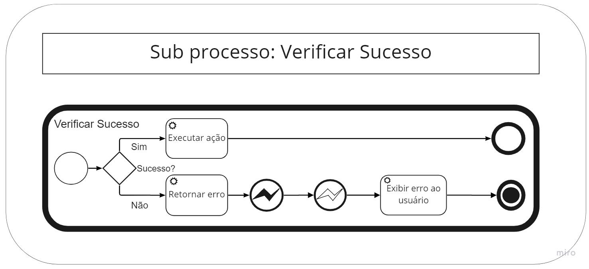
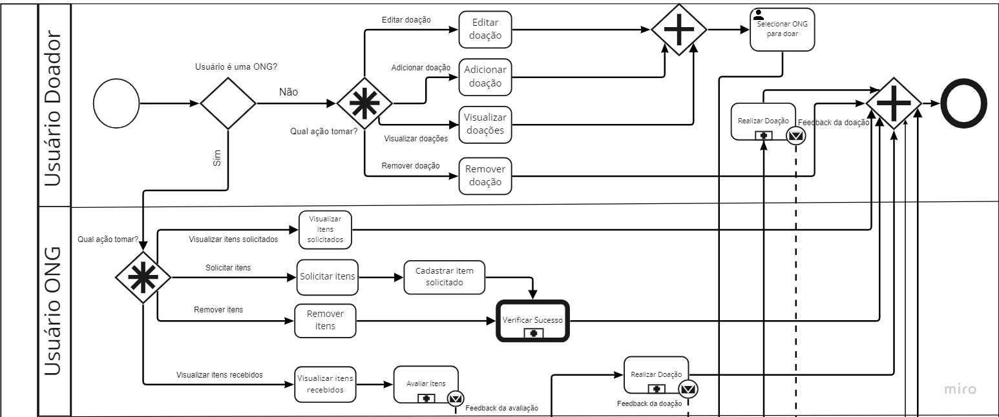
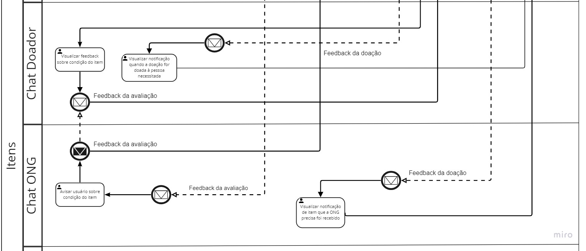
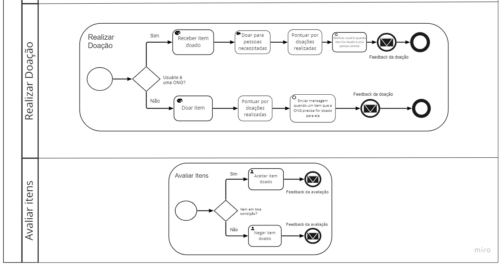

# 1.1. Módulo Projeto Não Orientado a Abordagens Específicas

| Versão | Alterações                                                                                                                           | Responsável                                                                                                             |
| ------ | ------------------------------------------------------------------------------------------------------------------------------------ | ----------------------------------------------------------------------------------------------------------------------- |
| 0.1    | Adicionado os tópicos 1.1.1, 1.1.2, 1.1.3, 1.1.3.1, 1.1.3.2                                                                          | Cibele Goudinho                                                                                                         |
| 0.2    | Adicionado os tópicos 1.1.3.3, 1.1.3.4, 1.1.3.5 e Referências; Correções gramaticais                                                 | Victor Buendia                                                                                                          |
| 0.3    | Alterado texto no tópico 1.1.1, 1.1.3.1, 1.1.3.2, adicionado imagens no tópico 1.1.3.1 e Referências                                 | Cibele Goudinho                                                                                                         |
| 0.4    | Confecção rich picture                                                                                                               | Antônio Neto, Carlos Rafael, Cibele Goudinho, , Luiz Henrique, Savio Cunha, Victor Eduardo, Victor Buendia, Yan Andrade |
| 0.5    | Registro rich picture nos tópicos 1.1.3.2 e 1.1.3.3 e adicionado apêndice                                                            | Luiz Henrique, Cibele Goudinho                                                                                          |
| 0.6    | Adicionando versão final do Rich Picture                                                                                             | Yan Andrade                                                                                                             |
| 0.7    | Colocado númeração em referências e apêndice, alterado texto no tópico 1.1.1, adicionado informação sobre apêndice no tópico 1.1.3.1, adicionado tópico 1.1.4 e imagens nesse tópico | Cibele Goudinho                                                                                                         |

## 1.1.1.  Introdução

O **Design Sprint** é uma metodologia desenvolvida pela Google Ventures, principalemente para facilitar o processo inicial de um projeto, ao invés de focar em um MVP (Minimum Viable Product) para escolher a ideia a ser trabalhada, o Design Sprint foca especificamente na validação da ideia com usuários e encurta o tempo necessário para essa fase do desenvolvimento. A metodologia visa construir uma visão de um projeto de maneira mais detalhada e auxiliar na compreensão do produto a ser alcançado. No contexto da disciplina de _Arquitetura e Desenho de Software_, o Design Sprint será usado com o intuito de desenvolver um produto de software. A metodologia reune os envolvidos no trabalho para atuar na construção, ideação e planejamento do projeto, podendo ter diversas fases de desenvolvimento, as quais podem ser adaptadas a cada projeto dependendo do escopo e do que melhor se encaixa para a equipe em questão.

Essa metodologia é dividida principalmente em cinco fases, sendo elas: *Unpack, Sketch, Decide, Prototype e Test*. As quais podem ser realizadas em um período de uma sprint, tendo um dia para cada fase, porém o tempo dedicado a cada fase pode ser adaptado as necessidades do time e o que melhor se encaixa para ele, o importante é que cada fase seja bem detalhada e que a equipe não tenha mais nenhuma dúvida em relação as atividades desenvolvidas em cada parte.

### Unpack
Nessa primeira fase para a equipe pensar no projeto a ser realizado, levantar problemas, trazer ideias. Nessa estapa o grupo pode utilizar de artefatos, como **Brainstorm** ou **Mapa Mental**, para levantar possíveis problemas e posteriormente discutir sobre eles e quail será o que a equipe irá focar.

### Sketch
Na segunda fase, o problema decidido na fase anterior é trabalhado, a equipe individualmente pensa sobre soluções e gera ideias plausíveis que poderam desenvolver para resolver o problema escolhido. Como no Unpack pode-se utilizar artefatos coomo **Brainstorm** ou **Mapa Mental**.

### Decide
Na terceira fase será dado continuidade ao Sketch e as ideias levantadas serão filtradas e refinadas para melhor se adaptarem ao que a equipe busca desenvolver como solução final do problema levantado na fase 1. Também há a criação do backlog e requisitos do produto a ser criado. Aqui usa-se artefatos como **Storyboard** para visualização da ideia em um cotidiano do usuário.

### Prototype
Nessa fase deve-se criar um protótipo para o projeto e definir prioridades, prazos de cada tarefa definida e responsabilidades de cada membro. É importante que o protótipo final seja de média para alta fidelidade, pois ajuda durante a fase de teste, trazendo uma imagem sólida do produto ao usuário final possibilitando um feedback mais realista e facilita a realizar os ajustes necessários. Além de que permite uma melhor visulização da ideia e assim diminui o tempo durante o desenvolvimento, já que a imagem do que seria o projeto já está construida.

### Test
A validação é a parte em que testes serão realizados. O prótotipo é apresentado para um grupo de teste, buscando receber feedbacks, possibilidades de melhoria e também possibilitar a interação do usário com o produto. Além disso, nessa atividade também se registra as conclusões das atividades anteriores e dos testes que foram realizados.

## 1.1.2. Porque vamos usar o Design Sprint

Escolhemos essa metodologia porque traz agilidade no ponto inicial do projeto, visto que possui etapas bem definidas com prazos para conclusão e possibilita o desenvolvimento rápido desde a decisão de tema do projeto ao protótipo. Além disso, é uma abordagem sistemática com baixa complexidade que facilita a curva de aprendizado e também a adaptação para dentro do escopo do projeto caso necessário. Ela também possibilita um melhor alinhamento entre a equipe, uma vez que todos os integrantes tem conhecimento acerca da base do projeto e dos requisitos a serem elaborados, facilitando o desenvolvimento posteriormente. E por fim, a maior parte dos integrantes do grupo já possuia contato com a metodologia, assim utilizá-la foi conveniente por trazer familiaridade aos integrantes em relação aos prazos estabelecidos para entrega e o ritmo do processo.

## 1.1.3. Fases

Como citado anteriormente, o Design Sprint tem atividades sistematizadas e que precisam ser seguidas com certo rigor para o sucesso do processo. Normalmente, utilizam-se cinco dias para percorrer todas as fases. Contudo, buscando adequar-se ao cronograma da disciplina e encontrar horários em comum para o trabalho colaborativo entre os integrantes, decidimos adaptar as atividades em 5 fases as quais seriam realizadas idealmente em três dias.

### 1.1.3.1. Fase 1 - Unpack

Nessa fase buscamos definir qual o problema que iriamos resolver, levantando por meio de um **Brainstorm**, com participação de todos os integrantes, ideias acerca do tema do projeto. Utilizamos o **Mapa Mental** como ferramenta de apoio para documentar os resultados do Brainstorm da equipe.

Em seguida, debatemos os aspectos da solução computacional desejada, no intuito de ter um levantamento bem razoável do problema que queríamos atingir para desenhar o escopo dessa solução. Para isso, fizemos uso dos artefatos **Ishikawa** e **5H2W**. Dessa forma aqui já obtemos uma ideia inicial do que será realizado, suas causas e informações relevantes, como o que será (aplicação web), por que está sendo criado, como será realizado, dentre outras informações levantadas durante o 5H2W.

### Brainstorm

*Imagem 1: Brainstorm*

### Ishikawa - Visão Geral

*Imagem 2: Ishikawa - Visão geral*
*Detalhes no apêndice (clique na imagem para ir até lá)*

### 5W2H - Visão geral
De acordo com Silva (2009), O método **5W2H** é uma ferramenta muito utilizada para realizar o plano de ação e colocar em prática as alternativas de soluções encontradas, bem como forma de padronizar procedimentos. O nome **5W2H** vem das palavras em inglês: What? Why? Who? Where? When? How? e How much?, que significam respectivamente: O que?, Por quê?, Quem?, Onde?, Quando?, Como? E Quanto custa?. Respondendo a essas perguntas se estará planejando as ações de melhoria ou padronizando processos de forma organizada, garantindo que a execução das atividades aconteça da forma planejada.

Nós utilizamos do método **5W2H** com a finalidade de trazer mais clareza e objetividade das atividades planejadas para todos os membros do grupo, assim auxiliando a contrução de um produto com maior qualidade. Os resultados da aplicação da metodologia podem ser vistos na imagem abaixo. 

*Imagem 10: 5W2H - Visão geral*
*Detalhes no apêndice*

### 1.1.3.2. Fase 2 - Sketch

No Sketch, buscamos detalhar ainda mais a ideia escolhida na fase anterior e optamos pelo uso do artefato **Rich Picture**, pois assim poderiamos obter vários diagramas na visão de cada indivíduo sobre o escopo de atuação da aplicação web dentro de um contexto real. 
Uma imagem rich é uma ferramenta eficaz para analisar problemas e expressar ideias, ao desenvolver uma solução para um problema de negócios, é essencial entender os componentes vitais desse problema, O Rich Picture pode ajudar a identificar pontos como:

- Processos de negócios e seus requisitos de dados;
- Os atores envolvidos nos processos e suas responsabilidades;
- As relações entre processos e atores;
- Problemas e conflitos potenciais.

### Rich Picture - Antônio Neto

*Imagem 13: Rich Picture Antônio Neto*
*Autor: Antônio Neto*

### Rich Picture - Carlos Rafael

*Imagem 14: Rich Picture Carlos Rafael*
*Autor: Carlos Rafael*

### Rich Picture - Cibele Goudinho

*Imagem 15: Rich Picture Cibele Goudinho*
*Autor: Cibele Goudinho*

### Rich Picture - Luiz Henrique

*Imagem 16: Rich Picture Luiz Henrique*
*Autor: Luiz Henrique*

### Rich Picture - Savio Cunha

*Imagem 17: Rich Picture Savio Cunha*
*Autor: Savio Cunha*

### Rich Picture - Victor Buendia

*Imagem 18: Rich Picture Victor Buendia*
*Autor: Victor Buendia*

### Rich Picture - Victor Eduardo

*Imagem 19: Rich Picture Victor Eduardo*
*Autor: Victor Eduardo*

### Rich Picture - Yan Andrade

*Imagem 20: Rich Picture Yan Andrade*
*Autor: Yan Andrade*

### 1.1.3.3. Fase 3 - Decision

Nesta fase, o intuito é realizar uma votação dos Rich Pictures construídos na etapa anterior para decidirmos em grupo qual Rich Picture reflete mais o funcionamento da aplicação web pretendida em um contexto real. A partir desta escolha, realiza-se incrementos convenientes ao Rich Picture escolhido para torná-lo mais completo, em concordância com a visão de produto concebida pela equipe.

Em seguida, utilizamos o **Storyboard** como um artefato para criar uma sequência de ilustrações que representem estados de interface e momentos de interação do usuário com o sistema que está sendo idealizado. É uma ferramenta que não consome muito tempo, mas traduz a visão do produto em um aspecto imagético que facilita a interpretação de seu contexto.

Além disso, nessa fase foi realizada a Elicitação dos Requisitos para construir o Backlog do Produto. A estratégia para isso foi novamente o Brainstorm, tendo em vista que o grupo já possuía artefatos que delimitavam bem o escopo e visão do produto (5H2W, Ishikawa, Rich Picture e Storyboard). Assim, com apoio do que já havia sido construído, os requisitos funcionais e não funcionais foram levantados nessa fase.

Com uma primeira versão dos requisitos do produto em mãos, foi realizada já a ordenação dos níveis de abstração dos requisitos em Tema, Épicos, Features, Histórias de Usuário e Critérios de Aceitação.

### Rich Picture versão final

*Imagem 21: Rich Picture Geral*
*Autor: Yan Andrade*

### 1.1.3.4. Fase 4 - Prototype

Na penúltima fase, o foco foi voltado para a prototipação em alta fidelidade da proposta de produto. Aqui fizemos uso do _realistic looking_ na aplicação por meio da construção do protótipo, uma vez que é ele que irá dar suporte para a próxima fase de validação do produto.
[foto do protótipo e legenda]

Além do protótipo, na Fase 4 também construímos importantes artefatos para desenhar nosso software, como: Léxico para esclarecer os termos que usaremos na aplicação e quais as noções e impactos eles possuem em contextos reais; Aprimoramento do Backlog do Produto com a priorização MoSCoW e elaboração da rastreabilidade dos requisitos; Gerenciamento de custos, tempo e riscos do projeto para ajudar no planejamento da execução do time; e a Modelagem BPMN para construir os rituais e organização da forma de trabalho da equipe durante seu desenvolvimento.
[foto de tudo e legenda]

### 1.1.3.5. Fase 5 - Validate
[escrever quando executarmos]

# 1.1.4. BPMN

A modelagem BPMN (Bussiness Process Modeling Notation) é uma notação gráfica, padrão OMG (https://www.omg.org), que tem como objetivo fornecer recursos e elementos para modelar (desenhar) os processos de negócio. Nessa modelagem utilizamos algumas estruturas que com seus elementos definem cada processo de negócio na forma de um diagrama, assim é possível identificar o responsável por cada atividade.

A piscina é um contêiner de um processo de negócio específico. Cada piscina tem o seu próprio processo, se ele depender de outros, deve ser apontado em uma nova piscina . As raias são as subdivisões que determinam os responsáveis pelas tarefas na parte da piscina em que ela está localizada, podem ser pessoas ou departamentos. 

Os eventos, que são representados por círculos, definem algum episódio do processo, esses eventos influenciam o fluxo do processo e geralmente o seu início tem uma causa. 
As atividades, são representadas por retângulos, e descrevem o tipo de trabalho que deve ser feito e pode apresentar uma ou mais tarefas, os tipos são processos, subprocessos e tarefas. E por fim, os desvios (gateways), representados por losangos que são utilizados nas tomadas de decisões ou para tratar divergências do fluxo (as linhas com setas) que são usadas para relacionar os elementos.

No nosso caso, separamos cada piscina com base nos nossos requisitos, cada piscina é um épico e assim, agrupamos as atividades e eventos relacionados. Nas raias , em algumas fizemos adaptações das features e outras, como na piscina de interação de usuários (imagem 23) e na de itens (imagem 24), usamos as raias para agrupar funcionalidades específicas que não estavam na mesma feature ou nem mesmo eram uma feature. 

Os eventos que mais utilizamos foram o de mensagem e erro, o de mensagem indica que para que o fluxo continue uma mensagem será enviada ou recebida para um participante, o envelope mais claro representa o recebimento e o mais escuro o envio. Sobre os subprocessos, foi criado um reutilizável para tratar os erros, uma vez que ele era utilizado em todo o diagrama e sendo a mesma atividade, também optamos por colocar os sub processos no diagrama de itens para facilitar a visualização. E sobre os gateways, decidimos usar os complexos no diagrama de itens e no interação de usuário.
No diagrama de itens:
- na parte do usuário doador: é possível visualizar e editar as doações ou visualizar e remover mas todas as outras ações são exclusivas, não se encaixando para nenhum dos outros gateways
- na parte do usuário ONG: é possível visualizar itens solicitados e remover itens mas as outras ações são exclusivas, também colocamos um gateway paralelo convergente após três ações por que elas levam a uma mesma atividade que é selecionar o doador. 
No diagrama de interação de usuário, as mensagens e feedbacks podem ser realizadas ao mesmo tempo mas as outras atividades são exclusivas, sendo assim ele não se encaixa em nenhum dos outros gateways.

## Cadastro

*Imagem 22: BPMN - Cadastro*

## Interação usuário

*Imagem 23: BPMN - Interação usuário*

## Itens - Visão geral

*Imagem 24: BPMN - Itens*
*Detalhes no apêndice*

## Sub processo reutilizável: Verificar Sucesso 

*Imagem 24: BPMN - Verificar Sucesso*

# 1.1.5. Apêndice

### Ishikawa - Mão de obra

*Imagem 3: Ishikawa - Mão de obra*

### Ishikawa - Meio ambiente

*Imagem 5: Ishikawa - Meio ambiente*

### Ishikawa - Materiais

*Imagem 6: Ishikawa - Materiais*

### Ishikawa - Métodos

*Imagem 7: Ishikawa - Métodos*

### Ishikawa - Medição

*Imagem 8: Ishikawa - Medição*

### Ishikawa - Máquina

*Imagem 9: Ishikawa - Máquina*

### 5W2H - O que? Por que? Onde? Quando?

*Imagem 11: 5H2W - O que? Por que? Onde? Quando?*

### 5W2H - Quem? Como? Quanto?

*Imagem 12: 5H2W - Quem? Como? Quanto?*

### Itens - Visão ampliada

*Imagem 25: BPMN - Itens - visão ampliada*

### Itens - Visão ampliada chat

*Imagem 26: BPMN - Itens - chat*

### Itens - Visão ampliada sub processos

*Imagem 27: BPMN - Itens - sub processos*

# 1.1.6. Referências

- LEONARDO, Alonso; DINA, Lais Leal. [Storyboarding e Prototipação](https://www.professores.uff.br/screspo/wp-content/uploads/sites/127/2017/09/artigoIHC3.pdf). Instituto de Ciencia e Tecnologia da Universidade Federal Fluminense. Rio das Ostras, RJ.
- Introducing Rich Pictures. Disponível em: https://aprender3.unb.br/mod/resource/view.php?id=597193. Acesso em: 14 de Junho de 2022.
- Design sprint no desenvolvimento de software. Disponível em: https://ateliware.com/blog/design-sprint-no-desenvolvimento-de-softwares?gclid=CjwKCAjw77WVBhBuEiwAJ-YoJNBJJdqCENUOHQyqd1JGtYop12UygUaiqFYZXdDWbXZvnxjTlvqzTRoCEvoQAvD_BwE. Acesso em 18 jun 2022.
- Design Sprint - Google Ventures. Disponível em : https://www.gv.com/sprint/. Acesso em 19 jun 2022.
- Google Design Sprint: como funciona e como aplicar no seu projeto. Disponível em: https://brasil.uxdesign.cc/google-design-sprint-como-funciona-e-como-aplicar-no-seu-projeto-279107363659. Acesso em 19 jun 2022.
- Design Sprint. Disponível em: https://www.meupositivo.com.br/panoramapositivo/design-sprint/. Acesso em 20 jun 2022.
- SILVA, Glauco Garcia Martins Pereira. Implantando a manufatura enxuta: um método estruturado. Florianópolis: UFSC 2009. 157 p. Dissertação (Mestrado)- Programa de Pós-Graduação em Engenharia de Produção, Universidade Federal de Santa Catarina, Florianópolis, 2009.
- Modelagem de processos com BPMN. Disponível em: https://www2.tce.pe.gov.br/eproc/images/treinamentos/ModelagemdeProcessoscomBPMN.pdf. Acesso em 21 jun 2022.
- Noção BPMN. Disponível em: https://www.sydle.com/br/blog/notacao-bpmn-5ef510823130175de40cc4c2/. Acesso em 21 jun 2022.   
- Modelagem BPMN. Disponível em: https://aprender3.unb.br/pluginfile.php/2083401/mod_label/intro/Arquitetura%20e%20Desenho%20de%20software%20-%20Aula%20BPMN%20Exemplos%20-%20Profa.%20Milene.pdf. Acesso em 24 jun 2022.
- Um guia para iniciar estudos em bpmn e atividades e sequencia. Disponível em: http://blog.iprocess.com.br/2012/11/um-guia-para-iniciar-estudos-em-bpmn-i-atividades-e-sequencia/. Acesso em 24 jun 2022.

<!-- Estudar o domínio de aplicações similares, e realizar Design Sprint para levantamento dos principais artefatos e requisitos.

Foco_1: Técnicas de Elicitação, Artefatos Independentes de Metodologia e Esboço da Baseline de Requisitos (Priorizada)

Entrega Mínina: Design Sprint, 5W2H, Mapa Mental, Diagrama Causa-Efeito, Rich Picture, Léxico (ou Glossário) e Planos de Risco, Custo e Tempo.

Apresentação (em sala) explicando passo a passo a Design Sprint realizada, com: (i) rastro claro aos membros participantes; (ii) justificativas & senso crítico sobre o trabalho realizado; (iii) breve apresentação dos artefatos
elaborados, e (iv) comentários gerais sobre iniciativas extras. Tempo da Apresentação: +/- 10min. Recomendação: Apresentar diretamente via Wiki ou GitPages do Projeto.

A Wiki ou GitPages do Projeto deve conter um tópico dedicado ao Módulo Projeto Não Orientado a Abordagens Específicas, com artefatos, histórico de versões, referências, e demais detalhamentos gerados pela equipe nesse escopo.

Demais orientações disponíveis nas Diretrizes (vide Moodle). -->
