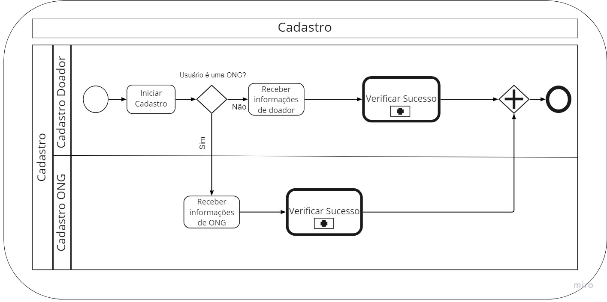
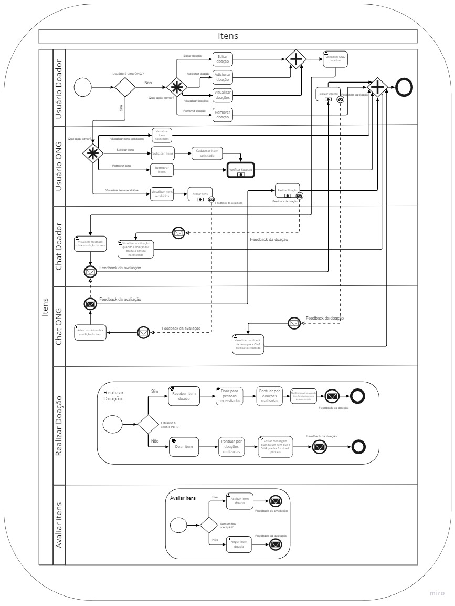

# 1.2. Módulo Processos/Metodologias/Abordagens

| Versão | Alterações                                                                                                                           | Responsável                                                                                                             |
| ------ | ------------------------------------------------------------------------------------------------------------------------------------ | ----------------------------------------------------------------------------------------------------------------------- |
| 0.1    | Adicionado os tópicos 1.2.1, 1.2.2 e 1.2.4                                  | Cibele Goudinho e Isadora Soares                                                                                                         |
| 0.2    | Adicionado o tópico 1.2.3 e alterando 1.2.4                                  | Isadora Soares 

## 1.2.1. BPMN

A modelagem BPMN (Bussiness Process Modeling Notation) é uma notação gráfica, padrão OMG (https://www.omg.org), que tem como objetivo fornecer recursos e elementos para modelar (desenhar) os processos de negócio. Nessa modelagem utilizamos algumas estruturas que com seus elementos definem cada processo de negócio na forma de um diagrama, assim é possível identificar o responsável por cada atividade.

A piscina é um contêiner de um processo de negócio específico. Cada piscina tem o seu próprio processo, se ele depender de outros, deve ser apontado em uma nova piscina . As raias são as subdivisões que determinam os responsáveis pelas tarefas na parte da piscina em que ela está localizada, podem ser pessoas ou departamentos. 

Os eventos, que são representados por círculos, definem algum episódio do processo, esses eventos influenciam o fluxo do processo e geralmente o seu início tem uma causa. 
As atividades, são representadas por retângulos, e descrevem o tipo de trabalho que deve ser feito e pode apresentar uma ou mais tarefas, os tipos são processos, subprocessos e tarefas. E por fim, os desvios (gateways), representados por losangos que são utilizados nas tomadas de decisões ou para tratar divergências do fluxo (as linhas com setas) que são usadas para relacionar os elementos.

No nosso caso, separamos cada piscina com base nos nossos requisitos, cada piscina é um épico e assim, agrupamos as atividades e eventos relacionados. Nas raias , em algumas fizemos adaptações das features e outras, como na piscina de interação de usuários (imagem 2) e na de itens (imagem 3), usamos as raias para agrupar funcionalidades específicas que não estavam na mesma feature ou nem mesmo eram uma feature. 

Os eventos que mais utilizamos foram o de mensagem e erro, o de mensagem indica que para que o fluxo continue uma mensagem será enviada ou recebida para um participante, o envelope mais claro representa o recebimento e o mais escuro o envio. Sobre os subprocessos, foi criado um reutilizável para tratar os erros, uma vez que ele era utilizado em todo o diagrama e sendo a mesma atividade, também optamos por colocar os sub processos no diagrama de itens para facilitar a visualização. E sobre os gateways, decidimos usar os complexos no diagrama de itens e no interação de usuário.
No diagrama de itens:
- na parte do usuário doador: é possível visualizar e editar as doações ou visualizar e remover mas todas as outras ações são exclusivas, não se encaixando para nenhum dos outros gateways
- na parte do usuário ONG: é possível visualizar itens solicitados e remover itens mas as outras ações são exclusivas, também colocamos um gateway paralelo convergente após três ações por que elas levam a uma mesma atividade que é selecionar o doador. 
No diagrama de interação de usuário, as mensagens e feedbacks podem ser realizadas ao mesmo tempo mas as outras atividades são exclusivas, sendo assim ele não se encaixa em nenhum dos outros gateways.

## Cadastro

*Imagem 1: BPMN - Cadastro*

## Interação usuário

*Imagem 2: BPMN - Interação usuário*

## Itens - Visão geral

*Imagem 3: BPMN - Itens*
*Detalhes no apêndice*

## Sub processo reutilizável: Verificar Sucesso 

*Imagem 4: BPMN - Verificar Sucesso*

## 1.2.2. Apêndice

### Itens - Visão ampliada

*Imagem 26: BPMN - Itens - visão ampliada*

### Itens - Visão ampliada chat

*Imagem 27: BPMN - Itens - chat*

### Itens - Visão ampliada sub processos

*Imagem 28: BPMN - Itens - sub processos*

## 1.2.3. Metodologias Ágeis

Para o nosso projeto, decidimos usar 2 metodologias agéis para auxiliar na gestão e no planejamento do nosso produto final.
## SCRUM

O SCRUM é uma estrutura que auxilia as equipes no desenvolvimento do seu produto. A ideia é um conjunto de reuniões, ferramentas e cargos que juntos fazem com que a equipe se organize e gerencie o seu trabalho. Sobre o conjunto de reuniões:

- Sprint: É determinado pela equipe um período em que deve ser entregue uma quantidade específica de trabalho.
- Sprint Planning: É o planejamento do que deve estar pronto na próxima sprint e como esse trabalho deve ser feito.
- Daily: São reuniões rápidas que devem alinhar todos os integrantes com as suas metas ou impedimentos.
- Sprint Review: Ocorre ao final da sprint para mostrar tudo o que foi entregue e a equipe também recebe feedbacks.
- Sprint Retrospective: Serve para documentar e discutir o que deu certo e o que deu errado na sprint, no projeto ou até nos relacionamentos dentro da equipe para que possa ser melhorado nas próximas vezes.

Sobre os cargos:

- Product Owner: É o dono do produto, deve compreender o negócio, o cliente e o mercado. Eles que priorizam o trabalho que deve ser feito e geram o backlog.
- Scrum Master: É responsável por orientar, treinar, ensinar e auxiliar um Time Scrum e seus ambientes no entendimento e uso adequado do Scrum.
- Developer: Qualquer membro de um Time Scrum, que está comprometido em criar qualquer aspecto de um Incremento utilizável em cada Sprint.
## XP
A XP (eXtreme Programming) é uma metodologia que fornece, que te traz um conjunto de valores, princípios e práticas e geralmente é integrada com o Scrum, que é o nosso caso. Os seus valores e princípios básicos são o feedback, a simplicidade, a comunicação e a ideia de aceitar mudanças incrementais.
Das suas práticas, as que iremos utilizar são:

- Pair Programming: É a programação em dupla, geralmente com um que esta iniciando na linguagem e outro que ja possui mais experiência na área. A intenção é evitar e diminuir a possibilidade de erros ja que duas pessoas estão sempre revendo o código.
- Refactoring: É o processo de melhoria do código, evitando a duplicação e deixando-o da maneira mais clara para ser compreendida por outros desenvolvedores.

# 1.2.4. Referências

- Modelagem de processos com BPMN. Disponível em: https://www2.tce.pe.gov.br/eproc/images/treinamentos/ModelagemdeProcessoscomBPMN.pdf. Acesso em 21 jun 2022.
- Noção BPMN. Disponível em: https://www.sydle.com/br/blog/notacao-bpmn-5ef510823130175de40cc4c2/. Acesso em 21 jun 2022.   
- Modelagem BPMN. Disponível em: https://aprender3.unb.br/pluginfile.php/2083401/mod_label/intro/Arquitetura%20e%20Desenho%20de%20software%20-%20Aula%20BPMN%20Exemplos%20-%20Profa.%20Milene.pdf. Acesso em 24 jun 2022.
- Um guia para iniciar estudos em bpmn e atividades e sequencia. Disponível em: http://blog.iprocess.com.br/2012/11/um-guia-para-iniciar-estudos-em-bpmn-i-atividades-e-sequencia/. Acesso em 24 jun 2022.
- Guia Simplificado de Boas Práticas em
Modelagem de Processos com BPMN. Disponível em: https://www.ufmg.br/dti/wp-content/uploads/2019/01/POP-0001-ANEXO-A-Guia-simplificado-de-boas-praticas-em-modelagem.pdf. Acesso em 25 jun 2022.
- Elementos de BPMN: o que são Swimlanes, Pools e Lanes?. Disponível em: https://www.euax.com.br/2016/03/elementos-do-bpmn-o-que-sao-swimlanes/. Acesso em 25 jun 2022.
- Scrum - Saiba como usar o Scrum da melhor forma. Disponível em: https://www.atlassian.com/br/agile/scrum. Acesso em 26 jun 2022.
- Agile Development: XP e Scrum em uma Abordagem Comparativa. Disponível em: https://www.devmedia.com.br/agile-development-xp-e-scrum-em-uma-abordagem-comparativa/30808. Acesso em 26 jun 2022.