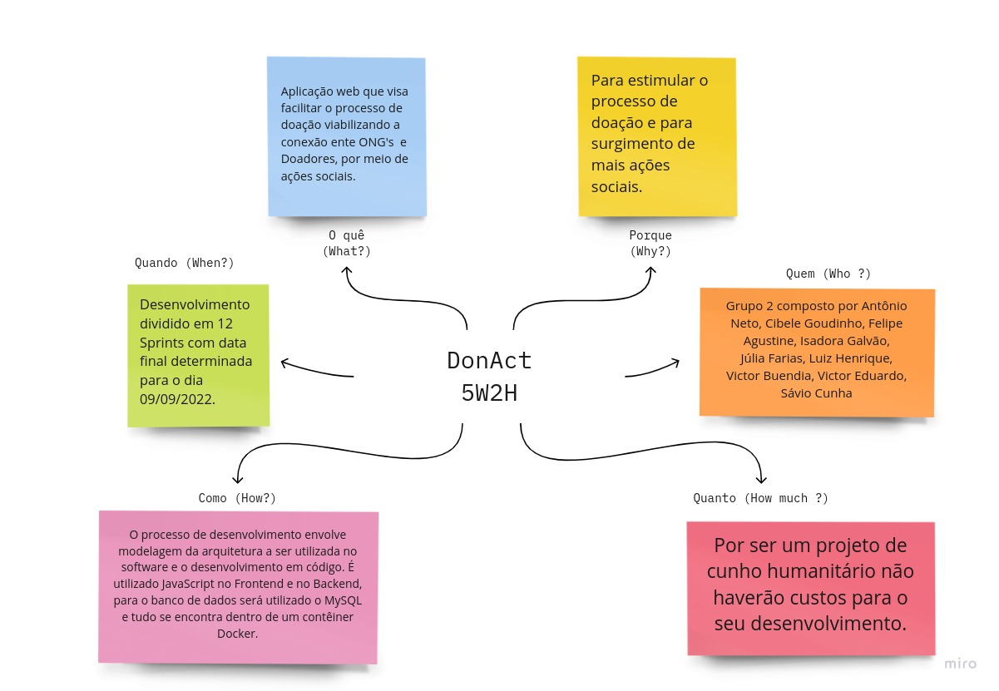
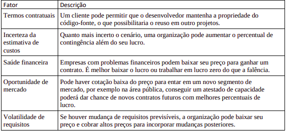

# 1.3. Iniciativas Extras - Base

## Versionamento

| Versão | Alterações  | Responsável |                              
| ------ | ------- | --------------- |
| 0.1.0  | Criação do documento | Yan Andrade |
| 0.2.0  | Adição do Manual de Identidade Visual | Yan Andrade |
| 0.3.0  | Realização de pequenas alterações no Manual e adição da introdução | Yan Andrade |
| 0.4.0  | Padronização página | Luiz Henrique |
| 0.5.0  | Novo 5W2H e Acréscimo na estimativa de custos | Júlia Farias|

## Manual de Identidade Visual

&emsp;&emsp;Um Manual de Identidade Visual é um documento que serve para designers e o público geral orientar-se através do mesmo na criação e aplicação da marca auxiliando, assim, na construção da reputação e da presença de marca, valorizando os serviços e produtos da empresa ou cliente.

<embed src="./imgs/Manual_de_Identidade_Visual.pdf" width="800px" height="500px" />

## Novo 5W2H

&emsp;&emsp; Analisando o 5W2H feito pela equipe previamente, foi percebido que ele focava nas perguntas relacionadas ao produto, portanto foi acrescentado o 5W2H relacionado ao desenvolvimento do projeto em que as perguntas são feitas direcionadas à equipe e como ela se comporta diante da criação do produto até a sua entrega.

  

## Acréscimo na estimativa de custos

&emsp;&emsp; O processo de precificação do software depende não só da mão de obra e dos serviços planejados para serem utilizados durante o projeto, depende também de interferências externas ao projeto. Segundo o (Sommerville 2019) devemos levar em consideração aspectos
organizacionais, econômicos, políticos e comerciais, além daqueles mostrados na Tabela
1. Possíveis riscos podem alterar o preço do software, seja para cima ou para baixo. Além
disso, devemos levar em consideração que, a decisão sobre o preço do projeto deve ser 
realizada em grupo, envolvendo as equipes de marketing e vendas, e demais gerências
envolvidas na concepção do software.

  
 
## Referências

- How to create a visual style guide for your brand - https://www.canva.com/learn/your-brand-needs-a-visual-style-guide/?irgwc=1&utm_medium=affiliate&utm_source=YieldKit%20GmbH&clickId=WLM3CkXQgxyOUZx0TBXEURvnUkiVQyx:9xIDQs0 Acesso em: 22 de Junho de 20222.

- Sommerville, Ian (2019). Engenharia de Software. 10. ed. Pearson Education.