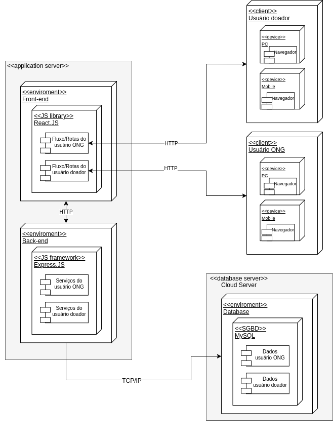

# 2.2.1. Notação UML – Diagramas Estáticos

## Versionamento
| Versão | Alterações                                                                    | Responsável                   | Data       |
| ------ | ----------------------------------------------------------------------------- | ----------------------------- | ---------- |
| 0.1    | Adicionado o diagrama de classes e introdução                                 | Yan Andrade                   | 08/07/2022 |
| 0.2    | Ajustes na sidebar com os tópicos                                             | Victor Buendia                | 08/07/2022 |
| 0.3    | Adicionando diagrama de Implantação                                           | Antonio Neto                  | 10/07/2022 |
| 0.4    | Alterando diagrama de classes com base na validação do Felipe Agustini        | Yan Andrade e Felipe Agustini | 11/07/2022 |
| 0.5    | Adicionando versão 2.0 do diagrama de Implantação                             | Antonio Neto                  | 14/07/2022 |
| 0.6    | Adicionando explicação do diagrama de Classes e alterando diagrama de classes | Yan Andrade e Felipe Agustini | 15/07/2022 |
| 0.7    | Adicionando diagrama de componentes                                           | Isadora Soares                | 15/07/2022 |
| 0.8    | Detalhando a criação do Diagrama de Implantação                               | Victor Buendia                | 15/07/2022 |

## 2.2.1.1. Diagrama de Classes

### 2.2.1.1.1. Introdução

Um diagrama de classes é um diagrama estático da UML que reúne os elementos mais importantes de um sistema orientado a objetos. Nele são exibidos um conjunto de classes, interfaces e seus relacionamentos. As classes especificam tanto as propriedades quanto os comportamentos dos objetos. O diagrama de classes surgiu com o objetivo de reunir as "melhores práticas de engenharia" que provaram ter sucesso em modelar sistemas complexos na época.

O nosso diagrama de classes aborda vários conceitos da Orientação à Objetos, como a utilização de herança, interface e polimorfismo. Como podemos obsevar a seguir:

    <i>Imagem 1: Diagrama de Classes</i>

Podemos ver a herança sendo utilizada para evitar a repetição de código, temos uma classe Usuário e ela vai ser herdada tanto por Doador como por Ong, por ter atributos em comum para ambas classes. Além disso, o conceito de interface também está sendo implementado 
também por Usuário, pela interface não possuir atributos e só ser composta da escrita de métodos, métodos esses que estão sendo sobrecarregados por ONG e Doador por utilizar atributos diferentes. Vale resaltar que, apesar de todos os métodos estarem públicos para serem acessados, precisarão de autenticação,  com execção do método de criarUsuario. 

## 2.2.1.1.2. Diagrama de Pacotes

## 2.2.1.1.3. Diagrama de Componentes
### 2.2.1.1.3.1. Introdução
O Diagrama de componentes é criado em UML e tem como função representar os componentes que pertencem a um sistema e como eles se comunicam entre si, para que assim possa ser criado de forma coesa. Com essas informações é possível obter uma visão geral do sistema e entender o comportamento exato do serviço fornecido pelo software em questão, além disso, por ser em UML, o diagrama faz a descrição de sistemas em qualquer linguagem de programação. 
 

Pode ser utilizado como forma de documentar como estão estruturados os arquivos físicos de um sistema, permitindo assim uma melhor compreensão do mesmo, além de facilitar a reutilização do código. 
 

Um componente é uma classe que representa uma parte modular do sistema, independente, que pode ser substituída no seu ambiente por outro componente compatível. Um componente tem seu comportamento definido pelas interfaces fornecidas e interfaces necessárias.
 

 Utilizando o software [Draw.io](https://app.diagrams.net/), foi realizado a confecção do diagrama, onde os componentes pertencentes ao sistema e suas comunicações foram baseadas no Product Backlog já confeccionado pela equipe.

    <i>Imagem: Diagrama de Componentes</i>

## 2.2.1.1.4. Diagrama de Implantação

### 2.2.1.1.4.1. Introdução
O Diagrama de Implantação é o diagrama com a visão mais física da UML. Ele foca na questão de organização da arquitetura física sob qual o software será implantado e executado em termos de hardware, ou seja, computadores pessoais e servidores que suportarão o sistema. 

### 2.2.1.1.4.2. Porque utilizamos
Utilizaremos o Diagrama de Implantação para explicar como essas máquinas estarão conectadas e por quais protocolos vão se comunicar e transmitir informações. O intuito é ter uma visão de implementação do software, facilitando no processo de desenvolvimento por conta da modelagem em nível arquitetural mais focada no hardware. 

### 2.2.1.1.4.3. Diagramas
A primeira versão desse diagrama se concentrou em um nível de desenvolvimento e tangibilizou uma implantação mais simples. Partindo dessa perspectiva, temos o servidor da aplicação englobando o ambiente do Front End, Back End e o Banco de Dados rodando localmente. Todos os ambientes estão dentro do container do Docker. O acesso é feito pelo protocolo HTTP a partir de navegadores, seja dentro de um PC ou de um Mobile.

    <i>Imagem 1: Diagrama de Implantação VERSÃO 1.0</i>

A segunda versão já possui um refinamento voltado para o ambiente em produção. Aqui, o Banco de Dados possui  um servidor próprio na nuvem. Também particularizamos os clientes para o Doador e para a ONG. Além disso, detalhamos mais os serviços dentro de cada servidor de aplicação.

Vale a pena destacar também as setas bidirecionais que indicam que as requisições são feitas dos dois servidores em produção.

    <i>Imagem 2: Diagrama de Implantação VERSÃO 2.0</i>

