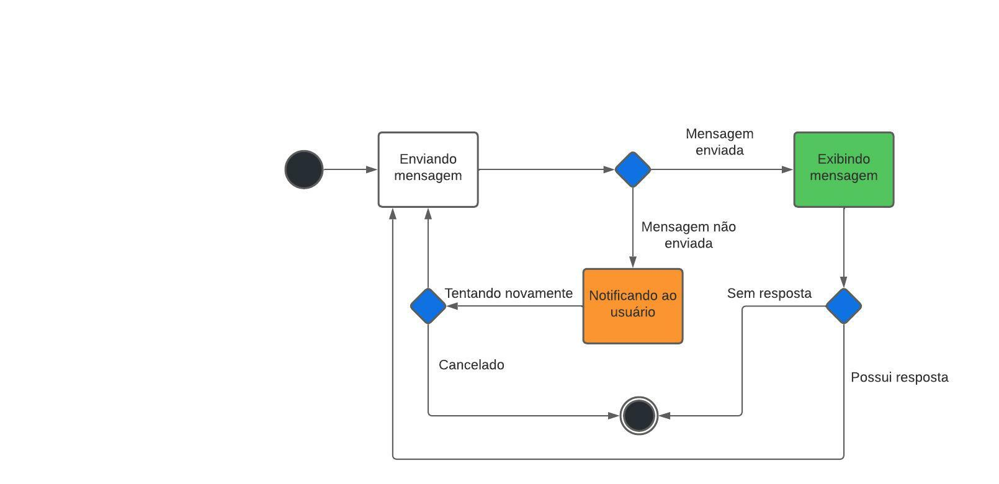

# 2.1.2. Notação UML – Diagramas Dinâmicos
## Versionamento
| Versão | Alterações                           | Responsável    | Data       |
| ------ | ------------------------------------ | -------------- | ---------- |
| 0.1    | Adicionado o Diagrama de Comunicação | Victor Eduardo | 25/06/2022 |
| 0.2    | Ajustes na sidebar com os tópicos    | Victor Buendia | 08/07/2022 |
| 0.3    | Criação do Diagrama de Atividades    | Victor Buendia | 11/07/2022 |
| 0.4    | Criação do Diagrama de Estados       | Cibele Goudinho | 11/07/2022 |

## 2.1.2.1 Introdução
### 2.1.2.1.1 Diagrama de Comunicação
#### 2.1.2.1.1.1 Definição
Um diagrama de comunicação, também chamado de diagrama de colaboração, é um tipo de diagrama UML de interação que demostra interações entre objetos e/ou partes, utilizando mensagens sequenciadas.
Os diagramas de comunicação são utilizados para mostrar como os objetos interagem para executar o comportamento de um caso de uso específico ou de parte de um caso de uso. Os diagramas de comunicação são utilizados para definir e esclarecer as funções dos objetos que executam um fluxo específico de eventos de um caso de uso.
Os seguintes nós e arestas são desenhados em um diagrama de comunicação UML: **frame** , **lifeline** e **message**.

##### 2.1.2.1.1.1.1 Frame (ou quadro)
Diagramas de comunicação são mostrados dentro de um quadro retangular com o nome em um compartimento no canto superior esquerdo.

##### 2.1.2.1.1.1.2 Lifeline (ou linha de vida)
Lifeline é uma especialização do elemento nomeado que representa um participante individual na interação. Embora as peças e os recursos estruturais possam ter multiplicidade maior que 1, as linhas de vida representam apenas uma entidade em interação.

##### 2.1.2.1.1.1.3 Message (ou mensagem)
A mensagem no diagrama de comunicação é mostrada com uma linha com expressão de sequência e uma seta acima da linha. A seta indica a direção da comunicação.

#### 2.1.2.1.1.2 Diagramas
Com base nos dois tipos de usuários do sistema, doador e ONG, foram construídos os diagramas abaixo contendo os fluxos deles, construídos utilizando-se a ferramenta on-line [LucidChart](https://www.lucidchart.com/pages/pt).

##### Diagrama Doador

_Imagem 1: Diagrama Comunicação - Doador_
##### Diagrama ONG

_Imagem 2: Diagrama Comunicação - ONG_

### 2.1.2.1.2 Diagrama de Atividades
O **Diagrama de Atividades** é mais um diagrama UML que é usado para a modelagem de software. Seu uso é focado na representação de um fluxo ou processo de execução em mais alto nível, evidenciando a interação entre o usuário e o sistema.

Os principais elementos desse diagrama são os retângulos, que representam as etapas do fluxo, e também os elementos de controle de execução, que podem ser de decisão, merge, fork e join.

A seguinte notação é utilizada na construção do Diagrama de Atividades:

Nó Inicial: É o nó que cria a ficha que dá início ao fluxo de execução. Não possui nenhuma condição de entrada.

  

_Imagem 3: Diagrama de Atividade - Nó Inicial_

Atividade: Possui um único fluxo de entrada e um único fluxo de saída. É executada quando a ficha passa por ela no fluxo de execução.

  

_Imagem 4: Diagrama de Atividade - Atividade_

Decisão: Possui um único fluxo de entrada e possui dois  ou mais fluxos de saída. A ficha sai apenas pelo fluxo de saída que possui a condição booleana verdadeira, chamada de guarda no contexto deste diagrama.

  

_Imagem 5: Diagrama de Atividade - Decisão_

Merge: Possui um ou mais fluxos de entrada, porém possui apenas um único fluxo de saída. É utilizado para unir fluxos de nós de Decisão.

  

_Imagem 6: Diagrama de Atividade - Merge_

Fork: Cria uma thread de execução paralela. Possui um único fluxo de entrada e múltiplos fluxos de saída. Multiplica a ficha de execução do fluxo para que todas os fluxos de saída sejam executados simultaneamente.

  

_Imagem 7: Diagrama de Atividade - Fork_

Join: Transforma vários fluxos de execução em um único. Possui vários fluxos de entrada e um único fluxo de saída. Absorve todas as fichas das threads e transforma-a em apenas uma ficha que é enviada para o fluxo de saída.

  

_Imagem 8: Diagrama de Atividade - Join_

Nó Final: Encerra a execução do Diagrama de Atividades ao receber a ficha. Possui um ou mais fluxos de entrada, mas não possui fluxos de saída.

  

_Imagem 9: Diagrama de Atividade - Nó Final_

Com essa notação em mente, e considerando que os Diagramas UML Dinâmicos são úteis em representar aspectos particulares do funcionamento da nossa aplicação, nós selecionamos os seguintes aspectos para esclarecer dentro das nossas especificações de software:

### 2.1.2.1.2.1 Diagramação para ONG

#### Avaliar Doação

Esse diagrama ilustra como é o processo de avaliar uma doação, partindo da perspectiva da ONG. O fluxo é relativamente simples e apresenta um comportamento sequencial, sem divisão de fluxo. Aqui evidencia-se a **US13** do nosso Backlog do Produto. A avaliação pode ser feita para doações aceitas que não tiveram um feedback atribuído na hora do aceite.

  

_Imagem 10: Diagrama de Avaliar Doação_

#### Aceitar Doação

Esse diagrama ilustra como é o processo de aceitar uma doação, partindo da perspectiva da ONG. Uma particularidade do fluxo de aceitar doação é que ela pode ser aceita ou não. Cada um desses fluxos apresenta sua execução particular, como por exemplo:
- Se a doação for rejeitada, um feedback para o doador é obrigatório.
- Se a doação for aceita, o feedback é opcional. Além disso, uma thread de execução concorrencial é aberta com o fork para pontuar o usuário pela doação e atualizar o status de doação da ONG.

Aqui evidencia-se a **US12, US14, US17, US24** do nosso Backlog do Produto.

  

_Imagem 11: Diagrama de Aceitar Doação_

#### Criar Ação Social

Esse diagrama ilustra como é o processo de criar uma ação social para inserir itens que a ONG está precisando para uma ação solidária, partindo da perspectiva da ONG. O fluxo também é relativamente simples e apresenta um comportamento sequencial, sem divisão de fluxo. Aqui evidencia-se a **US21** do nosso Backlog do Produto, que compreende apenas a criação de uma ação social. As *US20, US22* para remover e editar uma ação social, respectivamente, não foram consideradas úteis para a modelagem a nível de atividades, por apresentar um comportamento também linear e similar ao diagrama exibido abaixo.

  

_Imagem 12: Diagrama de Criar Ação Social_

#### Lista de Desejo

  

_Imagem 13: Lista de Desejo_

#### Doar Itens

  

_Imagem 13: Doar Itens_

### 2.1.2.1.2.2 Diagramação para Doador

#### Realizar Doação

  

_Imagem 14: Realizar Doação_

#### Chat com ONG

  

_Imagem 15: Chat com ONG_

### 2.1.2.1.2.3 Diagramação não Específico

#### Cadastro

  

_Imagem 16: Cadastro_

#### Login

  

_Imagem 17: Login_

### 2.1.2.1.3 Diagrama de Estados
O **Diagrama de Estados** é um diagrama UML que possibilita a visualização de diferentes estados de um objeto, ou seja, visualizar diferentes combinações de informações que esse objeto pode conter. 
Com base nos diferentes estados de cada fluxo realizado pela aplicação, foram construídos os diagramas abaixo contendo a visualização destes, construídos utilizando-se a ferramenta on-line [LucidChart](https://lucid.app/lucidchart/29cc2366-f737-4152-bc40-0e0a8d46b993/edit?viewport_loc=-308%2C-143%2C2694%2C1024%2CxHQx2_.IXBYI&invitationId=inv_abddb82b-03fd-48e8-a88e-b03794cc475e#).

#### Diagrama de Estados Cadastro

_Imagem 18: Cadastro_

#### Diagrama de Estados Ações Sociais

_Imagem 19: ações Sociais_

#### Diagrama de Estados Mensagem

_Imagem 20: Mensagem_

#### Diagrama de Estados Doações

_Imagem 21: Doações_

### 2.1.2.1.4 Diagrama de Sequência

## 2.1.5. Referências

- SERRANO, Millene. 06b - VideoAula - DSW-Modelagem - Comunicacao. Aprender 3, 28 de julho de 2020. Acesso em: 02 de Julho de 2022.
- "What is a communication diagram?". Disponível em: <https://www.lucidchart.com/pages/pt/diagrama-de-interacao-uml>. Acesso em: 06 de Julho de 2022.
- "O que é um diagrama de interação UML?". Disponível em: <https://www.lucidchart.com/pages/uml-communication-diagram>. Acesso em: 06 de Julho de 2022.
- VALENTE, Marco. ENGENHARIA DE SOFTWARE MODERNA: Princípios e Práticas para Desenvolvimento de Software com Produtividade, 2020. Disponível em: <https://engsoftmoderna.info/cap4.html#diagrama-de-atividades>. Acesso em: 11 de Julho de 2022.
- SERRANO, Millene. 06c - VídeoAula - DSW - Modelagem - Diagrama de Atividades. Aprender 3, 28 de julho de 2020. Acesso em: 11 de Julho de 2022.
- Modelagem UML Dinâmica. Disponível em: <https://aprender3.unb.br/pluginfile.php/2083407/mod_label/intro/Arquitetura%20e%20Desenho%20de%20Software%20-%20Aula%20Modelagem%20UML%20Din%C3%A2mica%20-%20Profa.%20Milene.pdf>. Acesso em: 11 de Julho de 2022.
- Diagrama de Estados. Disponível em: <https://www.facom.ufu.br/~abdala/DAS5312/Diagrama%20de%20Estados.pdf>. Acesso em: 12 de Julho de 2022.
- O que é Diagrama de Maquina de Estados. Disponível em: <https://www.lucidchart.com/pages/pt/o-que-e-diagrama-de-maquina-de-estados-uml>. Acesso em: 12 de Julho de 2022.