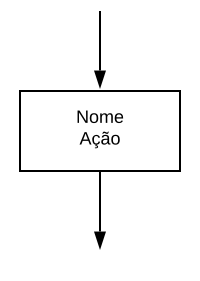

# 2.1.2. Notação UML – Diagramas Dinâmicos
## Versionamento
| Versão | Alterações                                     | Responsável     | Data       |
| ------ | ---------------------------------------------- | --------------- | ---------- |
| 0.1    | Adicionado o Diagrama de Comunicação           | Victor Eduardo  | 25/06/2022 |
| 0.2    | Ajustes na sidebar com os tópicos              | Victor Buendia  | 08/07/2022 |
| 0.3    | Criação do Diagrama de Atividades              | Victor Buendia  | 11/07/2022 |
| 0.4    | Criação do Diagrama de Estados                 | Cibele Goudinho | 11/07/2022 |
| 0.5    | Detalhamento textual do Diagrama de Atividades | Victor Buendia  | 12/07/2022 |
| 0.6    | Adicionando Diagramas de Sequência             | Felipe Agustini | 13/07/2022 |
| 0.7    | Alterando Diagramas de Sequência com base em validação do Yan Andrade | Yan Andrade e Felipe Agustini | 14/07/2022 |
| 0.8    | Validação dos Diagramas de Atividades e correções de detalhes | Antonio Neto | 14/07/2022 |
| 0.9    | Validação do Diagrama de Estados  (por Julia e Buendia) e correção de detalhes | Cibele Goudinho | 15/07/2022 |
| 0.10   | Corrigindo pequenos erros ortográficos e validando textos do diagrama de sequência | Yan Andrade e Felipe Agustini | 15/07/2022 |
| 0.11   | Adicionando detalhes para os diagramas de comunicação e correção de detalhes | Victor Eduardo e Sávio Cunha | 15/07/2022 |

## 2.1.2.1 Introdução
### 2.1.2.1.1 Diagrama de Comunicação
#### 2.1.2.1.1.1 Definição
Um diagrama de comunicação, também chamado de diagrama de colaboração, é um tipo de diagrama UML de interação que demonstra interações entre objetos e/ou partes, utilizando mensagens sequenciadas.
Os diagramas de comunicação são utilizados para mostrar como os objetos interagem para executar o comportamento de um caso de uso específico ou de parte de um caso de uso. Os diagramas de comunicação são utilizados para definir e esclarecer as funções dos objetos que executam um fluxo específico de eventos de um caso de uso.
Os seguintes nós e arestas são desenhados em um diagrama de comunicação UML: **frame** , **lifeline** e **message**.

##### 2.1.2.1.1.1.1 Frame (ou quadro)
Diagramas de comunicação são mostrados dentro de um quadro retangular com o nome em um compartimento no canto superior esquerdo.

##### 2.1.2.1.1.1.2 Lifeline (ou linha de vida)
Lifeline é uma especialização do elemento nomeado que representa um participante individual na interação. Embora as peças e os recursos estruturais possam ter multiplicidade maior que um, as linhas de vida representam apenas uma entidade em interação.

##### 2.1.2.1.1.1.3 Message (ou mensagem)
A mensagem no diagrama de comunicação é mostrada com uma linha com expressão de sequência e uma seta acima da linha. A seta indica a direção da comunicação.

#### 2.1.2.1.1.2 Diagramas
Com base nos dois tipos de usuários do sistema, doador e ONG, foram construídos os diagramas abaixo contendo os fluxos deles, construídos utilizando-se a ferramenta on-line [LucidChart](https://www.lucidchart.com/pages/pt).

#### Diagrama Doador
Esse diagrama ilustra as interações entre usuário doador e o sistema (fluxo doador), que evidencia o principal fluxo do usuário doador na aplicação, que se trata da doação de um item (apresentando apenas o "caminho feliz" do usuário). Além disso inclui a ação de editar o perfil da ONG na plataforma.
Pode-se citar os seguintes aspectos de interação nesse diagrama:

- Um usuário doador pode editar seu perfil na plataforma.
- Um usuário doador pode doar um item que possui para uma ONG ou ação social.
- Um usuário doador pode pesquisar por uma ação social ou por uma ONG para a qual deseja doar um item.
- Um usuário doador ao doar um item, receberá um feedback da ONG da qual ele doou, sobre seu item.

Aspectos que se relacionam com a US01, US06, US09, US19, US24 do nosso [Backlog do Produto](https://unbarqdsw2022-1.github.io/2022.1_G2_DonAct/#/Modelagem/2.1.3.Agil?id=backlog-produto-priorizado).

_Imagem 1: Diagrama Comunicação - Doador_

#### Diagrama ONG
Esse diagrama ilustra as interações entre usuário ONG e o sistema (fluxo ONG), que evidencia o principal fluxo do usuário ONG na aplicação, que se trata da solicitação e recebimento de um item (apresentando apenas o "caminho feliz" do usuário). Além disso inclui a ação de editar o perfil da ONG na plataforma. 
Pode-se citar os seguintes aspectos de interação nesse diagrama:

- Um membro da ONG pode editar o perfil de sua ONG na plataforma.
- Um membro da ONG pode solicitar uma lista itens avulsos que deseja receber.
- Um membro da ONG ao receber a doação de um item, pode avaliar esse item.
- Um membro da ONG ao avaliar um item, retona um feedback para o doador.
- Um membro da ONG pode criar novas ações sociais que sua ONG irá realizar.

Aspectos esses que se relacionam com a US03, US10, US13, US14, US21 do nosso [Backlog do Produto](https://unbarqdsw2022-1.github.io/2022.1_G2_DonAct/#/Modelagem/2.1.3.Agil?id=backlog-produto-priorizado).

_Imagem 2: Diagrama Comunicação - ONG_

### 2.1.2.1.2 Diagrama de Atividades
O **Diagrama de Atividades** é mais um diagrama UML que é usado para a modelagem de software. Seu uso é focado na representação de um fluxo ou processo de execução em mais alto nível, evidenciando a interação entre o usuário e o sistema.

Os principais elementos desse diagrama são os retângulos, que representam as etapas do fluxo, e também os elementos de controle de execução, que podem ser de decisão, merge, fork e join.

A seguinte notação é utilizada na construção do Diagrama de Atividades:

Nó Inicial: É o nó que cria a ficha que dá início ao fluxo de execução. Não possui nenhuma condição de entrada.

_Imagem 3: Diagrama de Atividade - Nó Inicial_

Atividade: Possui um único fluxo de entrada e um único fluxo de saída. É executada quando a ficha passa por ela no fluxo de execução.

_Imagem 4: Diagrama de Atividade - Atividade_

Decisão: Possui um único fluxo de entrada e possui dois  ou mais fluxos de saída. A ficha sai apenas pelo fluxo de saída que possui a condição booleana verdadeira, chamada de guarda no contexto deste diagrama.

_Imagem 5: Diagrama de Atividade - Decisão_

Merge: Possui um ou mais fluxos de entrada, porém possui apenas um único fluxo de saída. É utilizado para unir fluxos de nós de Decisão.

_Imagem 6: Diagrama de Atividade - Merge_

Fork: Cria uma thread de execução paralela. Possui um único fluxo de entrada e múltiplos fluxos de saída. Multiplica a ficha de execução do fluxo para que todas os fluxos de saída sejam executados simultaneamente.

_Imagem 7: Diagrama de Atividade - Fork_

Join: Transforma vários fluxos de execução em um único. Possui vários fluxos de entrada e um único fluxo de saída. Absorve todas as fichas das threads e transforma-a em apenas uma ficha que é enviada para o fluxo de saída.

_Imagem 8: Diagrama de Atividade - Join_

Nó Final: Encerra a execução do Diagrama de Atividades ao receber a ficha. Possui um ou mais fluxos de entrada, mas não possui fluxos de saída.

_Imagem 9: Diagrama de Atividade - Nó Final_

Com essa notação em mente, e considerando que os Diagramas UML Dinâmicos são úteis em representar aspectos particulares do funcionamento da nossa aplicação, nós selecionamos os seguintes aspectos para esclarecer dentro das nossas especificações de software:

### 2.1.2.1.2.1 Diagramação para ONG

#### Avaliar Doação

Esse diagrama ilustra como é o processo de avaliar uma doação, partindo da perspectiva da ONG. O fluxo é relativamente simples e apresenta um comportamento sequencial, sem divisão de fluxo. Aqui evidencia-se a **US13** do nosso Backlog do Produto. A avaliação pode ser feita para doações aceitas que não tiveram um feedback atribuído na hora do aceite.

_Imagem 10: Diagrama de Avaliar Doação_

#### Aceitar Doação

Esse diagrama ilustra como é o processo de aceitar uma doação, partindo da perspectiva da ONG. Uma particularidade do fluxo de aceitar doação é que ela pode ser aceita ou não. Cada um desses fluxos apresenta sua execução particular, como por exemplo:
- Se a doação for rejeitada, um feedback para o doador é obrigatório.
- Se a doação for aceita, o feedback é opcional. Além disso, uma thread de execução concorrencial é aberta com o fork para pontuar o usuário pela doação e atualizar o status de doação da ONG.

Aqui evidencia-se a **US12, US14, US17, US24** do nosso Backlog do Produto.

_Imagem 11: Diagrama de Aceitar Doação_

#### Criar Ação Social

Esse diagrama ilustra como é o processo de criar uma ação social para inserir itens que a ONG está precisando para uma ação solidária, partindo da perspectiva da ONG. O fluxo também é relativamente simples e apresenta um comportamento sequencial, sem divisão de fluxo. Aqui evidencia-se a **US21** do nosso Backlog do Produto, que compreende apenas a criação de uma ação social. As *US20 e US22* para remover e editar uma ação social, respectivamente, não foram consideradas úteis para a modelagem a nível de atividades, por apresentar um comportamento também linear e similar ao diagrama exibido abaixo.

_Imagem 12: Diagrama de Criar Ação Social_

#### Lista de Desejo

Esse diagrama ilustra como é o processo alterar a lista de desejo que existe para cada ONG, partindo da perspectiva da ONG. O fluxo também é relativamente simples e apresenta um comportamento sequencial, sem divisão de fluxo. Aqui evidencia-se a **US10 e US11** do nosso Backlog do Produto, que compreende a alteração de itens da lista de desejo, podendo ser a inserção ou remoção de itens.

_Imagem 13: Diagrama de Lista de Desejo_

#### Doar Itens

Esse diagrama ilustra como é o processo de registrar o processo de doação de itens captados pela ONG para as pessoas carentes, partindo da perspectiva da ONG. O detalhe que vale a pena mencionar é na divisão do fluxo de execução concorrente para a publicação do registro de doação da ONG, no qual pontua-se a ONG por ter realizado a doação e modificar as estatísticas de doação da ONG na aplicação, além de notificar os doadores que contribuíram com os itens utilizados.

Aqui evidencia-se a **US15, US18 e US22** do nosso Backlog do Produto, que compreende a notificação do doador por ter contribuído com um item que foi doado para uma pessoa necessitada, atribuição de pontos para a ONG que realizou a doação dos itens e edição da ação social da ONG.

_Imagem 14: Diagrama de Doar Itens_

### 2.1.2.1.2.2 Diagramação para Doador

#### Realizar Doação

Esse diagrama ilustra como é o processo de doar algum item para uma ONG, partindo da perspectiva do doador. Esse fluxo é um pouco mais complexo que os outros porque apresenta dois processos de decisão: um para doação avulsa ou de ação social; outro para doar algo material ou algo não material. Cada ramo possui sua especificidade de fluxo, como ilustrado no diagrama. Quando a doação é concluída, uma confirmação é exibida ao usuário e a ONG é notificada da doação. Dessa forma, o doador e ONG podem acordar a coleta dos itens, caso sejam materiais.

Aqui evidencia-se a **US06, US09 e US16** do nosso Backlog do Produto, que compreendem realizar uma doação para ONG, escolher a ONG para qual irá doar e notificar a ONG do recebimento de uma doação. As *US07, US08* para remover e editar uma itens de uma doação não foram consideradas úteis para a modelagem a nível de atividades, por apresentar um comportamento similar ao processo de escolher itens para doar.

_Imagem 15: Diagrama de Realizar Doação_

#### Chat com ONG

Esse diagrama ilustra como é o processo de iniciar um chat com uma ONG para qual uma doação foi feita, partindo da perspectiva do doador. O fluxo é relativamente simples e apresenta um comportamento sequencial, sem divisão de fluxo. Aqui evidencia-se a **US23** do nosso Backlog do Produto.

_Imagem 16: Diagrama de Chat com ONG_

### 2.1.2.1.2.3 Diagramação não Específico

#### Cadastro

Esse diagrama ilustra como é o processo de cadastrar uma conta. Aqui o detalhe é que o processo de cadastro é de um usuário, que se especializa em ONG ou doador a partir da escolha no menu. Aqui evidencia-se a **US01 e US03** do nosso Backlog do Produto.

_Imagem 17: Diagrama de Cadastro_

#### Login

Esse diagrama ilustra como é o processo de entrar em uma conta. Nesse fluxo, o CPF ou o CNPJ é identificado automaticamente, porém é a diferença entre o CNPJ ou CPF que diverge a execução do fluxo. Aqui evidencia-se a **US26** do nosso Backlog do Produto.

_Imagem 18: Diagrama de Login_

### 2.1.2.1.3 Diagrama de Estados
O **Diagrama de Estados** é um diagrama UML que possibilita a visualização de diferentes estados de um objeto, ou seja, visualizar diferentes combinações de informações que esse objeto pode conter. 
Com base nos diferentes estados de cada fluxo realizado pela aplicação, foram construídos os diagramas abaixo contendo a visualização destes, construídos utilizando-se a ferramenta on-line [LucidChart](https://lucid.app/lucidchart/29cc2366-f737-4152-bc40-0e0a8d46b993/edit?viewport_loc=-308%2C-143%2C2694%2C1024%2CxHQx2_.IXBYI&invitationId=inv_abddb82b-03fd-48e8-a88e-b03794cc475e#).

#### Diagrama de Estados Cadastro

Nesse diagrama temos a ilustração de como cadastrar uma conta. Começamos recebendo informações do usuário, o sistema verifica se o CPF ou CNPJ já existe, seguindo a **US02** e **US04** do nosso backlog do produto. Caso a validação falhe o usuário poderá tentar novamete ou sair do processo. Mas caso a validação tenha sucesso o usuário é cadastrado no banco, seguindo a **US01** e **US03**. 

_Imagem 19: Diagrama de Cadastro_

#### Diagrama de Estados Ações Sociais

Nesse diagrama temos a ilustração das possíveis aatividades com as ações sociais. Primeiramente separamos o tipo de usuário (ONG ou doador). Para doador temos a visualização de ações sociais e visualização de informações gerais das ONG de acordo com a **US19**. Já para usuário ONG, podemos adcionar, remover e editar suas próprias ações sociais, seguindo a **US20, US21 e US22**. Nessa parte, o sistema verifica se foi possível realizar a atividade no banco e notifica ao usuário o status de falha ou sucesso, assim o usuário pode cancelar ou tentar novamente em caso de falha e continuar em caso de sucesso.

_Imagem 20: Diagrama de Ações Sociais_

#### Diagrama de Estados Mensagem

Nesse diagrama temos a ilustração da troca de mensagem entre usuários e entre sistema e usuário, baseando-se na **US14, US15, US16, US23 e US24**. Inicia-se enviando uma mensagem, seja pelo usuário ONG ou doador ou pelo sistema, se há falha no envio pode-se tentar enviar novamente ou cancelar o envio encerrando o processo. Em caso de sucesso, caso não haja uma resposta encerra o processo, mas caso haja o fluxo inicia-se de novo.

_Imagem 21: Diagrama de Mensagem_

#### Diagrama de Estados Doações

Nesse diagrama temos o fluxo de doação. Primeiramente separamos os usuários (ONG e doador). Na parte de doador, as atividades são editar, visualizar, adicionar ou remover doações, baseadas na **US06, US07 e US08** do nosso backlog do produto. Editar e adicionar levam para uma nova atividade que atualiza ou preenche informações no banco de dados e remover finaliza o processo. Seguindo esse fluxo temos que o doador pode selecionar a ONG que ele quer doar, com base na **US09**. Aqui o sistema verifica se é possível doar para aquela ONG, caso tenha sucesso ou o usuário queira cancelar a doação termina o fluxo, caso ocorra falha e o usuário queira tentar novamente ele pode escolher uma outra ONG. No usuário ONG, pode-se solicitar itens, visualizar itens solicitados e recebidos e remover itens solicitados, baseados na **US10, US11 e US12**. Na situação de remover item o processo é encerrado após a remoção. Na situação de solicitar itens antes de prosseguir é necessário preencher as informações dos itens. E ao visualizar itens recebidos é necessário avaliar se o item está ou não em boa condição, caso sim segue esse fluxo, caso não o usuário doador é notificado e encerra o processo. Seguindo o fluxo a ONG recebe a doação e finaliza o processo.    

_Imagem 22: Diagrama de Doações_

### 2.1.2.1.4 Diagrama de Sequência
Os **diagramas de sequência** modelam as interações entre objetos em um único caso de uso. Eles servem para ilustrar como as diferentes partes de um sistema interagem umas com as outras para realizar uma função e a ordem em que as interações ocorrem quando um caso de uso específico é executado.

Nós decidimos assim criar os diagramas abaixo de acordo com nossos casos de uso mais importantes utilizando a ferramenta [LucidChart](https://www.lucidchart.com/pages/pt).
#### Diagrama de cadastro de usuário
Esse diagrama mostra como um usuário se cadastra dentro da plataforma. assim como a escolha que ele realiza no processo de cadastro, saindo de um tipo Usuário genério para as especializações Usuário Ong ou Usuário Doador. É importante notar que durante a criação da conta o usuário manda as informações através de um body durante a requisição HTTP, onde através de uma varíavel interna chamada **tipoUsuario** nós especializamos a classe de usuário genérico.

_Imagem 22: fluxo de cadastro de usuario_
#### Diagrama de Login/logout Doador e Ong
Os diagramas abaixo demostram o fluxo para execução de Login e Logout dos dois tipos de usuários existentes no sistema. Nota-se que os fluxos são similares, Só mudando a requisição http para a chamada de função e o retorno de dados do banco. É importante ressaltar o uso da mesma controller por ambos.

_Imagem 23: fluxo de Login/logout de usuario doador_

_Imagem 24: fluxo de Login/logout de usuario ong_

#### Diagrama de criação/edição/remoção de ação social
Este diagrama demonstra um fluxo de criação, edição e remoção das ações sociais que são usadas no sistema para a interação entre os usuários ong com os usários doador. Os dois primeiros fluxos mudam a requisição Http e retornam um objeto de Ação social chamado ação. enquanto o último o de remoção retorna apenas sucesso (200).

_Imagem 25: fluxo de criação/edição/remoção de ação social_
#### Diagrama de listar ação social
Enquanto neste diagrama temos o fluxo de listagem de ações sociais executado pelo doador para ver as ações disponíveis no sistema, temos a caixa de opção que utiliza da mesma controller mostrada anteriormente para fazer tanto um SELECT no banco de dados de acordo com o filtro passado quanto a listagem de todas ações existentes.

_Imagem 25: fluxo de listagem de ação social_
## 2.1.5. Referências

- SERRANO, Millene. 06b - VideoAula - DSW-Modelagem - Comunicacao. Aprender 3, 28 de julho de 2020. Acesso em: 02 de Julho de 2022.
- "What is a communication diagram?". Disponível em: <https://www.lucidchart.com/pages/pt/diagrama-de-interacao-uml>. Acesso em: 06 de Julho de 2022.
- "O que é um diagrama de interação UML?". Disponível em: <https://www.lucidchart.com/pages/uml-communication-diagram>. Acesso em: 06 de Julho de 2022.
- VALENTE, Marco. ENGENHARIA DE SOFTWARE MODERNA: Princípios e Práticas para Desenvolvimento de Software com Produtividade, 2020. Disponível em: <https://engsoftmoderna.info/cap4.html#diagrama-de-atividades>. Acesso em: 11 de Julho de 2022.
- SERRANO, Millene. 06c - VídeoAula - DSW - Modelagem - Diagrama de Atividades. Aprender 3, 28 de julho de 2020. Acesso em: 11 de Julho de 2022.
- Modelagem UML Dinâmica. Disponível em: <https://aprender3.unb.br/pluginfile.php/2083407/mod_label/intro/Arquitetura%20e%20Desenho%20de%20Software%20-%20Aula%20Modelagem%20UML%20Din%C3%A2mica%20-%20Profa.%20Milene.pdf>. Acesso em: 11 de Julho de 2022.
- Diagrama de Estados. Disponível em: <https://www.facom.ufu.br/~abdala/DAS5312/Diagrama%20de%20Estados.pdf>. Acesso em: 12 de Julho de 2022.
- O que é Diagrama de Maquina de Estados. Disponível em: <https://www.lucidchart.com/pages/pt/o-que-e-diagrama-de-maquina-de-estados-uml>. Acesso em: 12 de Julho de 2022.
- SERRANO, Millene. 06a - VideoAula - DSW-Modelagem - Sequencia. Aprender 3, 28 de julho de 2020. Acesso em: 14 de Julho de 2022.
- Diagramas de Seqüência. Disponível em: <https://www.ibm.com/docs/pt-br/rsm/7.5.0?topic=uml-sequence-diagrams>. Acesso em: 14 de Julho de 2022.
- Diagramas de Comunicação. Disponível em: <https://www.ibm.com/docs/pt-br/radfws/9.6?topic=SSRTLW_9.6.0/com.ibm.xtools.sequence.doc/topics/ccommndiag.html>. Acesso em: 15 de Julho de 2022.