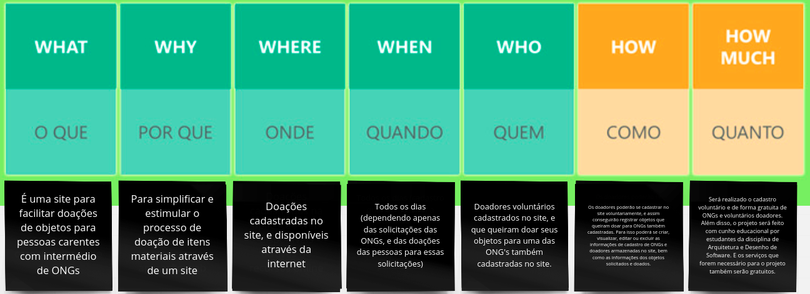

# 2.2 Iniciativas Extras - Modelagem
## Versionamento

| Versão | Alterações  | Responsável | Data |
| ------ | ------- | --------------- | ---- |
| 0.1    | Adição das Tecnologias a Serem Usadas | Victor Eduardo | 06/07/2022 |
| 0.2    | Adição do 5W2H em Alto Nível | Victor Eduardo | 06/07/2022 |

## 2.2.1 Tecnologias a serem usadas
### 2.2.1.1 Introdução

As tecnologias a serem usadas no projeto foram escolhidas em dois passos, o primeiro passo foi selecionar dentre as tecnologias mais usadas do mercado, e após isso fazer uma votação usando a enquete do grupo do telegram para que dessas tecnologias pré-selecionadas, pudéssemos escolher a tecnologia a qual os membros mais tivesse afinidade em usar.

### 2.2.1.2 Pré-seleção de tecnologias
Para esse primeiro passo foi pesquisados em diversos sites as tecnologias mais usadas para cada parte do software (front-end, back-end e banco de dados). E como resultado obteu-se que as tecnologias mais usadas são:
- Front-end: React.js, Flutter, Angular.js, Vue.js e Bootstrap;
- Back-end: Django, Express.js, Flask e Spring Boot;
- Banco de dados: MongoDB, PostgreSQL e MySQL;  
- Além disso também incluímos uma enquete para decidirmos se faríamos ou não o uso do Docker, haja visto todas as vantagens que ele nos proporciona.

### 2.2.1.3 Escolha das tecnologias
Para escolha das tecnologias, criamos uma enquete no telegram para que assim pudesse se escolher dentre as tecnologias mais usadas, aquela que tivéssemos maior afinidade.
#### Enquete Front-end:
  
_Imagem 1: Enquete Tecnologias - Front-end_
#### Enquete Back-end:
  
_Imagem 2: Enquete Tecnologias - Back-end_
#### Enquete Banco de dados:
  
_Imagem 3: Enquete Tecnologias - Banco de Dados_
#### Enquete Docker:
  
_Imagem 4: Enquete Tecnologias - Docker_

### 2.2.1.4 Conclusão
Por fim ficou então decidido que usaríamos React.js, Express.js, MySQL e faríamos também uso do Docker. Após essa definição foi pesquisado se era possível fazer a integração dessas tecnologias e obtivemos que era possível. E abaixo está uma arquitetura simplificada do sistema.
  
_Imagem 5: Arquitetura simplificada do sistema_

## 2.2.2 5W2H em Alto Nível
O [5W2H anteriomente feito](https://unbarqdsw2022-1.github.io/2022.1_G2_DonAct/#/Base/1.1.AbordagemNaoEspecifica?id=_5w2h-vis%c3%a3o-geral) possuía uma linguagem mais baixo nível, ou seja, uma linguagem mais técnica, e que exigia um conhecimento sobre desenvolvimento, já o 5W2H apresentado logo abaixo, tem uma linguagem alto nível, ou seja, uma linguagem na qual usuários que não fazem parte do meio de desenvolvimento de software, possam entender perfeitamente.
  

_Imagem 6: 5W2H - Alto Nível_
_Detalhes no apêndice_
## 2.2.3 Apêndice
### 5W2H - 5W's

### 5W2H - 2H's

## Referências
- CUNHA, Fernando. framework de desenvolvimento: quais os mais usados?. Disponível em: <https://mestresdaweb.com.br/tecnologias/framework-de-desenvolvimento-quais-os-mais-usados/>. Acesso em 06 de Julho de 2022.

- KAWASHIMA, Fernanda. 6 frameworks front-end mais utilizados no mercado de tecnologia. Disponível em: <https://ezdevs.com.br/6-frameworks-front-end-mais-utilizados-no-mercado-de-tecnologia/>. Acesso em 06 de Julho de 2022.

- SOUZA, Wesley Soares de. Desenvolvimento front-end: como começar e principais tecnologias. Disponível em: <https://www.zup.com.br/blog/desenvolvimento-front-end>. Acesso em 06 de Julho de 2022.

- KRIGER, Daniel. 5 BANCOS DE DADOS GRATUITOS PARA VOCÊ CONHECER. Disponível em: <https://kenzie.com.br/blog/bancos-de-dados/>. Acesso em 06 de Julho de 2022.

- CHAMPAGNE, Jennifer; ROSSI, Daniel. 7 opções de bancos de dados gratuitos e de código aberto. Disponível em: <https://www.capterra.com.br/blog/846/bancos-de-dados-gratuitos-e-de-codigo-aberto>. Acesso em 06 de Julho de 2022.

- PATEL, Rushi. Top 6 Backend Frameworks for Web App Development in 2022. Disponível em: <https://www.mindinventory.com/blog/best-backend-frameworks/>. Acesso em 06 de Julho de 2022.

- GOEL, Aman. 10 Best Web Development Frameworks. Disponível em: <https://hackr.io/blog/web-development-frameworks>. Acesso em 06 de Julho de 2022.
