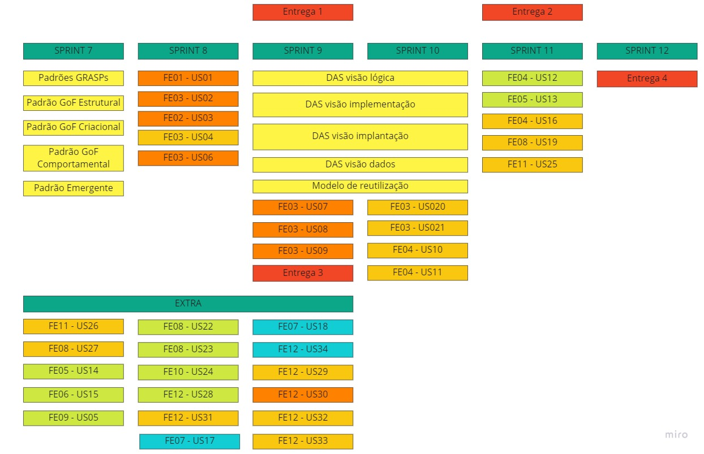

# 2.2 Iniciativas Extras - Modelagem

## Versionamento

| Versão | Alterações                                                            | Responsável     | Data       |
| ------ | --------------------------------------------------------------------- | --------------- | ---------- |
| 0.1    | Adição das Tecnologias a Serem Usadas                                 | Victor Eduardo  | 06/07/2022 |
| 0.2    | Adição do 5W2H em Alto Nível                                          | Victor Eduardo  | 06/07/2022 |
| 0.3    | Adição de papéis e reuniões das metodologias utilizadas               | Cibele Goudinho | 08/07/2022 |
| 0.4    | Refinamento do texto de papéis e reuniões das metodologias utilizadas | Victor Buendia  | 08/07/2022 |
| 0.5    | Ajustes na sidebar com os tópicos                                     | Victor Buendia  | 08/07/2022 |
| 0.6    | Validação do protótipo                                                | Isadora Soares  | 08/07/2022 |
| 0.7    | Roadmap                                                               | Cibele Goudinho  | 12/07/2022 |
| 0.8    | Mudanças no 5W2H após validação com o Yan Andrade  | Victor Eduardo  | 14/07/2022 |

## 2.2.1 Tecnologias a serem usadas

### 2.2.1.1 Introdução

As tecnologias a serem usadas no projeto foram escolhidas em dois passos, o primeiro passo foi selecionar dentre as tecnologias mais usadas do mercado, e após isso fazer uma votação usando a enquete do grupo do telegram para que dessas tecnologias pré-selecionadas, pudéssemos escolher a tecnologia a qual os membros mais tivesse afinidade em usar.

### 2.2.1.2 Pré-seleção de tecnologias

Para esse primeiro passo foi pesquisados em diversos sites as tecnologias mais usadas para cada parte do software (front-end, back-end e banco de dados). E como resultado obteu-se que as tecnologias mais usadas são:

- Front-end: React.js, Flutter, Angular.js, Vue.js e Bootstrap;
- Back-end: Django, Express.js, Flask e Spring Boot;
- Banco de dados: MongoDB, PostgreSQL e MySQL;
- Além disso também incluímos uma enquete para decidirmos se faríamos ou não o uso do Docker, haja visto todas as vantagens que ele nos proporciona.

### 2.2.1.3 Escolha das tecnologias

Para escolha das tecnologias, criamos uma enquete no telegram para que assim pudesse se escolher dentre as tecnologias mais usadas, aquela que tivéssemos maior afinidade.

#### Enquete Front-end:

  
_Imagem 1: Enquete Tecnologias - Front-end_

#### Enquete Back-end:

  
_Imagem 2: Enquete Tecnologias - Back-end_

#### Enquete Banco de dados:

  
_Imagem 3: Enquete Tecnologias - Banco de Dados_

#### Enquete Docker:

  
_Imagem 4: Enquete Tecnologias - Docker_

### 2.2.1.4 Conclusão

Por fim ficou então decidido que usaremos React.js para o front-end, Express.js para o back-end, MySQL para o banco de dados e faremos também a conteinerização com o uso do Docker. Após essa definição foi pesquisado se era possível fazer a integração dessas tecnologias e obtivemos que era possível. E abaixo está uma arquitetura simplificada do sistema.
  
_Imagem 5: Arquitetura simplificada do sistema_

## 2.2.2 5W2H em Alto Nível

O [5W2H anteriomente feito](https://unbarqdsw2022-1.github.io/2022.1_G2_DonAct/#/Base/1.1.AbordagemNaoEspecifica?id=_5w2h-vis%c3%a3o-geral) possuía uma linguagem mais baixo nível, ou seja, uma linguagem mais técnica, e que exigia um maior conhecimento sobre desenvolvimento, já esse 5W2H apresentado logo abaixo, tem uma linguagem alto nível, ou seja, uma linguagem a qual se exigirá menor conhecimento técnico sobre desenvolvimento para que se possa entender perfeitamente.

_Imagem 6: 5W2H - Alto Nível_
_Detalhes no apêndice_

## 2.2.3 Papéis e reuniões na Metodologia Ágil

Conforme definimos na seção [Base](/Base/1.2.ProcessosMetodologiasAbordagens?id=_122-metodologias-Ágeis) iremos utilizar as metodologias SCRUM, XP e KANBAN. Assim, discutimos qual seria a melhor maneira de realizar as práticas dessas metodologias visando uma melhor organização e agilidade do time.

### SCRUM

No SCRUM utilizamos a _Sprint_ com _duração de uma semana_, já que facilitava a visualização das entregas e também é um período de tempo adequado para o desenvolvimento das atividades, evitando acumulo de muitas atividades em uma Sprint só, como seria se por exemplo utilizassemos duas semanas ou mais. Outro fator é que a disciplina possui para os próximos módulos períodos de entrega de duas ou três semanas, então a quebra semanal dá um ritmo mediano para a execução do time.

Além disso, também decidimos fazer a _Sprint Review_ e a _Sprint Retrospective_ juntas, pois, considerando o período definido para a Sprint e o Heatmap da Equipe, poderiamos aproveitar os horários disponíveis e realizar os dois ritos em um único encontro, tentando ser mais eficiente no aproveitamento de tempo.

Definida a quantidade de reuniões, levantamos pelo Heatmap os melhores dias e seus horários de disponibilidade do time. Fizemos, então, uma enquete entre os membros para escolher o melhor horário para todos, assim a _Sprint Review_ será realizada de 11:00 às 11:30 de sábado (junta à _Sprint Retrospective_ de 11:30 às 12:00 de sábado) e a _Sprint Plannig_ 20 horas de segunda-feira, dia o qual seria considerado o início da sprint já que esta foi baseada no ciclo semanal. Todas as reuniões serão realizadas de maneira online e síncrona via Discord.

Por fim, também utilizaremos as dailys. Discutimos qual seria a melhor forma de realizá-las e definimos que será implementá-la de segunda a sexta, que seria o período no qual nós, alunos, nos dedicaríamos à faculdade. Caso sejam realizadas atividades nos finais de semanas, estas seriam relatadas na daily da segunda-feira imediatamente seguinte.

Ademais, escolhemos realizá-las de maneira assíncrona via Telegram, tendo o período de 08:00 às 23:59 para relatar o que foi feito no dia, assim conseguimos dar mais liberdade aos membros tendo em vista a carga horária de cada um.

Após definir em conjunto as reuniões escolhemos quem realizariam os papéis do SCRUM, inicialmente levantamos quais membros teriam interesses nos papéis de _Scrum Master_ e _Product Owner_. É válido lembrar que todos serão desenvolvedores. Assim, temos como _Product Owner_ a Júlia Farias e como _Scrum Master_ o Luiz Henrique, que se voluntariaram para assumir o papel.

### Daily

_Imagem 7: Votação Daily_

### Reuniões

_Imagem 8: Votação Reuniões_

## 2.2.4 Validação do protótipo

Para validar o protótipo, fizemos um formulário com algumas perguntas estratégicas para compreender melhor as opiniões do público em relação ao nosso protótipo. Esse formulário traz as opiniões do público em relação à dificuldade de localizar certas partes no protótipo, na escala de 1 a 5 (onde 1 equivale a muito fácil e 5 a muito difícil) e depois pergunta qual foi esse dificuldade.

Segue abaixo as perguntas, grau de dificuldade e dificuldades:

### 1- Em uma escala de 1 a 5, onde 1 equivale a muito fácil e 5 a muito difícil, avalie o grau de dificuldade em relação a identificar onde se cadastrar.

 

_Imagem 9: Resposta 1_

### Dificuldades

_Imagem 10: Dificuldade 1_

### Comentários

A maior porcentagem ficou em que foi muito fácil de identificar onde o usuário deve se cadastrar e foram bem pequenas as dificuldades

### 2- Em uma escala de 1 a 5, onde 1 equivale a muito fácil e 5 a muito difícil, avalie o grau de dificuldade em relação a identificar o login

_Imagem 12: Resposta 2_

### Dificuldades

_Imagem 13: Dificuldade 2_

### Comentários

Nessa pergunta as respostas foram bem flexíveis com todas as opções sendo marcadas mas a maior porcentagem foi no 1, de muito fácil, e bem próximo também ficou o 4, como razoavelmente difícil. Sobre as dificuldades, houveram bastante mas em geral é que o botão de login não está intuitivo.

### 3- Em uma escala de 1 a 5, onde 1 equivale a muito fácil e 5 a muito difícil, avalie o grau de dificuldade em relação a inserir dados para realizar o login.

_Imagem 14: Resposta 3_

### Dificuldades

_Imagem 15: Dificuldade 3_

### Comentários

Nessa pergunta a porcentagem de que está muito fácil é a maior e como dificuldade disseram mais como uma dica para que a label seja mais marcante.

### 4- Em uma escala de 1 a 5, onde 1 equivale a muito fácil e 5 a muito difícil, avalie o grau de dificuldade em relação a escolher se é doador ou uma ONG.

_Imagem 16: Resposta 4_

### Dificuldades

_Imagem 17: Dificuldade 4_

### Comentários

Nessa pergunta ficou quase unânime a porcentagem em muito fácil e sem nenhuma dificuldade.

### 5- Em uma escala de 1 a 5, onde 1 equivale a muito fácil e 5 a muito difícil, avalie o grau de dificuldade em relação a inserir dados para cadastrar uma nova conta.

_Imagem 18: Resposta 5_

### Dificuldades

_Imagem 19: Dificuldade 5_

### Comentários

Nessa pergunta a porcentagem também é grande em muito fácil e como dificuldades não da pra diferenciar quais campos são obrigatórios e que os campos deveriam estar mais agrupados.

### 6- Em uma escala de 1 a 5, onde 1 equivale a muito fácil e 5 a muito difícil, avalie o grau de dificuldade em relação a visualizar ONG's cadastradas, doações realizadas, consultar perfil, consultar doações, consultar ações sociais e sair da conta.

_Imagem 20: Resposta 6_

### Dificuldades

_Imagem 21: Dificuldade 6_

### Comentários

Nessa pergunta o muito fácil se destaca também e como dificuldades seria sobre o contraste das cores.

### 7- Em uma escala de 1 a 5, onde 1 equivale a muito fácil e 5 a muito difícil, avalie o grau de dificuldade em relação a visualizar as informações do perfil e onde editá-lo.

_Imagem 22: Resposta 7_

### Dificuldades

_Imagem 23: Dificuldade 7_

### Comentários

Nessa pergunta o muito fácil se destaca também e sem dificuldades.

### 8- Em uma escala de 1 a 5, onde 1 equivale a muito fácil e 5 a muito difícil, avalie o grau de dificuldade em relação a visualizar as informações da ONG, que doações são válidas, seguir ONG e sugerir ação social.

_Imagem 24: Resposta 8_

### Dificuldades

_Imagem 25: Dificuldade 8_

### Comentários

Nessa pergunta o muito fácil se destacou mas com algumas dificuldades como muito informação na tela, o contraste das cores novamente e que poderia ter informações de coleta

### 9- Em uma escala de 1 a 5, onde 1 equivale a muito fácil e 5 a muito difícil, avalie o grau de dificuldade em relação a visualizar as informações pessoais do perfil e onde editá-lo e também como apagar a conta.

_Imagem 26: Resposta 9_

### Dificuldades

_Imagem 27: Dificuldade 9_

### Comentários

Nessa pergunta o muito fácil também se destaca e como dificuldades é que o botão de apagar está muito grande e o botão de editar muito pequeno.

### 10- Em uma escala de 1 a 5, onde 1 equivale a muito fácil e 5 a muito difícil, avalie o grau de dificuldade em relação a visualizar ações sociais pendentes, avaliar doadores, alterar doações e cadastrar ação social.

_Imagem 28: Resposta 10_

### Dificuldades

_Imagem 29: Dificuldade 10_

### Comentários

Nessa pergunta o muito fácil também se destaca mas de novo com a dificuldade do contraste das cores, muita informação na tela e letras pequenas.

### 11- Em uma escala de 1 a 5, onde 1 equivale a muito fácil e 5 a muito difícil, avalie o grau de dificuldade em relação a visualizar as informações pessoais do perfil da ONG e onde editá-lo, pesquisar doações recebidas e alterar solicitação de doação.

_Imagem 30: Resposta 11_

### Dificuldades

_Imagem 31: Dificuldade 11_

### Comentários

Nessa pergunta o muito fácil é o maior mas com alguns pontos no em razoavelmente fácil. Como dificuldade apenas que poderia ter um campo específico com os endereços das ongs e dos pontos de coleta.

## 2.2.5 Roadmap
O **Roadmap** é uma ferramenta visual para auxiliar os desenvolvedores durante o percurso de desenvolvimento, servindo como um guia do produto, mostrando seus pontos de evolução e variavéis que serão encontradas pelo caminho. Nesse sentido, a equipe optou por criar um roadmap desde a ideia do produto até a entrega final (MVP), assim poderiamos organizar melhor as entregas de artefatos, modelagem e produto. 
Dessa forma, tomando como base as entregas da disciplina, o backlog desenvolvido e previamente priorizado e as atividades a serem desenvolvidas desenvolvemos um roadmap inicial, com previsões de entrega, porém a medida que formos evoluindo no projeto as previsões podem ser modificadas, seja adiantando ou atrasando, e para garantir a entrega de todos os itens requeridos e do MVP, esses itens obrigatórios são finalizados com uma sprint de antecedencia, deixando tempo habil caso ocorra algum imprevisto e caso não possibilitando o desenvolvimento de extras. 

### Roadmap Visão Geral

_Imagem 32: Roadmap Visão Geral_

## 2.2.6 Apêndice

### 5W2H - 5W's

### 5W2H - 2H's

### Roadmap Semana 1 a 6

_Imagem 32: Roadmap Semana 1-6_

### Roadmap Semana 7 a 12

_Imagem 33: Roadmap Semana 7-12_

## 2.2.7 Referências

- CUNHA, Fernando. framework de desenvolvimento: quais os mais usados?. Disponível em: <https://mestresdaweb.com.br/tecnologias/framework-de-desenvolvimento-quais-os-mais-usados/>. Acesso em 06 de Julho de 2022.

- KAWASHIMA, Fernanda. 6 frameworks front-end mais utilizados no mercado de tecnologia. Disponível em: <https://ezdevs.com.br/6-frameworks-front-end-mais-utilizados-no-mercado-de-tecnologia/>. Acesso em 06 de Julho de 2022.

- SOUZA, Wesley Soares de. Desenvolvimento front-end: como começar e principais tecnologias. Disponível em: <https://www.zup.com.br/blog/desenvolvimento-front-end>. Acesso em 06 de Julho de 2022.

- KRIGER, Daniel. 5 BANCOS DE DADOS GRATUITOS PARA VOCÊ CONHECER. Disponível em: <https://kenzie.com.br/blog/bancos-de-dados/>. Acesso em 06 de Julho de 2022.

- CHAMPAGNE, Jennifer; ROSSI, Daniel. 7 opções de bancos de dados gratuitos e de código aberto. Disponível em: <https://www.capterra.com.br/blog/846/bancos-de-dados-gratuitos-e-de-codigo-aberto>. Acesso em 06 de Julho de 2022.

- PATEL, Rushi. Top 6 Backend Frameworks for Web App Development in 2022. Disponível em: <https://www.mindinventory.com/blog/best-backend-frameworks/>. Acesso em 06 de Julho de 2022.

- GOEL, Aman. 10 Best Web Development Frameworks. Disponível em: <https://hackr.io/blog/web-development-frameworks>. Acesso em 06 de Julho de 2022.

- Estrategia e Gestao. Disponível em: <https://endeavor.org.br/estrategia-e-gestao/roadmap/>. Acesso em 12 de Julho de 2022.
