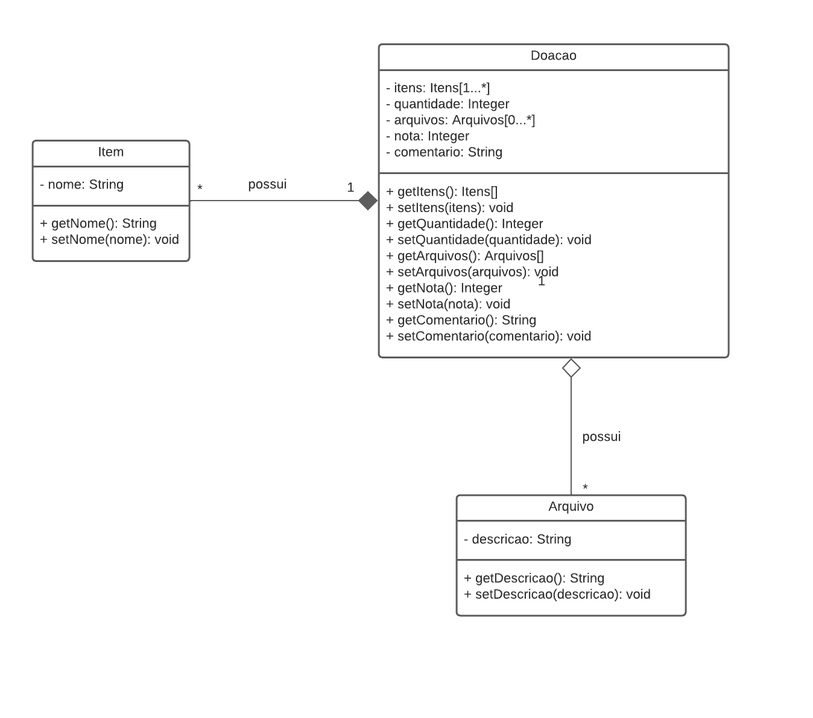
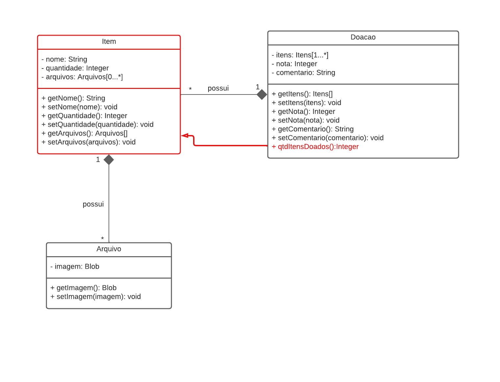
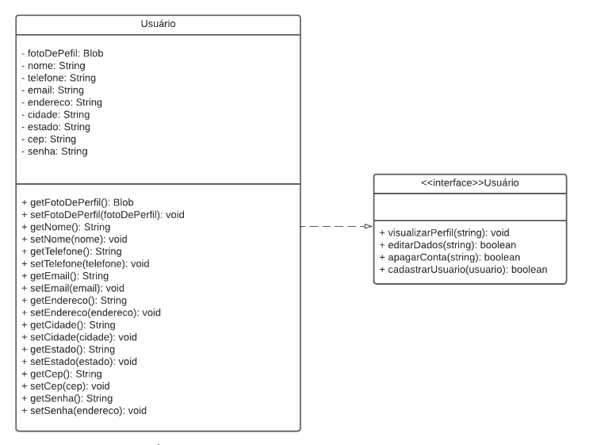
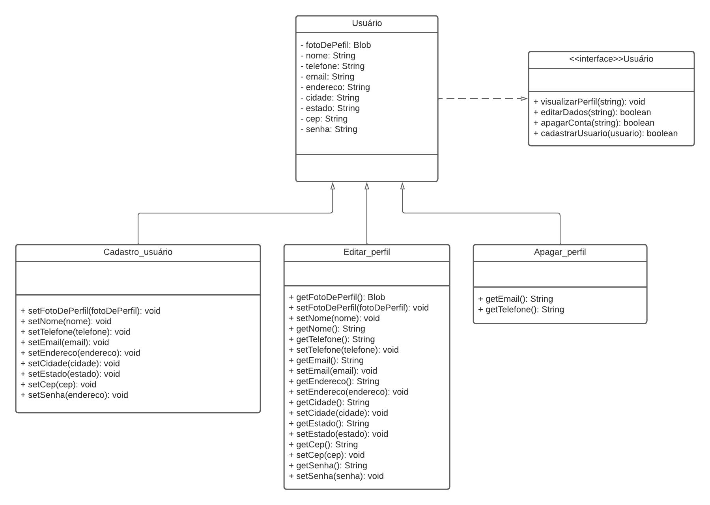

# 3.1. Módulo Padrões de Projeto GRASPs


## Versionamento
| Versão | Alterações                                            | Responsável                      | Data       |
| ------ | ----------------------------------------------------- | -------------------------------- | ---------- |
| 0.1    | Introdução ao GRASP e GRASP Criador                   | Felipe Agustini e Julia Sousa    | 25/07/2022 |
| 0.2    | Texto GRASP Especilista e imagem                      | Felipe Agustini e Victor Buendia | 26/07/2022 |
| 0.3    | Detalhamento do GRASP Especialista no Projeto         | Felipe Agustini e Victor Buendia | 31/07/2022 |
| 0.4    | Text GRASP Alta Coesão                                | Antonio Neto e Júlia Farias      | 01/08/2022 |
| 0.5    | Criando implementação em código de GRASP Especialista | Victor Buendia                   | 02/08/2022 |
| 0.6    | Corrigindo diagrama do Grasp criador                  | Felipe Agustini e Antonio Neto   | 02/08/2022 |
| 0.7    | Validação do Grasp Criador 							 | Antonio Neto   					| 02/08/2022 |
| 0.8    | Validação do Grasp Criador 							 | Sávio Cunha 						| 03/08/2022 |
| 0.9    | Finalização do Grasp de Alta Coesão 					 | Antonio Neto e Júlia Farias 		| 04/08/2022 |
| 1.0    | Revisão e validação final do grasp     		 		 | Felipe Agustini e Júlia Farias   | 04/08/2022 |
## 3.1.1. GRASP
### 3.1.1.1. Introdução

General Responsability Assignment Software Patterns (GRASP), são diretrizes para atribuição de responsabilidade a classes e objetos em projetos orientados a objetos. 

É um padrão de projeto baseado em princípios e boas práticas usadas durante a criação do software, que descreve o problema e a solução adotada. Os princípios e os raciocínios utilizados para atribuir responsabilidades de objetos podem ser descritos de modo metódico, explicável e repetível. [[SERRANO]](#ref2).

### 3.1.1.2. GRASP Criador

Diferente do paradigma de orientação a objetos, que trata da relação entre os objetos de uma classe, o GRASP Criador é responsável por atribuir a responsabilidade de criação de objetos às classes que são coerentes para realizar essa ação. Quando atribuímos a função de criar objetos a uma classe qualquer, podemos gerar graves violações de encapsulamento, de alto acoplamento e de responsabilidades. 

Para conceber um GRASP Criador devemos partir do seguinte questionamento: Quem deve ser responsável por criar uma nova instância de uma classe? [[BACALÁ]](#ref1)

Segundo BACALÁ [[BACALÁ]](#ref1), a responsabilidade da criação de um objeto B se da se uma ou mais situações abaixo forem verdadeiras.

- B contém A;
- B registra A;
- B usa A;
- B tem os dados necessários para a inicialização de A;

### **Utilização no projeto**:

Pode ser visto na seleção abaixo do diagrama de classe da aplicação que a responsabilidade da criação do objeto 'Arquivo' recai sobre a classe 'Item', e a criação do objeto 'Item' recai sobre a classe 'Doacao'. Dessa forma, podemos atribuir a classe 'Doacao' a responsabilidade de criar 'Item', e também atribuir a classe 'Item' a responsabilidade de criar 'Arquivo'.



### 3.1.1.3. GRASP Especialista
O padrão de projeto GRASP Especialista tem um viés de atribuir responsabilidades bem específicas para a entidade mais especialista nesse aspecto observado.

O GRASP Especialista parte desse princípio geral de atribuir responsabilidades aos objetos [[BACALÁ]](#ref1), na medida em que o objeto escolhido para assumir uma responsabilidade tenha a informação necessária para cumpri-la.

O inuito desse padrão de projeto é diminuir o acoplamento entre as classes e aumentar a coesão delas, de forma que o encapsulamento é mantido, uma vez que a classe especialista em uma determinada responsabilidade é a classe que possui as informações necessárias para cumpri-la, ou seja, todas as informações para performar a atividade estarão dentro da classe especialista. [[BACALÁ]](#ref1)

A comunicação entre a classe especialista com outras classes para executar sua responsabilidade ocorre na troca de mensagens mais simples, como uma multiplicação numérica ou contagem de objetos.[[SERRANO]](#ref2)

#### **Utilização no projeto**: 


Um exemplo que ilustra bem a utilização do padrão de projeto GRASP Especialista no DonAct é a relação entre a classe "Doacao" e a classe "Item".

Analisando a partir de uma perspectiva de regra de negócio, uma doação pode ser composta por um ou mais itens. É partindo dessa interação entre objetos de "Itens" e "Doacao" que observamos o método ```qtdItensDoados():Integer```. Esse método faz uma contagem da quantidade de itens que existe dentro de uma determinada doação ao pegar a quantidade de itens de cada objeto "Item" e somá-las para obter o total de itens doados.

Vemos que o método ```getQuantidade():Integer``` está presente dentro da classe "Itens" porque esse número é inserido particularmente para cada item. Como esse atributo é algo específico do item, estando encapsulado nele, é mais coerente que a classe "Item" seja especialista em recuperar a quantidade daquele item específico.

Contudo, quando analisamos o total de itens de uma doação, um item específico não sabe qual é a quantidade de outro item. É por isso que aqui o método ```qtdItensDoados():Integer``` é uma responsabilidade da classe "Doacao", porque ela é a entidade mais adequada para calcular o somatório da quantidade de todos os itens de uma doação.

Abaixo está uma possível implementação em código de como esse padrão de projeto se adequaria a uma solução computacional:

	class Arquivo is
			[atributos]
			...
			[métodos]
			...

	import Arquivo
	class Item is
			[atributos]
			field arquivos: Arquivo[]
			...
			[métodos]
			method getQuantidade() : Integer is
					return this.quantidade
			method getArquivos() : Arquivo[] is
					[...]
			method setArquivos(arquivos: Arquivo[]) is
					[...]
			...

	import Item
	class Doacao is
			[atributos]
			field itens: Item[]
			...
			[métodos]
			method getItens() : Item[] is
					[...]
			method setItens(itens: Item[]) is
					[...]
			method qtdItensDoados() : Integer is
					field qtdTotal: Integer
					qtdTotal = 0
					for each(item : this.getItens())
							qtdTotal = qtdTotal + item.getQuantidade()
					return qtdTotal
			...

### 3.1.1.4. GRASP de Alta Coesão

Coesão é a medida de quão relacionadas ou focadas estão as
responsabilidades de um elemento [[BACALÁ]](#ref1).Quando em uma aplicação é aplicado o padrão GRASP de Alta Coesão, significa que as suas classes serão mais enxutas e focadas, possuindo apenas uma responsabilidade. 

Mantendo as classes pequenas, podemos garantir que o código será de melhor compreensão, reutilizável e testável.Classes com baixa coesão geralmente apresentação características mais de uma responsabilidade, com tamanho grande e pouca legibilidade [[SILVA]](#ref3). Essa falta de coesão dificulta a manutenção, manipulação e reutilização da classe.


### **Utilização no projeto**: 

Pode ser visto na seleção abaixo do diagrama de classe da aplicação que a  classe Usuário possui uma sobrecarga de funções, entre elas cadastrar usuário, editar usuário e apagar a conta.



Afim de tornar a classe mais enxuta, pode-se dividir ela em uma classe *Usuário* que terá os atributos necessários para o usuário. Depois criar três classes que herdarão os atributos da classe *Usuário* que serão específicas para cadastrar, editar ou apagar o perfil. Essas mudanças resultam no diagrama representado abaixo.



## 3.1.2 Referências
<a id="ref1"></a> 
- BACALÁ. Sílvio. **Página do Professor Sílvio Bacalá Júnior:** Padrões GRASP. Uberlândia, 18 ago. 2012. Disponível em: <http://www.facom.ufu.br/~bacala/ESOF/05a-Padr%C3%B5es%20GRASP.pdf>. Acesso em 25 de julho de 2022.

<a id="ref2"></a>
- SERRANO, Milene. GRASP Complementar, 2022. Material apresentado na Disciplina de Arquitetura e Desenho de Software do curso de engenharia de software da UnB, FGA. Acesso em: 25 de julho de 2022.

<a id="ref3"></a>
- SILVA. Ramon. **Página do Engenheiro Ramon Ferreira Silva:** Padrões GRASP. Rio de Janeiro, 10 mar. 2021. Disponível em: <https://www.ramonsilva.net/post/alta-coes%C3%A3o-padr%C3%B5es-grasp>. Acesso em 31 de julho de 2022.


- Padrão para atribuir responsabilidades: Expert. Disponível em: http://www.dsc.ufcg.edu.br/~jacques/cursos/map/html/pat/expert.htm. Acesso em 31 de julho de 2022.

