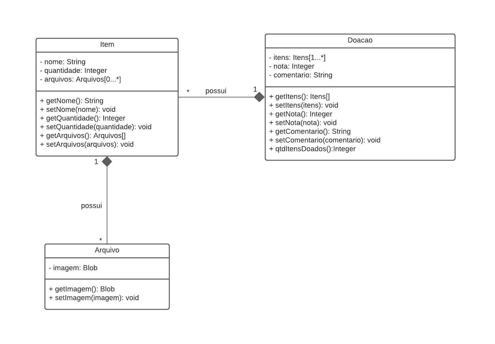

# 3.1. Módulo Padrões de Projeto GRASPs

## Versionamento
| Versão | Alterações                                                                    | Responsável                   | Data       |
| ------ | ----------------------------------------------------------------------------- | ----------------------------- | ---------- |
| 0.1    |   Introdução ao GRASP e GRASP Criador                                        | Felipe Agustini e Julia Sousa | 25/07/2022 |

## 3.1.1.
### 3.1.1.1. Introdução

General Responsability Assignment Software Patterns (GRASP), são diretrizes para atribuição de responsabilidade a classes e objetos em projetos orientados a objetos. 

É um padrão de projeto baseado em princípios e boas práticas usadas durante a criação do software, que descreve o problema e a solução adotada. Os princípios e os raciocínios utilizados para atribuir responsabilidades de objetos podem ser descritos de modo metódico, explicável e repetível. [[2]](#ref2).

### 3.1.1.2. GRASP Criador

Diferente do paradigma de orientação a objetos, que trata da relação entre os objetos de uma classe, o GRASP Criador é responsável por atribuir a responsabilidade de criação de objetos às classes que são coerentes para realizar essa ação. Quando atribuímos a função de criar objetos a uma classe qualquer, podemos gerar graves violações de encapsulamento, de alto acoplamento e de responsabilidades. 

Para conceber um GRASP Criador devemos partir do seguinte questionamento: Quem deve ser responsável por criar uma nova instância de uma classe [[1]](#ref1)?

Segundo BACAlÁ [[1]](#ref1). A responsabilidade da criação de um objeto B se da se uma ou mais situações abaixo forem verdadeiras.

- B contém A;
- B registra A;
- B usa A;
- B tem os dados necessários para a inicialização de A;

**Utilização no projeto**: Pode ser visto na seleção abaixo do diagrama de classe da aplicação que a responsabilidade da criação do objeto 'Arquivo' e o objeto 'item' recaem sobre a classe 'Doacao'. 

## Referências

[1] BACAlÁ. Sílvio. **Página do Professor Sílvio Bacalá Júnior:** Padrões GRASP. Uberlândia, 18 ago. 2012. Disponível em: <http://www.facom.ufu.br/~bacala/ESOF/05a-Padr%C3%B5es%20GRASP.pdf>. Acesso em 25 de julho de 2022.

[2] SERRANO, Milene. GRASP Complementar, 2022. Material apresentado na Disciplina de Arquitetura e Desenho de Software do curso de engenharia de software da UnB, FGA. Acesso em: 25 de julho de 2022.
