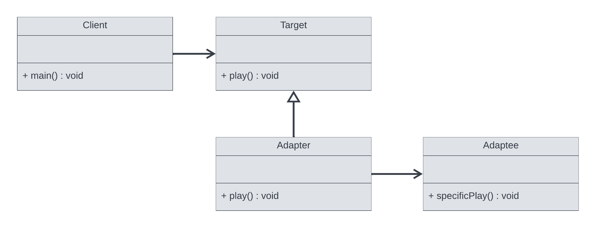

# 3.2. Módulo Padrões de Projeto GoFs

## Versionamento
| Versão | Alterações                                                                     | Responsável                 | Data       |
| ------ | ------------------------------------------------------------------------------ | --------------------------- | ---------- |
| 0.1    | Adicionado o Gof criacional                                                    | Cibele Goudinho             | 27/07/2022 |
| 0.2    | Adicionado o Gof Estrutural                                                    | Luiz Henrique, Antônio Neto | 28/07/2022 |
| 0.3    | Adicionado o Gof criacional builder                                            | Yan                         | 31/07/2022 |
| 0.4    | Corrigindo erros ortográficos no diagrama Builder e na implementação do código | Yan                         | 01/08/2022 |
| 0.5    | Modelando diagrama e código do GoF Strategy                                    | Victor Buendia              | 02/08/2022 |
| 0.6    | Adicionando introdução e aplicação do GoF Strategy                             | Sávio Cunha                 | 03/08/2022 |
| 0.7    | Melhorando introdução com base na validação do Victor Buendia                  | Yan Andrade                 | 05/08/2022 |
| 0.8    | Criando diagrama e código para GoF Criacional Template Method                  | Victor Buendia              | 05/08/2022 |
| 0.9   | Melhorando introdução factory method com base na validação do Victor Buendia                  | Cibele Goudinho                | 07/08/2022 |
| 1.0    | Adicionando introdução e aplicação do GoF Template Method                             | Sávio Cunha                 | 07/08/2022 |
| 0.11    | Adicionando referências no texto do padrão Builder                       | Yan Andrade                | 07/08/2022 |
| 0.12 | aplicação do GoF Template Method                      | Sávio Cunha                      | 07/08/2022 |
| 0.13    | Validando GoFs Criacionais                                                     | Victor Buendia e Felipe Agustini | 08/08/2022 |
| 0.14    | Finalizando Gofs Estruturais  | Antônio Neto e Luiz Henrique | 09/08/2022 |
| 0.15    | Validando GoFs Estruturais      | Isadora Soares e Cibele Goudinho| 08/08/2022 |
| 0.16    | Validando GoFs Criacionais     | Júlia Farias e Victor Eduardo| 09/08/2022 |
| 0.17    | Aprimorando GoFs Estruturais | Antônio Neto | 10/08/2022 |
| 0.18    | Validação e Correções | Victor Eduardo | 10/08/2022 |
| 0.19    | Validação e Correções | Cibele Goudinho | 12/08/2022 |


## 3.2.1. GoFs Criacionais
<p align="justify">&emsp;&emsp;O GoF criacional tem como objetivo auxiliar e controlar a criação das classes do projeto. Ele possui cinco padrões criacionais documentados: Builder, Abstract Factory, Factory Method, Prototype e Singleton.<br>
&emsp;&emsp;Trazendo para o contexto do nosso projeto iremos abordar o Factory Method e o Builder.</p>

### 3.2.1.1. Factory Method

#### Introdução

<p align="justify">&emsp;&emsp;Esse tipo de GoF criacional permite instanciar melhor as classes concretas e as suas respectivas subclasses. Seus elementos são os seguintes:</p>

- Creator(Criador abstrato) — declara o factory method que retorna o objeto da classe Product (produto). Este elemento também pode definir uma implementação básica que retorna um objeto de uma classe ConcreteProduct (produto concreto) básica;

- ConcreteCreator(Criador concreto) — sobrescreve o factory method e retorna um objeto da classe ConcreteProduct;

- Product(Produto abstrato) — define uma interface para os objectos criados pelo factory method;

- ConcreteProduct(Produto concreto) — uma implementação para a interface Product.


_Imagem 1: Diagrama genérico de representação: GoF Factory_

<p align="justify">&emsp;&emsp;Nesse padrão definimos as seguintes classes e subclasses ao aplicá-lo no nosso projeto:</p>

- Usuario (ex. usuário) - declara o factory method, o qual retorna um objeto do “tipo” Atividade. Usuario pode também definir uma implementação default do factory method que retorna um objeto AtividadeConcreta default. Usuario pode ainda chamar um factory method para criar, deletar ou alterar um objeto de Atividade.

- UsuarioConcreta (ex. Ong, Doador) – sobrescreve o factory method para retornar uma instância de AtividadeConcreta.

- Atividade (ex. atividade realizada) - define atributos e métodos, esses últimos abstratos ou programados de forma mais genérica, para um conjunto de objetos, os quais serão criados pelo factory method.

- AtividadeConcreta (ex. Doação, Ação Social) - estende Atividade, especializando o que foi definido na superclasse.

[Padrão Factory Method](https://lucid.app/lucidchart/fe56ed17-fed3-4432-a859-4811fd0e31fc/edit?beaconFlowId=E4251B866A4ABC99&invitationId=inv_85462122-0db6-4fe8-8a04-ccd5ae61a99b&page=HWEp-vi-RSFO#)

#### Aplicação no Projeto


_Imagem 2: Factory Method_

#### Possível implementação em código

```
class Usuario is

    abstract method createUsuario():Usuario

    

class Ong extends Usuario is
    method createUsuario():Usuario is
        return new Ong()

class Doador extends Usuario is
    method createUsuario():Usuario is
        return new Doador()

method visualizeProfile() is
    profile = this.usuario
    this.reset()
    result profile

method editProfile() is
    profile = this.usuario
    result profile

method deleteProfile() is
    profile = this.usuario
    profile = new profile();

method donate() is
method sugestSocialAction() is
method followOng() is
method visualizeReceivedItens() is
method addSocialAction() is
method completeSocialAction() is
method searchDonations() is

class Atividade is

    abstract method createAtividade():Atividade

class AcaoSocial extends Atividade is
    method createAtividade():Atividade is
        return new AcaoSocial()

class Doacao extends Atividade is
    method createAtividade():Atividade is
        return new Doacao()

class Application is
    field Usuario: Usuario
    field Atividade: Atividade

    method main() is
        

```

### 3.2.1.2. Builder

#### Introdução

&emsp;&emsp;O Builder é um padrão de projeto criacional que permite a você construir objetos complexos passo a passo. O padrão permite que você produza diferentes tipos e representações de um objeto usando o mesmo código de construção [[GURU]](#ref4).

&emsp;&emsp;O Builder funciona da seguinte forma. O padrão organiza a construção de objetos em uma série de etapas (No nosso caso, setFotoDePerfil, setNome, setTelefone, etc...). Dessa forma, para criar um objeto você precisará executar uma série de etapas em um objeto builder. O principal ponto que devemos ressaltar aqui é que <b>não</b> precisamos chamar todas etapas, precisamos chamar apenas aquelas etapas que serão necessárias para a produção específica de um objeto [[GURU]](#ref4).


_Imagem 3: Diagrama genérico de representação: GoF Builder_

#### Aplicação no Projeto

&emsp;&emsp;Aplicado no nosso projeto, teremos dois builders concretos um será de Ong e outro para Doador. Teremos também uma interface com todos os métodos de ambas classes concretas. Assim se caso queremos criar um objeto Ong, basta passar NULL nos parâmetros dos métodos que servem para criar um Doador. E para criar um objeto doador devemos fazer o mesmo porém com os métodos que servem para criar Ong [[GURU]](#ref4).


_Imagem 4: Builder aplicado ao projeto_

#### Possível implementação em código
````
class Ong is

class Doador is

interface Builder is
    method reset()
    method setFotoDePerfil(Blob)
    method setNome(String)
    method setTelefone(String)
    method setEmail(String)
    method setEndereco(String)
    method setCidade(String)
    method setEstado(String)
    method setCep(String)
    method setSenha(String)
    method setCnpj(String)
    method setNomeDoResponsavel(String)
    method setEmailDoResponsavel(String)
    method setCpf(String)
    method setDataNascimento(Date)   

class OngBuilder implements Builder is
    private field ong:Ong

    constructor OngBuilder() is
        this.reset()

    method reset() is
        this.ong = new Ong()

    method setFotoDePerfil(Blob) is
    method setNome(String) is
    method setTelefone(String) is
    method setEmail(String) is
    method setEndereco(String) is
    method setCidade(String) is
    method setEstado(String) is
    method setCep(String) is
    method setSenha(String) is
    method setCnpj(String) is
    method setNomeDoResponsavel(String) is
    method setEmailDoResponsavel(String) is
    method setCpf(null) is
    method setDataNascimento(null) is 

    method getProduct():Ong is 
        product = this.ong
        this.reset()
        result product

class DoadorBuilder implements Builder is
    private field doador:Doador

    constructor DoadorBuilder() is
        this.reset()

    method reset() is
        this.doador = new Doador()

   method setFotoDePerfil(Blob) is
    method setNome(String) is
    method setTelefone(String) is
    method setEmail(String) is
    method setEndereco(String) is
    method setCidade(String) is
    method setEstado(String) is
    method setCep(String) is
    method setSenha(String) is
    method setCnpj(null) is
    method setNomeDoResponsavel(null) is
    method setEmailDoResponsavel(null) is
    method setCpf(String) is
    method setDataNascimento(Date) is 

    method getProduct():Doador is
        product = this.doador
            this.reset()
            result product

class Director is
    private field builder:Builder

    method setBuilder(builder:Builder)
        this.builder = builder

    method constructOng(builder: Builder) is
        builder.reset()
        builder.setFotoDePerfil(Blob)
        builder.setNome(String)
        builder.setTelefone(String)
        builder.setEmail(String)
        builder.setEndereco(String)
        builder.setCidade(String)
        builder.setEstado(String)
        builder.setCep(String)
        builder.setSenha(String)
        builder.setCnpj(String)
        builder.setEmailDoResponsavel(String)
        builder.setNomeDoResponsavel(String)
        builder.setCpf(null)
        builder.setDataNascimento(null)

    method constructDoador(builder: Builder) is
        builder.reset()
        builder.setFotoDePerfil(Blob)
        builder.setNome(String)
        builder.setTelefone(String)
        builder.setEmail(String)
        builder.setEndereco(String)
        builder.setCidade(String)
        builder.setEstado(String)
        builder.setCep(String)
        builder.setSenha(String)
        builder.setCnpj(null)
        builder.setNomeDoResponsavel(null)
        builder.setEmailDoResponsavel(null)
        builder.setCpf(String)
        builder.setDataNascimento(Date)


class Application is

    method makeOng() is
        director = new Director()

        OngBuilder builder = new OngBuilder()
        director.constructOng(builder)
        Ong ong = builder.getProduct()

        DoadorBuilder builder = new DoaodorBuilder()
        director.constructDoador(builder)
        Doador doador = builder.getProduct()
````

## 3.2.2. GoFs Estruturais

<p align="justify">&emsp;&emsp;As interações entre os objetos de um sistema podem gerar fortes dependência entre eles, o que eventualmente resulta no maior custo de funcionamento e manutenção do sistema.</p>

<p align="justify">&emsp;&emsp; Dado isso, os padrões de projeto estruturais tem como objetivo diminuir o acoplamento entre os objetos de um sistema orientado a objetos. Assim, esses padrões alteram a estrutura, principalmente no nível de classes.</p>

### 3.2.2.1. Composite

#### Introdução

<p align="justify">&emsp;&emsp;O padrão Composite tem como objetivo compor objetos em estruturas de árvore para representar hierarquias partes/todo. O Composite permite tratar de maneira uniforme objetos individuais e composições de objetivos.</p>

<p align="justify">&emsp;&emsp; Abaixo podemos observar de maneira mais clara a modelagem do padrão Composite: </p>


_Imagem 5: Composite_

<p align="justify">&emsp;&emsp; Dessa forma, podemos interpretar os componentes da seguinte forma:

- Uma classe *Component* que seria uma Interface que especifica/define os métodos para um determinado componente.
- Uma classe *Composite* define o comportamento dos componentes que compõem essa classe, além de implementar a interface.
- Uma classe denominada *Leaf* que seriam as folha da estrutura em árvore, ou seja, não possuem classes abaixo dela. Essa classe define os métodos mais básicos do componente, e também implementa a interface.

#### Aplicação no Projeto

<p align="justify">&emsp;&emsp; Uma possível aplicação do conceito de Composite no contexto do projeto pode ser visualizado na imagem abaixo. Uma classe Component Usuário que é herdada por duas classes: uma Leaf denominada UsuarioNãoCadastrado e uma Composite UsuarioCadastrado, sendo esta última formada pelos usuários ONGs e usuários doadores. 


_Imagem 6: Composite no contexto do projeto_

### 3.2.2.2. Adapter

#### Introdução

<p align="justify">&emsp;&emsp;Em suma, esse padrão Adapter consistem em um adaptador de um objeto para uma interface, tornando  possível um processo que seria incompatível. Assim tendo como principal objetivo a alteração de um objeto permitindo a sua interação com o outro.</p>

<p align="justify">&emsp;&emsp; Abaixo podemos observar de maneira mais clara a modelagem do padrão Adapter e seu funcionamento: </p>


_Imagem 7: Adapter_

<p align="justify">&emsp;&emsp; Os componentes desse diagrama podem ser interpretados da seguinte forma:

- O *Client* colabora com outros objetos de acordo com o *Target*
- O *Target* define uma classe/interface específica o qual o *Client* utiliza diretamente.
- O *Adapter* adapta a classe/interface *Target* de forma que seja possível fazer o uso da *Adaptee*.
- O *Adaptee* define uma classe/interface já existente.

## 3.2.3. GoFs Comportamentais

<p align="justify">&emsp;&emsp;O padrão GOF Comportamental Strategy é um padrão de projeto comportamental que permite que você defina uma família de algoritmos, coloque-os em classes separadas, e faça os objetos deles intercambiáveis. Para esse padrão a hierarquia é de suma importância, podendo acontecer com classes abstratas ou interfaces, sendo relações de herança ou realização.</p>

### 3.2.3.1 GoF Strategy

#### Introdução

<p align="justify">&emsp;&emsp;Para a implementação do padrão GOF Comportamental Strategy é necessário seguir uma estrutura contendo os seguintes elementos:</p> 

- **Context(Contexto):**  Mantém uma referência para uma das estratégias concretas e se comunica com esse objeto através da interface/classe abstrata da estratégia.

- **Strategy(Estratégia):** Declara um método que o contexto usa para executar uma estratégia.

- **ConcreteStrategy(Estratégia Concreta):** Implementa diferentes variações de um algoritmo que o contexto usa.

<p align="justify">&emsp;&emsp;Esses três elementos formam o GOF Comportamental Strategy como mostra o modelo exemplo abaixo.</p>


_Imagem 8: Modelo do GoF Comportamental Strategy_

#### Aplicação no Projeto

<p align="justify">&emsp;&emsp;O padrão Strategy propõe uma solução que pode ser adotada no cenário desse projeto.</p>

- Quando o cliente acessar a plataforma, é necessário verificar se o mesmo está cadastrado como usuário.

- Caso o cliente não seja cadastrado é necessário executar uma estratégia onde permite ao usuário criar seu próprio perfil, com  a possibilidade de se cadastrar como Doador ou ONG.

- Caso o cliente seja cadastrado, é necessário fazer login como Doador ou ONG.


_Imagem 9: GoF Strategy no Projeto_

#### Possível Implementação em Código


```
import Usuario
import Ong 
import Doador

abstract class Cadastro is
    abstract method cadastrarUsuario(usuario)

class CadastrarOng extends Cadastro is
    // Particularidades da ONG
    private String cnpj
    private String nomeDoResponsavel
    private String emailDoResponsavel
    ...

    cadastrarUsuario(usuario) is
        try:
           // Ler atributos da ONG
            ...
            new Ong( ... )
            return true
        catch Exception:
            return false

class CadastrarDoador extends Cadastro is
    // Particularidades Doador 
    private String cpf 
    private Date dataNascimento

    cadastrarUsuario(usuario) is
        try:
          // Ler atributos do Doador
            ...
            new Doador( ... )
            return true
        catch Exception:
            return false

class Home is
    private tipoCadastro: Cadastro

    method setTipoCadastro(Cadastro tipoCadastro) is
        this.tipoCadastro = tipoCadastro

    method cadastrarUsuario(Usuario usuario) is
        return tipoCadastro.cadastrarUsuario(usuario)

class App is
    method main() is
        Home homePage
        Usuario usuario

        // Cadastro ou Login

        // Login ...

        // Cadastro: Lê se o usuário clicou em cadastrar Ong ou Doador

        if (action == 'ong') then
            homePage.setTipoCadastro(new CadastrarOng())
            homePage.cadastrarUsuario(usuario)

        if (action == 'doador') then
            homePage.setStrategy(new CadastrarDoador())
            homePage.cadastrarUsuario(usuario)

        ...
```

### 3.2.3.1 GoF Template Method

#### Introdução

<p align="justify">&emsp;&emsp;O Padrão GoF Template Method é um padrão de projeto comportamental que define o esqueleto de um algoritmo na superclasse mas deixa as subclasses sobrescreverem etapas específicas do algoritmo sem modificar sua estrutura.</p>

<p align="justify">&emsp;&emsp;Para a implementação do padrão GOF Comportamental Template Method é necessário seguir uma estrutura contendo os seguintes classes:</p> 

- AbstractClass(Classe Abstrata): Classe abstrata para a definição das operações primitivas e qual sequência deve ser seguida.

- ConcreteClass(Classe Concreta): Implementação das operações primitivas a serem utilizadas.

<p align="justify">&emsp;&emsp;Essas duas classes formam o GOF Comportamental Template Method como mostra o modelo exemplo abaixo.</p>


_Imagem 10: Modelo GoF Template Method_

#### Aplicação no Projeto
<p align="justify">&emsp;&emsp;O padrão GOF Comportamental Template Method propõe uma solução que pode ser adotada no cenário desse projeto.</p>

- A AbstractClass Login que especifica os métodos como um guia  para solução de um problema, temos um template onde o usuário pode efetuar login(efetuarLogin()).
 
- Na ConcreteClass que define de forma mais detalhada os métodos especificados na AbstractClass, temos duas opções de login, podendo ser Doador ou OnG. 


_Imagem 10: GoF Template Method no Projeto_

#### Possível Implementação em Código

```
abstract class Login is

    // Métodos Abstratos
    abstract method getUserInfo(userInfo)
    
    // Template
    method efetuarLogin() is
        user = getUserInfo()
        if(authenticate() == true)
            sucess()
        else 
            error()
    
    // Método Padrão  
    method authenticate() is
        userInfo = input()
        if(userInfo == getUserInfo(userInfo))
            return true
        else 
            return false

import Ong
class LoginOng extends Login is
    method getUserInfo() is
        identifier = input()
        password = input()
        
        Ong ong 
        try:
            ong = fingOngInDBbyCnpj(identifier)
            return ong
        except:
            catch(NotFoundOngException)

class LoginDoador extends Login is
    method getUserInfo() is
        identifier = input()
        password = input()
        
        Doador doador 
        try:
            doador = fingDoadorInDBbyCpf(identifier)
            return doador
        except:
            catch(NotFoundDoadorException)

```

## Referências

<a id="ref1"></a> 
- GoFs Criacionais. <https://aprender3.unb.br/pluginfile.php/2083414/mod_label/intro/Arquitetura%20e%20Desenho%20de%20Software%20-%20Aula%20GoFs%20Criacionais%20-%20Profa.%20Milene.pdf> Acesso em: 27 de Julho de 2022.

<a id="ref2"></a> 
- Introdução aos padrões criacionais. Disponível em: <https://www.devmedia.com.br/introducao-aos-padroes-criacionais-abstract-factory-factory-method-prototype-e-singleton/21249>. Acesso em: 27 de Julho de 2022.

<a id="ref3"></a> 
- Factory Method. Disponível em: <https://refactoring.guru/pt-br/design-patterns/factory-method>. Acesso em: 27 de Julho de 2022.

<a id="ref4"></a> 
- Factory. Disponível em: <http://www.dsc.ufcg.edu.br/~jacques/cursos/map/html/pat/factory.htm>. Acesso em: 27 de Julho de 2022.

<a id="ref5"></a> 
- Arquitetura e Desenho de Software - Aula GoFs Estruturais. Disponível em: <https://aprender3.unb.br/pluginfile.php/2083415/mod_label/intro/Arquitetura%20e%20Desenho%20de%20Software%20-%20Aula%20GoFs%20Estruturais%20-%20Profa.%20Milene.pdf>. Acesso em: 28 de Julho de 2022.

<a id="ref6"></a> 
- Builder. Disponível em: <https://refactoring.guru/pt-br/design-patterns/builder>. Acesso em: 31 de Julho de 2022.

<a id="ref7"></a> 
- Strategy. Disponível em: <https://refactoring.guru/pt-br/design-patterns/strategy>. Acesso em: 03 de Agosto de 2022. 

<a id="ref8"></a> 
- GOF Comportamental: Strategy. XDOCS. Disponível em: <https://xdocs.com.br/doc/gof-comportamental-strategy-grupo-enio-teixeira-maristela-machado-e-thalia-silva-6nw52ydq5qn1>. Acesso em: 03 de Agosto de 2022. 

<a id="ref9"></a> 
- Padrões GoF. Disponível em: <https://www.facom.ufu.br/~bacala/ESOF/05b-Padr%C3%B5es%20Gof.pdf>. Acesso em: 07 de Agosto de 2022.

<a id="ref10"></a> 
- Padrão Template Method. Disponível em: <https://diogomoreira.gitbook.io/padroes-de-projeto/padroes-gof-comportamentais/padrao-template-method>. Acesso em: 07 de Agosto de 2022.

<a id="ref11"></a> 
- Gofs Estruturais. Disponível em: <https://aprender3.unb.br/pluginfile.php/2083415/mod_label/intro/Arquitetura%20e%20Desenho%20de%20Software%20-%20Aula%20GoFs%20Estruturais%20-%20Profa.%20Milene.pdf>. Acesso em: 09 de Agosto de 2022.