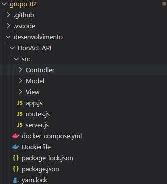
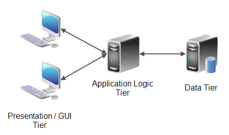
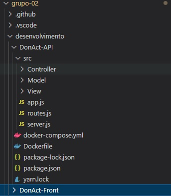

# 3.3. Módulo Padrões de Projeto Extras

## Versionamento
| Versão | Alterações                                            | Responsável                                | Data       |
| ------ | ----------------------------------------------------- | ------------------------------------------ | ---------- |
| 0.1    | Criando Documento                                     | Luiz Henrique, Victor Eduardo, Yan Andrade | 22/07/2022 |
| 0.2    | Arquitetura multicamadas                              | Cibele Goudinho                            | 01/08/2022 |
| 0.3    | Validação e aprimoramento da Arquitetura multicamadas | Antonio Neto                               | 02/08/2022 |
| 0.4    | Adicionando aplicação no projeto MVC e N-Tier         | Cibele Goudinho                            | 06/08/2022 |
| 0.5    | Validação do MVC e N-Tier                             | Victor Buendia e Felipe Agustini           | 08/08/2022 |
| 0.6    | Validação e correção                                  | Isadora Soares                             | 08/08/2022 |

## 3.3.1. MVC - Model (modelo) View (visão) Controller (Controle)

&emsp;&emsp;O MVC(Model View Controller) é padrão de projeto que se caracteriza pela utilização de três principais camas, sendo elas Modelo, Visão e Controlador, onde a camada de  modelo é responsável por armazenar os dados da aplicação, a visão é destinada a exibir os dados e o controller tem a responsabilidade interagir com camadas de modelo e visão.

&emsp;&emsp;O padrão MVC foi desenvolvido pelo Cientista da Computação Trygve Reenskaug no ano de 1979, este padrão foi desenvolvido inicialmente com o objetivo de ser utilizado como arquitetura para aplicações para desktops, porém a utilização deste padrão ficou popular em sistemas webs por suas vantagens.

&emsp;&emsp;O uso do padrão deste padrão foi escolhido pela equipe por trazer ao software benefícios ao isolar as regras de negócio do sistema da lógica de apresentação, assim trazendo baixo acoplamento so sistema, possibilitando flexibilidade e reaproveitamento de classes pois possibilita que modificações sem a necessidade de alterar as regras de negócio.

Podemos observar o funcionamento desta arquitetura no diagrama descrito abaixo:

_Imagem 1: MVC_

 Analisando a imagem acima podemos analisar de maneira mais clara a arquitetura MVC onde usuário da aplicação interage com a interface gráfica do software denominada View, que é responsável por exibir os dados para o mesmo, esta interface interage com a Controller que serve como um "intermediador" no processo que interage com a Model que é a camada responsável pelas regras de negócio do sistema.

### 3.3.1.1. - Aplicação MVC

_Imagem 2: MVC_

## 3.3.2. N-tier Architecture (arquitetura multicamada)

Esse padrão de projeto é caracterizado principalmente por separar processamentos, gerência de dados e funções de apresentação física e logicamente separadas. Dessa forma, o projeto se torna mais fácil de gerenciar, mais fácil de identificar os bugs e as mudanças realizadas em uma parte do projeto não afeta as outras. Além de fornecer vantagens como maior segurança, melhor escalabilidade e mais facilidade de manutenção e atualização.

Usualmente, temos três diferentes camadas nesse padrão, nesse caso, podemos visualizar nossa arquitetura como uma "3-Tiered Architecture": 
- Camada de apresentação: É voltado para interface do usuário, é o que vai traduzir e apresentar o sistema ao usuário.
- Camada lógica: É a parte que processa a lógica do projeto e também coordena os dados entre a camada de apresentação e a de dados.
- Camada de dados: Aqui é onde acontece o manejo de dados, onde estes são guardados ou recuperados no banco.

No nosso projeto, iremos utilizar o N-tier em conjunto com o [MVC](/3.3.PadroesExtra?id=_331-mvc-model-modelo-view-visão-controller-controle). Nesse sentido, o MVC será utilizado como padrão dentro das camadas, enquanto o N-tier será utilizado como arquitetura geral, tendo o front e a View como camada de apresentação, a Controller e a Model dentro da camada lógica e na camada de dados o próprio banco mysql. 
. Dessa forma, podemos aproveitar flexibilidade e reaproveitamento de código do MVC e também a melhor gerência de projeto do N-tier. 

Um exemplo de aplicação desse modelo:

### 3.3.2.1. - Aplicação N-tier

_Imagem 3: N-tier_

## Referências

Introdução ao Padrão MVC Disponível em: <https://www.devmedia.com.br/introducao-ao-padrao-mvc/29308#:~:text=Hist%C3%B3ria%20do%20MVC,-O%20artigo%20apresenta&text=O%20Engenheiro%20Civil%20Christopher%20Alexander,problema%20espec%C3%ADfico%20em%20projetos%20distintos>. Acesso em: 28 de Julho de 2022.

Padrão MVC - Arquitetura Model-View-Controller. Disponível em: <https://www.portalgsti.com.br/2017/08/padrao-mvc-arquitetura-model-view-controller.html>. Acesso em: 28 de Julho de 2022.

Definition of N Tier Architecture. Disponível em: <https://stackify.com/n-tier-architecture/#:~:text=Definition%20of%20N%2DTier%20Architecture,functions%20physically%20and%20logically%20separated.>. Acesso em: 01 de Agosto de 2022.

Introdução ao modelo multicamadas. Disponível em: <https://www.devmedia.com.br/introducao-ao-modelo-multicamadas/5541>. Acesso em : 01 de Agosto de 2022.

n-Tier Architecture Explained. Disponível em: <https://www.youtube.com/watch?v=KlHvRKSH4pk>. Acesso em : 02 de Agosto de 2022.

MVC Explained. Disponível em: <https://www.youtube.com/watch?v=DUg2SWWK18I>. Acesso em : 02 de Agosto de 2022.

