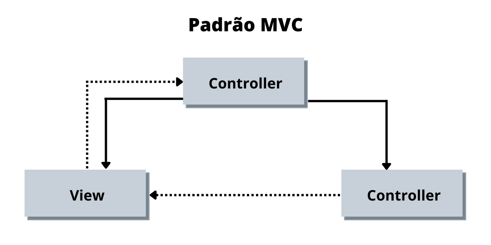

# 3.3. Módulo Padrões de Projeto Extras

## Versionamento
| Versão | Alterações        | Responsável                 | Data       |
| ------ | ---------------   | --------------------------- | ---------- |
| 1.0    | Criando Documento | Luiz Henrique, Victor Eduardo, Yan Andrade     | 22/07/2022 |

## 3.3.1 MVC - Model (modelo) View (visão) Controller (Controle)

&emsp;&emsp;O MVC(Model View Controller) é padrão de projeto que se caracteriza pela utilização de três pricipais camas, sendo elas Modelo, Visão e Controlador, onde a camada de  modelo é responsável por armazenar os dados da aplicação, a visão é destinada a exibir os dados e o controller tem a responsabilidade interagir com camads de modelo e visão.

&emsp;&emsp;O padrão MVC foi desenvolvido pelo Cientista da Computação Trygve Reenskaug no ano de 1979, esté padrão foi desenvolvido inicialmente com o objeitvo de ser utilizado como arquitetura para aplicações para desktops, porém a utilização deste padrão ficou popular em sistemas webs por suas vantagens.

&emsp;&emsp;O uso do padrão deste padrão foi escolhido pela equipe por trazer ao software benefícios ao isolar as regras de negócio do sistema da lógica de apresentação, assim trazendo baixo acoplamento so sistema, possibilitando flexibilidade e reaproveitamento de classes pois possibilita que modificações sem a necessidade de alterar as regras de negócio.

Podemos observar o funcionamento desta arquitetura no diagrama descrito abaixo:

_Imagem 1: MVC_

 Analisando a imagem acima podemos analisar de maneira mais clara a arquitetura MVC onde usuário da aplicação interage com a interface gráfica do software denominada View, que é responsável por exibir os dados para o mesmo, esta interface interage com a Controller que serve como um "intermediador" no processo que interage com a Model que é a camada responsável pelas regras de negócio do sistema.

### 3.3.1 - Aplicação MVC

## Referências

Introdução ao Padrão MVC Disponível em: <https://www.devmedia.com.br/introducao-ao-padrao-mvc/29308#:~:text=Hist%C3%B3ria%20do%20MVC,-O%20artigo%20apresenta&text=O%20Engenheiro%20Civil%20Christopher%20Alexander,problema%20espec%C3%ADfico%20em%20projetos%20distintos>. Acesso em: 28 de Julho de 2022.

Padrão MVC - Arquitetura Model-View-Controller. Disponível em: <https://www.portalgsti.com.br/2017/08/padrao-mvc-arquitetura-model-view-controller.html>. Acesso em: 28 de Julho de 2022.

